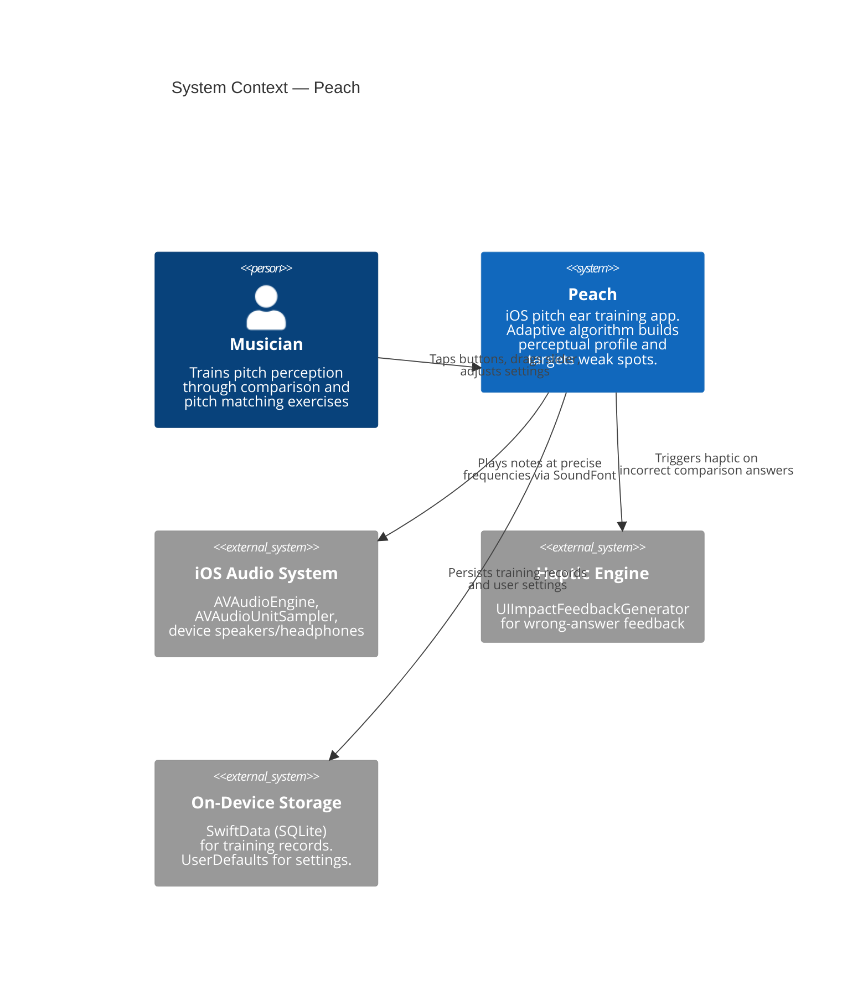
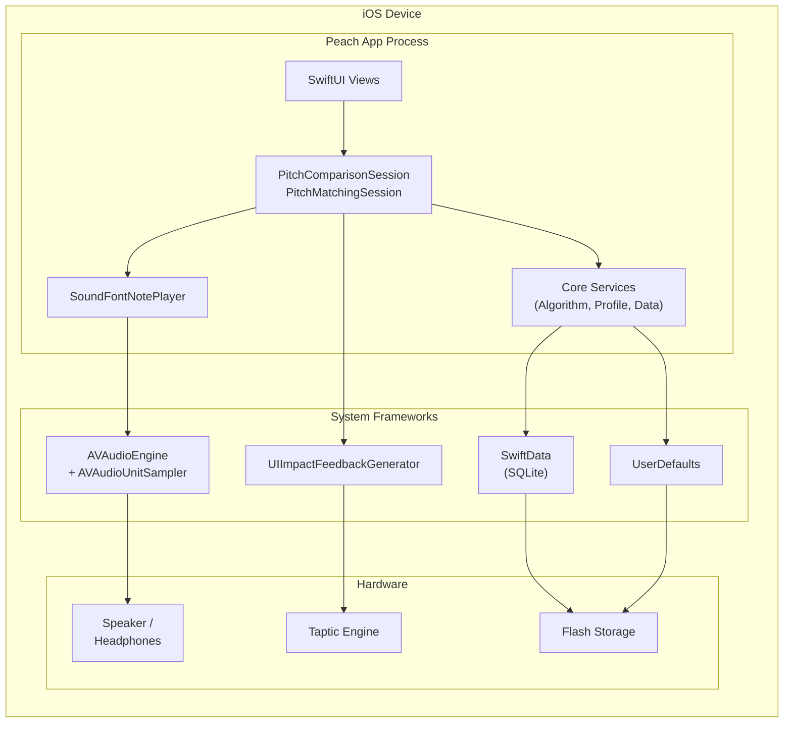

# 3. Context and Scope

## Business Context

Peach is a standalone, fully offline iOS app. It has no backend, no network communication, and no external service dependencies. The system boundary is the app itself running on the user's device.

| Actor / System | Input to Peach | Output from Peach |
|---|---|---|
| **User (musician)** | Tap higher/lower, drag pitch slider, adjust settings | Audio playback, visual feedback, haptic feedback, perceptual profile visualization |
| **iOS Audio System** | Audio interruption notifications (phone call, headphone disconnect) | Note playback commands (MIDI note on/off, pitch bend, preset selection) |
| **On-Device Storage** | Persisted training records, user settings | New comparison/pitch matching records, settings updates |

## Technical Context

All communication is in-process. There are no network channels, no IPC, and no remote services. The only external signals are iOS system notifications (audio interruptions, app lifecycle events).
