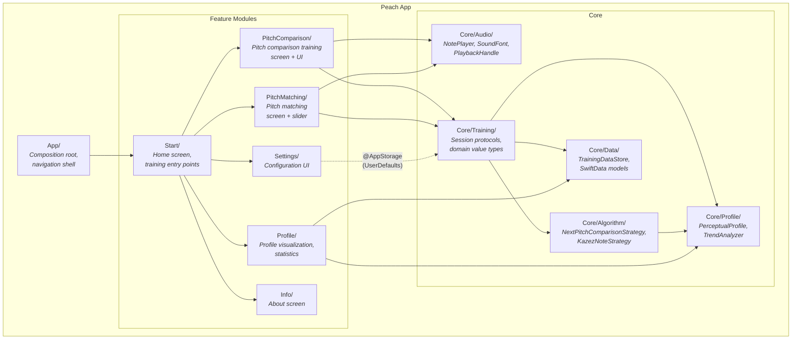
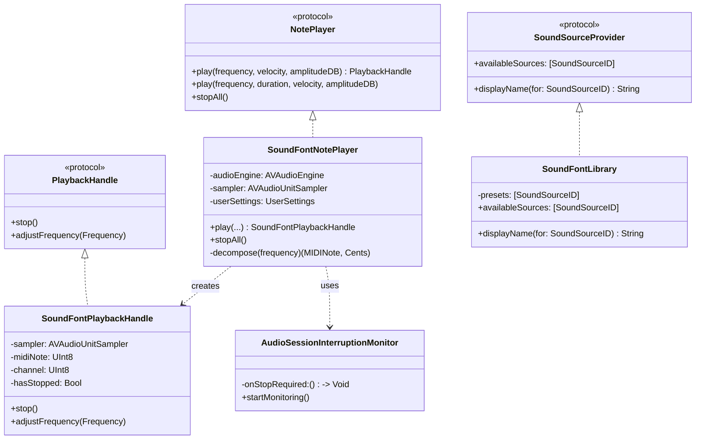
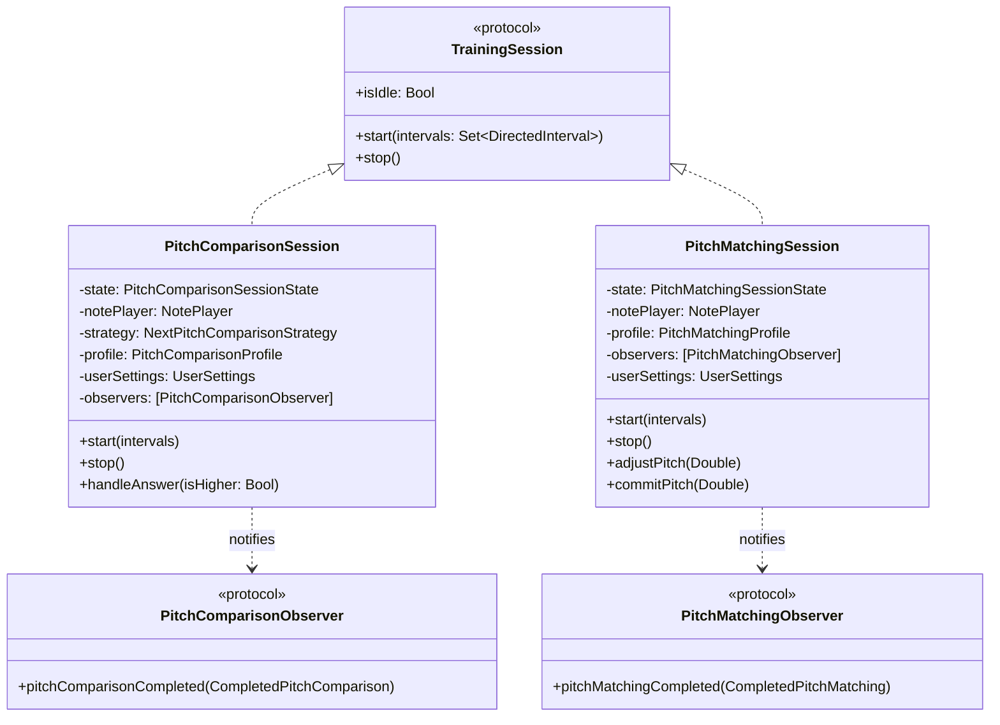
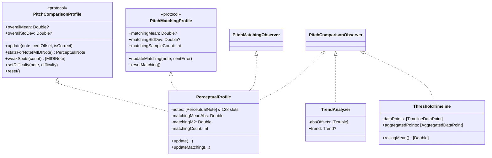

# 5. Building Block View

## Level 1 — Overall System

### Contained Building Blocks

| Building Block | Responsibility |
|---|---|
| **App/** | Composition root (`PeachApp.swift`): wires all dependencies, injects services into SwiftUI environment. Navigation shell (`ContentView.swift`): hub-and-spoke `NavigationStack`. |
| **Start/** | Home screen with four training entry points (Pitch Comparison, Pitch Matching, Interval Pitch Comparison, Interval Pitch Matching), profile preview sparkline, and navigation to Settings/Profile/Info. |
| **PitchComparison/** | Pitch comparison training UI: Higher/Lower buttons, feedback indicator, difficulty display. Reads `PitchComparisonSession` from environment. |
| **PitchMatching/** | Pitch matching UI: vertical pitch slider, feedback indicator. Reads `PitchMatchingSession` from environment. |
| **Profile/** | Perceptual profile visualization: threshold timeline chart (Swift Charts), summary statistics with trend, matching statistics. |
| **Settings/** | Configuration interface: interval selector, note range, duration, reference pitch, loudness variation, tuning system, sound source picker, reset button. All backed by `@AppStorage`. |
| **Info/** | Static about screen: app name, developer, copyright, version. |
| **Core/Audio/** | Audio playback: `NotePlayer` protocol, `SoundFontNotePlayer` (AVAudioEngine + AVAudioUnitSampler), `PlaybackHandle` for note lifecycle, `SoundFontLibrary` for preset discovery, `AudioSessionInterruptionMonitor`. |
| **Core/Algorithm/** | Pitch comparison selection: `NextPitchComparisonStrategy` protocol, `KazezNoteStrategy` (psychoacoustic staircase algorithm). |
| **Core/Data/** | Persistence: `TrainingDataStore` (SwiftData CRUD), `PitchComparisonRecord` and `PitchMatchingRecord` (`@Model` classes). |
| **Core/Profile/** | User model: `PerceptualProfile` (128-slot per-note statistics via Welford's algorithm), `PitchComparisonProfile` and `PitchMatchingProfile` protocols, `TrendAnalyzer`, `ThresholdTimeline`. |
| **Core/Training/** | Domain types and session protocols: `PitchComparison`, `CompletedPitchComparison`, `CompletedPitchMatching`, `PitchMatchingChallenge`, `PitchComparisonObserver`, `PitchMatchingObserver`, `TrainingSession` protocol, `Resettable`. |

---

## Level 2 — Core/Audio

The audio layer knows only frequencies (Hz), velocities, and amplitudes. It has no concept of MIDI notes, musical intervals, comparisons, or training. The `SoundFontNotePlayer` internally decomposes a frequency into the nearest MIDI note + cent remainder for pitch bend, but this is an implementation detail.

**Key interface — `PlaybackHandle`:** Every `play()` call returns a handle. The caller owns the handle and is responsible for stopping playback. This makes note ownership explicit and enables both fixed-duration (comparison) and indefinite (pitch matching) playback patterns.

---

## Level 2 — Core/Training (Sessions)

Both sessions follow the same patterns: `@Observable` state machines, protocol-based dependency injection, observer fan-out for side effects, and error boundary behavior (audio/persistence failures don't crash the training loop).

---

## Level 2 — Core/Profile

`PerceptualProfile` is the central user model — a 128-slot array indexed by MIDI note, each slot holding Welford's online statistics (mean, variance, standard deviation, sample count, current difficulty). It is never persisted directly; it is rebuilt from `PitchComparisonRecord` entries on every app launch and updated incrementally during training.
