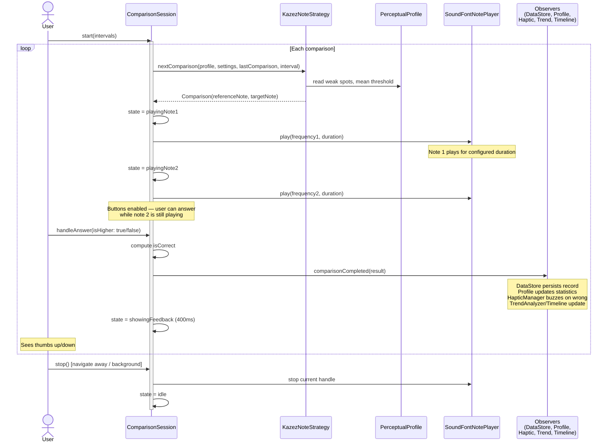
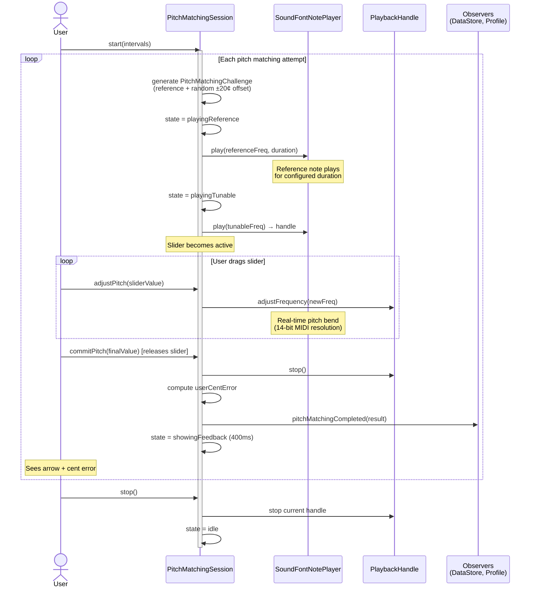
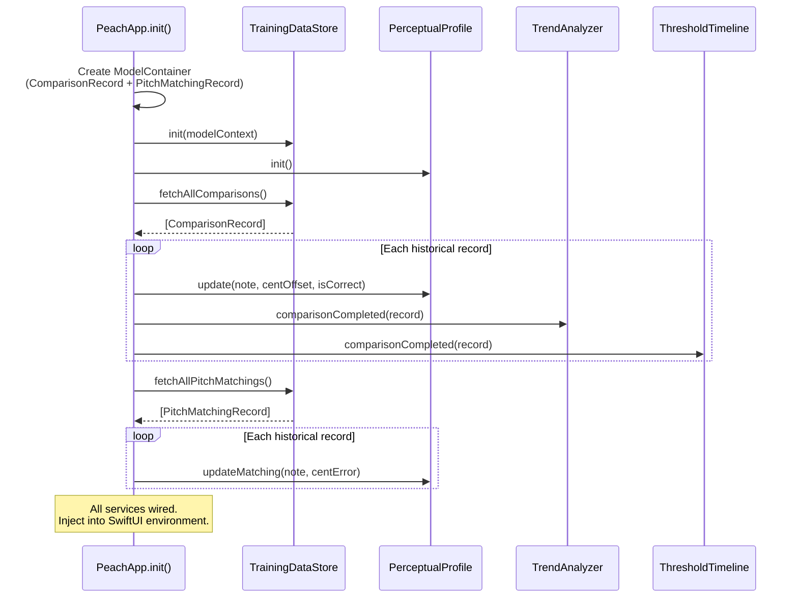
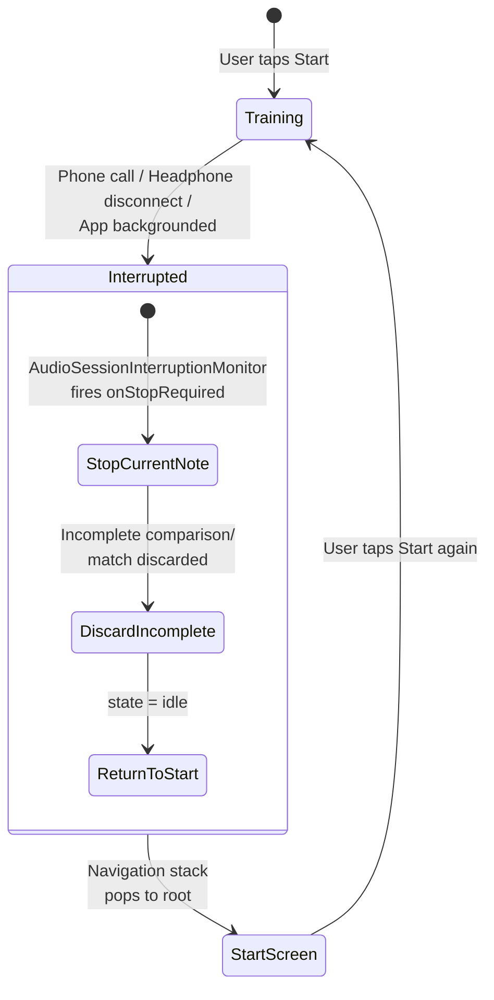

# 6. Runtime View

## Comparison Training Loop

The core training interaction — the user answers a stream of pitch comparisons.

**Key behavior:**
- Buttons are enabled during `playingNote2` — the user can answer before the second note finishes
- The 400ms feedback phase is skippable if the user navigates away
- Audio interruptions (phone call, headphone disconnect) trigger `stop()` automatically via `AudioSessionInterruptionMonitor`

## Pitch Matching Loop

The user tunes a note to match a target pitch.

**Key behavior:**
- The slider maps -1.0..+1.0 to ±20 cents from the initial offset
- No visual feedback during active tuning — only after release
- `adjustFrequency()` on the `PlaybackHandle` uses MIDI pitch bend for real-time frequency change

## App Startup and Profile Rebuild

The perceptual profile is never persisted — it is always rebuilt from raw records. This ensures the profile is always consistent with the stored data and simplifies the data model.

## Audio Interruption Handling

Interruption handling is identical for both training modes. The session discards any incomplete attempt — no partial data is ever persisted.
