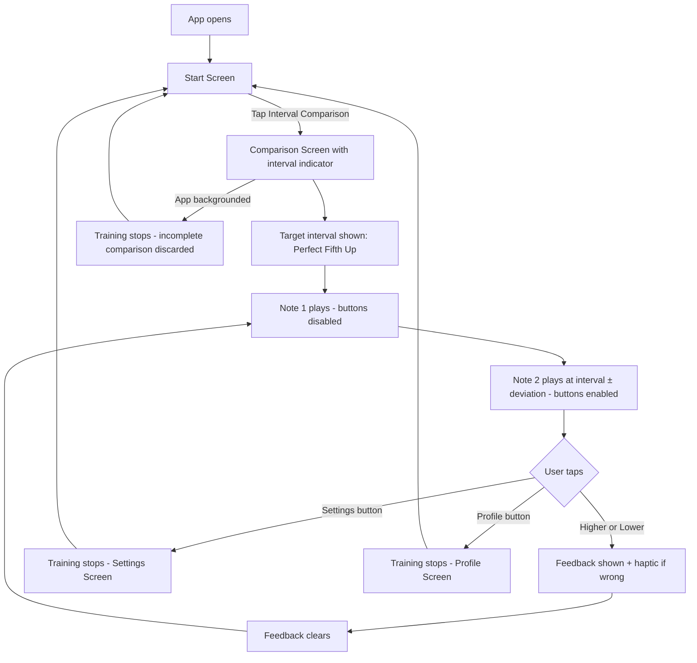
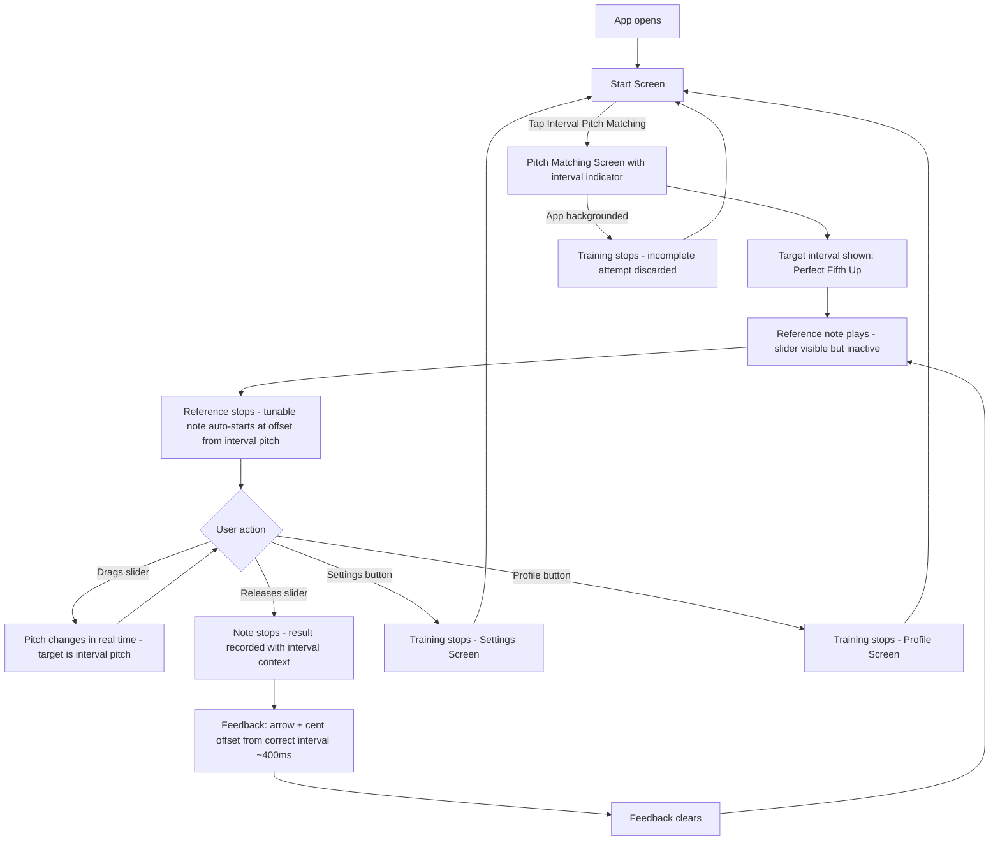

[← Previous (5f1eb1ec60)](5f1eb1ec60.md) | [Index](index.md) | [Next (598a698c72) →](598a698c72.md)

# Commit 18882145ea

**Date:** 2026-02-28 12:02:29 UTC+01:00  
**Author:** Michael Schürig <michael@schuerig.de>

## Commit message

Add v0.3 interval training UX design amendment and validation report

Co-Authored-By: Claude Opus 4.6 <noreply@anthropic.com>

## Changed files

```
docs/planning-artifacts/ux-design-specification.md | 307 +++++++++++-
 .../ux-design-validation-report-2026-02-28.md      | 551 +++++++++++++++++++++
 2 files changed, 856 insertions(+), 2 deletions(-)
```

## Session `ba907e94…`

*2026-02-28 09:44:50 UTC → 2026-02-28 11:02:58 UTC*

### 🧑 Human (09:44:50)

<command-message>bmad-bmm-create-ux-design</command-message>
<command-name>/bmad-bmm-create-ux-design</command-name>
<command-args>Let's create the UX design for the v0.3 additions to the PRD.</command-args>

### 🤖 Assistant (09:45:00)

Let me check for an existing UX design specification and discover input documents.

### 🤖 Assistant (09:45:05)

The UX design specification already exists. Let me check its frontmatter for workflow state.

### 🤖 Assistant (09:45:09)

The document exists with completed steps. Per the workflow, I need to load the continuation step.

### 🤖 Assistant (09:45:18)

Now let me reload the context documents from the previous sessions.

### 🤖 Assistant (09:45:25)

Let me read the full UX design specification to understand what's already been designed.

### 🤖 Assistant (09:46:07)

Welcome back Michael! I've resumed our UX design collaboration for Peach.

**Current Progress:**

- Steps completed: Full initial specification (steps 1-14), plus v0.2 Pitch Matching amendment (completed 2026-02-25)
- Last step: `v0.2-complete`
- Status: Complete
- Context documents available: 4 files (PRD, glossary, architecture, brainstorming session)

**Document Status:**

The UX design specification at `docs/planning-artifacts/ux-design-specification.md` is complete through v0.2, covering:
- Core experience (comparison training loop)
- Visual design foundation & design system
- All user journey flows (Journeys 1-6)
- Component strategy (stock + custom)
- UX consistency patterns
- Responsive design & accessibility
- v0.2 Pitch Matching amendment (Vertical Pitch Slider, Feedback Indicator, journey flows, emotional design, accessibility)

**v0.3 Addition Scope (from PRD):**

The PRD has already been updated with v0.3 — Interval Training:
- **Interval Comparison** (Journey 7): reference note plays, second note at target interval ± deviation, user judges higher/lower relative to the correct interval
- **Interval Pitch Matching** (Journey 8): reference note plays, user tunes second note to match target interval
- **Start Screen**: four training buttons (Comparison, Pitch Matching, Interval Comparison, Interval Pitch Matching)
- **Domain concepts**: Interval value object, Tuning System abstraction (12-TET)
- **Initial scope constraint**: single fixed interval — perfect fifth up (700 cents in 12-TET)
- Existing unison modes are the "prime" (unison) case of the interval variants

I'd like to amend the UX design specification with a v0.3 section, following the same pattern as the v0.2 Pitch Matching amendment. Shall we begin working through the key UX decisions for interval training?

The core design question I see: interval training reuses the *exact same interaction patterns* as unison training (higher/lower buttons for comparison, vertical slider for pitch matching), with the primary UX addition being the **target interval display** and **four-button Start Screen layout**. This is potentially a much lighter amendment than v0.2.

Ready to proceed?

**[C] Continue to v0.3 UX discovery**

### 🧑 Human (09:48:20)

c

### 🤖 Assistant (09:48:35)

Let me read the workflow discovery step to follow the proper process.

### 🤖 Assistant (09:49:04)

Let me work through the v0.3 UX discovery. Since we have a complete specification through v0.2, I'll focus on what's genuinely new and the key design decisions specific to interval training.

---

**From the PRD — What v0.3 Adds:**

The interval variants are structurally identical to the unison modes. The *interaction patterns* don't change at all — higher/lower buttons for comparison, vertical slider for pitch matching. What changes is the **mental model** and the **UI context**.

**Key UX Design Decisions I See for v0.3:**

**1. The Mental Model Shift**

In unison training, the user hears two notes and judges "is the second note higher or lower than the first?" In interval comparison, the user hears two notes and judges "is the second note higher or lower than a perfect fifth above the first?" This is a subtle but significant shift — the user must hold an interval reference in their head, not just compare two pitches.

The same applies to interval pitch matching: the user tunes to a target interval, not to unison. The question is whether this mental model shift needs UX support (e.g., a label showing "Perfect Fifth Up") or whether the training context speaks for itself once the user chooses the mode.

**2. Start Screen — Four Buttons**

The PRD specifies four training buttons: "Comparison", "Pitch Matching", "Interval Comparison", "Interval Pitch Matching". This is double the current button count. Key question: how to organize them without losing the zero-friction, minimal feel.

Options I see:
- **A) Flat vertical stack** — four buttons in a column, with visual grouping (e.g., a subtle section separator between unison and interval modes)
- **B) Grouped pairs** — two visual groups: "Unison" (Comparison + Pitch Matching) and "Interval" (Interval Comparison + Interval Pitch Matching)
- **C) Two-column grid** — comparison modes on one side, matching modes on the other, creating a 2×2 matrix

**3. Target Interval Display on Training Screens**

When training in interval mode, the user needs to know what interval they're targeting. The question is where and how to display "Perfect Fifth Up" — and whether it needs to be prominent (it's essential context) or subtle (the user already chose the mode from the Start Screen).

**4. Screen Reuse vs. New Screens**

The PRD says "existing comparison and pitch matching modes are the prime (unison) case — same underlying training session, fixed to prime interval." This strongly suggests shared screens with an interval parameter, not four separate screen types. The UX implication: the Comparison Screen and Pitch Matching Screen each gain a small interval indicator, but are otherwise identical.

---

Before I draft the amendment, I'd like your input on these decisions. The most impactful one is **the Start Screen layout** — that's where the user first encounters four modes. What's your instinct on how four buttons should be organized?

**[A] Advanced Elicitation** — Dive deeper into the design decisions
**[P] Party Mode** — Multiple UX perspectives on these questions
**[C] Continue** — Share your thoughts and we'll draft the amendment

### 🧑 Human (09:57:22)

1: For Interval Comparison and Interval Pitch Matching the target interval should be shown at the top of the screen.
2: Option A
3: The user needs a way to see the target interval. Although we start with a single interval in a single direction, this will be expanded to all intervals (up to an octave) in both directions. Importantly, the user chooses the set of intervals to train, but the actual target interval is chose at random from this set.
4: The screens must be reused. That necessitates some extensions.

### 🤖 Assistant (09:59:16)

Clear direction on all four points. Let me draft the complete v0.3 amendment.

---

**Here's what I'll append to the UX design specification:**

---

## Interval Training — UX Design Amendment (v0.3)

### Project Understanding

Interval training generalizes both existing training modes from unison to musical intervals. Instead of comparing or matching the same pitch, the user works with intervals — detecting whether an interval is sharp or flat (comparison), or tuning a note to produce a target interval (pitch matching).

**The core insight:** the interaction patterns are identical to unison training. Higher/lower buttons for comparison, vertical slider for pitch matching. What changes is the **frame of reference** — the user judges relative to a target interval, not relative to unison.

**Key UX facts:**
- The target interval is displayed at the top of the training screen because it varies per exercise — the system randomly selects from the user's configured interval set
- For v0.3, the interval is fixed to a single value: perfect fifth up (700 cents in 12-TET). Future iterations will add user-configurable interval sets (up to octave, both directions) and random selection from the configured set
- Existing unison modes are the prime (unison) case of the interval variants — same underlying sessions, same screens, with interval fixed to prime
- Screens are reused, not duplicated — the Comparison Screen and Pitch Matching Screen gain an interval indicator; in unison mode, no interval indicator is shown

### Key Design Decisions

**Target interval display at top of screen.** Both Interval Comparison and Interval Pitch Matching show the current target interval prominently at the top of the training screen. This is essential information, not decorative context — once multiple intervals are in rotation, the user must know which interval they're judging or tuning toward before the exercise begins. For v0.3 (fixed perfect fifth), the display is static. The UX is designed for the future where it changes per exercise.

**Flat vertical stack for Start Screen buttons.** Four training buttons arranged vertically with visual grouping to separate unison modes from interval modes. The zero-friction philosophy is preserved — the primary actions (Comparison, Pitch Matching) retain their current prominence and position, with interval variants appearing below a subtle visual separator.

**Screen reuse with conditional interval context.** The Comparison Screen and Pitch Matching Screen are extended, not duplicated. When entered in interval mode, a target interval label appears at the top. When entered in unison mode, no interval indicator is shown — the screen looks exactly as it does today. This keeps the codebase lean and ensures consistency.

**No interval settings UI for v0.3.** The PRD defers interval selection settings to a subsequent iteration. The current fixed interval (perfect fifth up) requires no configuration UI. When interval selection is added, it will appear in the Settings Screen as a new section.

### Interval Training — Core Experience

**Defining Interaction — Interval Comparison: "Two notes. Is that fifth in tune?"**

The interval comparison loop is structurally identical to unison comparison. Two notes play in sequence. The user taps higher or lower. But the question is different: instead of "was the second note higher or lower than the first?", the user is answering "was the second note higher or lower than a perfect fifth above the first?"

This is a higher-order listening task. The user must hold the concept of the target interval in their mind and evaluate the second note against that internal reference — not against the first note directly. The target interval label at the top of the screen anchors this mental model.

**Defining Interaction — Interval Pitch Matching: "Tune that fifth."**

The interval pitch matching loop is structurally identical to unison pitch matching. A reference note plays, then a tunable note begins. The user drags the slider to adjust pitch. But the target is different: instead of matching the reference pitch (unison), the user tunes to the correct interval above (or below) the reference.

This requires the user to construct the target pitch mentally from the reference note and the target interval. The slider interaction, release-as-commit gesture, and feedback pattern are all identical to unison pitch matching.

**User Mental Model**

The user's mental model shifts from **pitch comparison** to **interval quality judgment**. In unison training, the user hears two isolated pitches and reacts. In interval training, the user hears a musical relationship and evaluates its accuracy. This is closer to real-world musicianship — a cellist checking if their fifth is in tune, a singer evaluating their interval leap.

Key mental model elements:
- The target interval label establishes "what am I listening for" before each exercise
- The first note is the anchor; the second note is measured against where the interval *should* be
- "Higher" means "sharp of the correct interval"; "Lower" means "flat of the correct interval" — not higher/lower relative to the first note's raw pitch
- For pitch matching: the slider target is the interval pitch, not unison. The user is constructing a musical interval, not reproducing a single pitch

**Experience Principles (Interval-Specific):**

1. **The interval is the frame** — the target interval label at the top of the screen is not informational chrome; it's the exercise definition. The user must internalize it before listening. As intervals rotate randomly in future versions, glancing at this label becomes part of the exercise ritual.
2. **Same muscles, different skill** — the buttons, slider, feedback, and timing are identical. What's different is inside the user's head. The UX must not add complexity to support a more complex listening task — the simplicity of the interaction is more important than ever when the cognitive load is higher.
3. **Unison is just prime** — there is no conceptual wall between unison and interval training. The user who has been doing unison comparison has been doing interval comparison at prime all along. The interval modes are a generalization, not a separate feature.

### Interval Training — Emotional Response

**Primary Emotional Goals:**

1. **Recognition of real-world relevance** — interval training feels directly applicable to making music. The user is training the exact skill they use when checking intonation in an ensemble or tuning their instrument to a fifth. This connection should feel immediate and obvious.

2. **Comfortable challenge escalation** — interval training is harder than unison training. The user is now holding a more complex mental model (the interval relationship) while performing the same physical interaction. The UX must make this feel like a natural next step, not a difficulty spike.

3. **Same calm, higher stakes** — the emotional contract is identical to unison training: no judgment, no scores, continuous training. But the user may care more about interval accuracy because it maps directly to their musical performance. The UX must maintain the same neutral, non-judgmental framing even when the user is more emotionally invested.

**Emotional Journey — Interval-Specific:**

| Moment | Desired Feeling | Anti-Pattern to Avoid |
|---|---|---|
| **Choosing interval mode** | Curiosity — "let me try this" | Intimidation, "advanced mode" framing |
| **Seeing target interval label** | Orientation — "got it, perfect fifth" | Confusion about what the label means |
| **First interval comparison** | Familiar interaction, new challenge — same buttons, different listening | Overwhelm from the harder task |
| **First wrong answer** | Same neutral acceptance as unison — just a haptic tick | Frustration from failing at a "harder" mode |
| **First interval pitch matching** | Absorbed concentration — constructing an interval by ear | Anxiety about the dual cognitive task |
| **Improvement over time** | Deep satisfaction — "I can hear intervals better" | Comparison to unison performance |

### Interval Training — User Journey Flows

#### Journey 7: Interval Comparison



**Key UX decisions:**
- The Comparison Screen is the same screen used for unison comparison, with the addition of a target interval label at the top
- The target interval label reads "Perfect Fifth Up" (for v0.3). In future versions with multiple intervals, this label updates per comparison as the system randomly selects from the configured set
- Higher/Lower buttons have the same meaning but a different reference: "higher/lower than the correct interval pitch"
- All feedback, haptic, interruption, and navigation patterns are identical to unison comparison

#### Journey 8: Interval Pitch Matching



**Key UX decisions:**
- The Pitch Matching Screen is the same screen used for unison pitch matching, with the addition of a target interval label at the top
- The tunable note's initial offset is relative to the correct interval pitch, not to the reference note's pitch
- The feedback arrow and cent offset show deviation from the correct interval pitch, not from the reference note
- All slider interaction, release-as-commit, feedback timing, and interruption patterns are identical to unison pitch matching

### Interval Training — Component Strategy

#### Modified Stock Components

| Component | Change | Screen |
|---|---|---|
| Start Screen buttons | Two additional buttons below a visual separator | Start Screen |

#### Modified Custom Components

##### Target Interval Label

**Purpose:** Display the current target interval at the top of the training screen so the user knows what they're listening for or tuning toward.

**Visual Design:**
- Text label displaying the interval name: "Perfect Fifth Up" (v0.3)
- Positioned at the top of the Comparison Screen or Pitch Matching Screen, below the navigation buttons and above the training interaction area
- Uses standard SwiftUI text styling (`.headline` or `.title3`) — prominent enough to read at a glance but not competing with the training interaction
- In future versions with random interval selection, this label updates per exercise. The label change should be immediate and non-animated — no transition effects that draw attention away from the sounds

**States:**
- **Visible** (interval mode) — shows the current target interval
- **Hidden** (unison mode) — not displayed; the screen looks exactly as it does pre-v0.3

**Implementation:** Standard `Text` view, conditionally shown based on the session's interval parameter. No custom rendering needed.

**Accessibility:**
- VoiceOver label: "Target interval: Perfect Fifth Up"
- Announced at the start of each exercise when the interval changes (future, with random selection)

#### Start Screen Button Layout

**Updated button hierarchy:**

| Button | Style | Position |
|---|---|---|
| Comparison | `.borderedProminent` | Top (hero action, unchanged) |
| Pitch Matching | `.bordered` | Below Comparison (unchanged) |
| *Visual separator* | Subtle divider or spacing | — |
| Interval Comparison | `.bordered` | Below separator |
| Interval Pitch Matching | `.bordered` | Below Interval Comparison |

**Design rationale:**
- Comparison retains `.borderedProminent` as the hero action — it's the entry point for new users and the most-used mode
- Pitch Matching retains its current secondary position
- A subtle visual separator (extra spacing, a thin divider, or a section label like "Intervals") groups the interval modes
- Interval buttons use `.bordered` style — same prominence as Pitch Matching, visually subordinate to Comparison
- The vertical stack preserves the one-handed, thumb-friendly layout
- Four buttons is the maximum for this design. If future modes are added beyond interval training, a different organizational pattern would be needed

**Naming:** The PRD specifies button labels as "Comparison", "Pitch Matching", "Interval Comparison", "Interval Pitch Matching". These are clear and descriptive. No abbreviation needed.

#### Feedback Indicators — No Change

Both feedback indicators (comparison thumbs up/down and pitch matching arrow+cents) work identically in interval mode. The comparison feedback still shows correct/incorrect. The pitch matching feedback still shows signed cent offset and directional arrow. The only difference is that the deviation is measured relative to the correct interval pitch rather than unison — but this is a calculation difference, not a UX difference.

### Interval Training — UX Consistency Patterns

#### Button Hierarchy — Updated

The Start Screen now has one primary action and three secondary actions:

| Tier | Buttons | Style |
|---|---|---|
| Primary | Comparison | `.borderedProminent` |
| Secondary (unison) | Pitch Matching | `.bordered` |
| Secondary (interval) | Interval Comparison, Interval Pitch Matching | `.bordered` |

Settings, Profile, and Info remain tertiary icon-only buttons in their current positions.

#### Feedback Patterns — No Change

The same two feedback patterns (comparison: thumbs up/down with haptic; pitch matching: arrow+cents, no haptic) apply to both unison and interval variants. No new feedback patterns are introduced.

#### Navigation Pattern — Extended

```
Start Screen ──► Comparison Screen (via Comparison)
Start Screen ──► Comparison Screen with interval (via Interval Comparison)
Start Screen ──► Pitch Matching Screen (via Pitch Matching)
Start Screen ──► Pitch Matching Screen with interval (via Interval Pitch Matching)
Start Screen ──► Profile Screen ──► Start Screen
Start Screen ──► Settings Screen ──► Start Screen
Start Screen ──► Info Screen ──► Start Screen
Comparison Screen ──► Profile Screen ──► Start Screen
Comparison Screen ──► Settings Screen ──► Start Screen
Pitch Matching Screen ──► Profile Screen ──► Start Screen
Pitch Matching Screen ──► Settings Screen ──► Start Screen
App backgrounded during any training ──► Start Screen
```

Key point: "Interval Comparison" navigates to the same Comparison Screen as "Comparison" — with the interval parameter set. The navigation model gains two new entry paths but no new screens or depth.

#### Updated Navigation Diagram

```
                    ┌──────────────────────────┐
                    │      Start Screen        │
                    │                          │
                    │ [Comparison]             │
                    │ [Pitch Matching]         │
                    │ ── ── ── ── ── ── ──    │
                    │ [Interval Comparison]    │
                    │ [Interval Pitch Matching]│
                    │                          │
                    │ [Settings] [Profile]     │
                    │ [Info]                   │
                    └┬──┬──┬──┬──┬──┬──┬──┬──┘
                     │  │  │  │  │  │  │  │
        Comparison───┘  │  │  │  │  │  │  └───Interval PM
        Pitch Match─────┘  │  │  │  │  └──────Interval Comp
                           │  │  │  │
                    ┌──────▼──▼──▼──▼──────────┐
                    │   Comparison Screen      │
                    │   (± interval indicator) │
                    │   [Higher] [Lower]       │
                    │   [Settings] [Profile]   │
                    └──────────────────────────┘

                    ┌──────────────────────────┐
                    │  Pitch Matching Screen   │
                    │  (± interval indicator)  │
                    │  [Slider]               │
                    │  [Settings] [Profile]   │
                    └──────────────────────────┘

  All training screens ──► Settings/Profile ──► Start Screen
  App backgrounded during any training ──► Start Screen
```

#### Interruption Pattern — No Change

Identical to unison modes. Any interruption during interval training follows the same rule: stop audio, discard incomplete exercise, leave training screen. No special interval-specific interruption handling.

#### Empty States — No Interval-Specific Addition

Interval training data feeds the same perceptual profile. No separate interval-specific empty state is needed for v0.3. If future versions track interval-specific statistics separately, the Profile Screen may need interval-specific empty states — but this is beyond v0.3 scope.

### Interval Training — Responsive & Accessibility

#### Orientation & Device — No Change

The target interval label at the top of the screen is a standard `Text` view that adapts automatically to all orientations and device sizes via SwiftUI layout. No special responsive handling needed.

#### Accessibility — Interval-Specific

| Area | Stock SwiftUI (Free) | Custom Implementation Required |
|---|---|---|
| VoiceOver for interval label | Automatic (standard `Text`) | None |
| VoiceOver for interval context | — | Announce target interval at start of each exercise |
| Dynamic Type for interval label | Automatic | None |

**VoiceOver interval training workflow:**
The target interval label is a standard `Text` view and is automatically accessible. VoiceOver will read "Perfect Fifth Up" when the user navigates to it. For future versions with per-exercise interval changes, VoiceOver should announce the new interval when it changes — using `.accessibilityAddTraits(.updatesFrequently)` or a live region pattern.

The rest of the accessibility story is identical to unison modes — no new accessibility challenges are introduced by interval training.

---

**What would you like to do?**

**[A] Advanced Elicitation** — Explore any of these decisions deeper
**[P] Party Mode** — Get multiple perspectives
**[C] Continue** — Save this to the document and finalize

### 🧑 Human (10:01:08)

c

### 🤖 Assistant (10:01:12)

Let me save the v0.3 amendment to the document and update the frontmatter.

### 🤖 Assistant (10:01:16)

Now let me update the frontmatter and append the v0.3 amendment.

### 🤖 Assistant (10:02:57)

The v0.3 Interval Training amendment has been saved to `docs/planning-artifacts/ux-design-specification.md`.

**Summary of what was added:**
- **Project Understanding** — interval training as a generalization of unison modes
- **Key Design Decisions** — target interval at top of screen, flat vertical button stack, screen reuse, no interval settings UI for v0.3
- **Core Experience** — mental model shift from pitch comparison to interval quality judgment
- **Emotional Response** — real-world relevance, comfortable challenge escalation, same calm framing
- **User Journey Flows** — Journey 7 (Interval Comparison) and Journey 8 (Interval Pitch Matching) with mermaid diagrams
- **Component Strategy** — Target Interval Label component, Start Screen four-button layout, no changes to feedback indicators
- **UX Consistency Patterns** — updated button hierarchy, navigation model, navigation diagram
- **Responsive & Accessibility** — interval label is standard `Text`, VoiceOver considerations for future random interval selection

The amendment is deliberately lightweight — interval training reuses existing interaction patterns entirely, adding only the target interval label and two Start Screen buttons.

### 🧑 Human (10:08:41)

let's validate the ux design

### 🤖 Assistant (10:08:56)

**Validate Mode: Validating an existing document against BMAD standards.**

Let me load the validation standards and set up the discovery.

### 🤖 Assistant (10:09:07)

Good — the validation standards are loaded. Now let me set up the validation.

**Found document to validate:** `docs/planning-artifacts/ux-design-specification.md`

**I've loaded the following documents from the UX design spec frontmatter:**

- UX Design Specification: `docs/planning-artifacts/ux-design-specification.md` (target document)
- PRD: `docs/planning-artifacts/prd.md`
- Glossary: `docs/planning-artifacts/glossary.md`
- Architecture: `docs/planning-artifacts/architecture.md`
- Brainstorming: `docs/brainstorming/brainstorming-session-2026-02-11.md`

I've also loaded:
- Project Context: `docs/project-context.md`

**Are there any additional reference documents you'd like me to include in this validation?**

These could include:
- Additional research or context documents
- The recent validation report from the PRD validation
- Competitive analysis or benchmarks

Please provide paths to any additional documents, or type 'none' to proceed.

### 🧑 Human (10:09:29)

none

### 🤖 Assistant (10:09:42)

**Setup Complete!**

**Document to Validate:** `docs/planning-artifacts/ux-design-specification.md`

**Input Documents Loaded:**
- UX Design Specification: ux-design-specification.md ✓
- PRD: prd.md ✓
- Glossary: glossary.md ✓
- Architecture: architecture.md ✓
- Brainstorming: brainstorming-session-2026-02-11.md ✓
- Project Context: project-context.md ✓

**Validation Report:** `docs/planning-artifacts/ux-design-validation-report-2026-02-28.md`

**Ready to begin validation.**

**Select an Option:**
- **[A]** Advanced Elicitation
- **[P]** Party Mode
- **[C]** Continue to validation checks

### 🧑 Human (10:49:33)

c

### 🤖 Assistant (10:49:47)

Now let me analyze the document structure. Let me extract all Level 2 headers from the UX design specification.

### 🤖 Assistant (10:49:59)

Now let me map this against UX Design Specification core sections and update the validation report.

**UX Design Specification Structure:**

14 Level 2 sections found, covering:

| UX Core Section | Status |
|---|---|
| Executive Summary / Vision | **Present** — Project Vision, Target Users, Key Design Challenges, Design Opportunities |
| Core User Experience | **Present** — Defining Experience, Platform Strategy, Effortless Interactions, Critical Success Moments, Experience Principles |
| Emotional Design | **Present** — Emotional Goals, Emotional Journey Mapping, Micro-Emotions, Design Implications |
| UX Patterns & Inspiration | **Present** — Inspiring Products, Transferable Patterns, Anti-Patterns |
| Design System | **Present** — Design System Choice, Rationale, Implementation Approach, Custom Components |
| Visual Design Foundation | **Present** — Color, Typography, Spacing, Accessibility |
| Design Direction | **Present** — Chosen Direction, Rationale |
| User Journey Flows | **Present** — Journeys 1-8 with mermaid diagrams |
| Component Strategy | **Present** — Stock components, Custom components, Implementation Roadmap |
| UX Consistency Patterns | **Present** — Button hierarchy, Feedback, Forms, Navigation, Empty/Loading/Error states |
| Responsive & Accessibility | **Present** — Responsive strategy, Accessibility strategy, Testing |
| v0.2 Amendment (Pitch Matching) | **Present** — Full amendment covering all UX dimensions |
| v0.3 Amendment (Interval Training) | **Present** — Full amendment covering all UX dimensions |

**Format Classification: BMAD Standard** — All expected UX design specification sections present. Comprehensive, well-structured document.

### 🤖 Assistant (10:50:14)

**Format Detected:** BMAD Standard — all 11 core UX design specification sections present, plus two version amendments.

Proceeding to systematic validation checks...

### 🤖 Assistant (10:50:20)

Let me scan the UX design spec for information density anti-patterns.

### 🤖 Assistant (10:50:41)

**Information Density Validation Complete**

Severity: **Pass** — zero violations across all categories.

**Proceeding to next validation check...**

### 🤖 Assistant (10:50:46)

No Product Brief was provided as input (frontmatter shows `briefs: 0`).

### 🤖 Assistant (10:50:50)

**Product Brief Coverage: Skipped** (No Product Brief provided)

**Proceeding to next validation check...**

### 🤖 Assistant (10:51:00)

This step focuses on FR/NFR measurability — which is PRD-specific. For the UX design spec, I'll adapt this to check **design specification measurability**: are component specs, interaction specs, and accessibility requirements concrete and testable?

### 🤖 Assistant (10:53:49)

Thorough analysis complete. Let me record the findings and proceed.

### 🤖 Assistant (10:54:22)

**Measurability Validation Complete**

Total Issues: 23 (6 MEDIUM, 14 MINOR, 3 INFO) — **Pass**

**Proceeding to next validation check...**

### 🤖 Assistant (10:54:47)

For a UX design specification, the traceability chain is: **PRD Vision/Journeys/FRs → UX Design Decisions/Flows/Components**. Let me validate this mapping.

### 🤖 Assistant (10:55:13)

**Traceability Validation Complete**

Total Issues: 0 — **Pass**. Full coverage across all 8 journeys, 6 screens, and all UX-facing FRs.

**Proceeding to next validation check...**

### 🤖 Assistant (10:55:25)

For a UX design specification targeting a specific platform, some implementation references are appropriate (SwiftUI component names are design decisions, not leakage). Let me scan and classify.

### 🤖 Assistant (10:56:16)

**Implementation Leakage Validation Complete**

Total Violations: 6 MINOR (internal class name references used for context) — **Pass**

**Proceeding to next validation check...**

### 🤖 Assistant (10:56:22)

The PRD frontmatter classifies the domain as `edtech_music_training` with complexity `low`. This is a personal/learning music training app with no regulatory compliance requirements.

### 🤖 Assistant (10:56:29)

**Domain Compliance Validation Skipped** — Low complexity domain.

**Proceeding to next validation check...**

### 🤖 Assistant (10:56:43)

Project type is `mobile_app`. Required sections per CSV: `platform_reqs`, `device_permissions`, `offline_mode`, `push_strategy`, `store_compliance`. Excluded: `desktop_features`, `cli_commands`.

### 🤖 Assistant (10:56:58)

**Project-Type Compliance Validation Complete**

Project Type: mobile_app — Compliance: 100%

**Proceeding to next validation check...**

### 🤖 Assistant (10:57:09)

This step validates FRs against SMART criteria — which is PRD-specific. For the UX design spec, I'll adapt to assess design decision quality.

### 🤖 Assistant (10:57:29)

**Design Decision Quality Validation Complete**

Overall Average: 4.7/5.0 — **Pass** (93% with acceptable scores)

**Proceeding to final validation check...**

### 🤖 Assistant (10:58:31)

**Holistic Quality Assessment Complete**

Overall Rating: **4/5 — Good**

**Proceeding to final completeness check...**

### 🤖 Assistant (10:58:41)

That's a mermaid diagram syntax node, not a template variable. No real template variables found.

### 🤖 Assistant (10:58:58)

**Completeness Validation Complete**

Overall Completeness: 100% — **Pass**

**Proceeding to final step...**

### 🤖 Assistant (11:00:25)

I'll complete Step 13 of the validation workflow. Let me read the current state of the validation report and the step instructions.

### 🤖 Assistant (11:00:30)

Now let me finalize the report. I'll update the frontmatter and append the overall summary.

### 🤖 Assistant (11:00:40)

Now append the overall summary section.

### 🤖 Assistant (11:01:09)

---

**UX Design Validation Complete**

**Overall Status: Pass**

**Quick Results:**

| Validation Check | Result |
|---|---|
| Format Detection | BMAD Standard — 11/11 core sections |
| Information Density | Pass — 0 violations |
| Product Brief Coverage | N/A |
| Measurability | Pass — 23 issues (6 MEDIUM, 14 MINOR, 3 INFO) |
| Traceability | Pass — 0 issues, full PRD alignment |
| Implementation Leakage | Pass — 6 MINOR |
| Domain Compliance | N/A |
| Project-Type Compliance | Pass — 100% |
| Design Decision Quality | Pass — 4.7/5.0 |
| Holistic Quality | 4/5 — Good |
| Completeness | Pass — 100% |

**Critical Issues:** None

**Warnings:** 3
1. Audio envelope unspecified — "smooth" has no parameters
2. Feedback timing ambiguity — ~300-500ms range inconsistent
3. Inter-note/inter-exercise gaps unspecified

**Strengths:**
- Zero information density violations
- Complete traceability — all 8 journeys, 6 screens, all FRs covered
- 11/14 design decisions score 4+/5
- Thorough state enumeration and edge case handling
- Effective v0.2/v0.3 amendment model
- Excellent accessibility coverage

**Holistic Quality:** 4/5 — Good

**Top 3 Improvements:**
1. Specify audio envelope parameters (attack/release ms, curve shape)
2. Canonicalize timing defaults (pick 400ms, drop `~` markers)
3. Resolve component micro-decisions (empty states, text positions, font choices)

**Recommendation:** UX design spec is in good shape. Address the audio envelope and timing canonicalization to go from good to excellent.

**What would you like to do next?**

- **[R] Review Detailed Findings** — Walk through the validation report section by section
- **[E] Use Edit Workflow** — Systematic improvements guided by validation findings
- **[F] Fix Simpler Items** — Immediate fixes for straightforward issues
- **[X] Exit** — Done for now

### 🧑 Human (11:02:10)

x

### 🤖 Assistant (11:02:13)

**Validation Report Saved:** `docs/planning-artifacts/ux-design-validation-report-2026-02-28.md`

**Summary:** Pass — UX design specification is solid across all validation checks. Address audio envelope parameters and timing canonicalization for the jump from good to excellent.

### 🧑 Human (11:02:21)

commit this

### 🤖 Assistant (11:02:23)

Let me check the current state of the repository.

### 🤖 Assistant (11:02:32)

Committed as `1888214`. Two files: the v0.3 UX design amendment to the spec and the new validation report.

### 🧑 Human (11:02:58)

<command-name>/exit</command-name>
            <command-message>exit</command-message>
            <command-args></command-args>

### 🧑 Human (11:02:58)

<local-command-stdout>Goodbye!</local-command-stdout>

---

[← Previous (5f1eb1ec60)](5f1eb1ec60.md) | [Index](index.md) | [Next (598a698c72) →](598a698c72.md)
