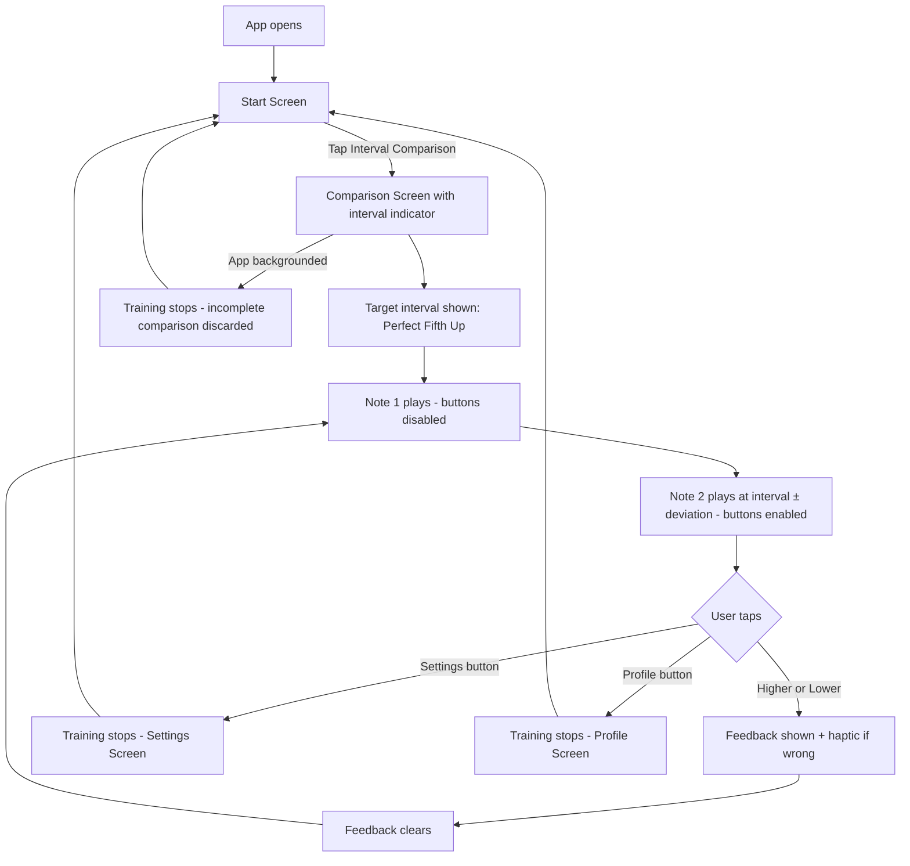
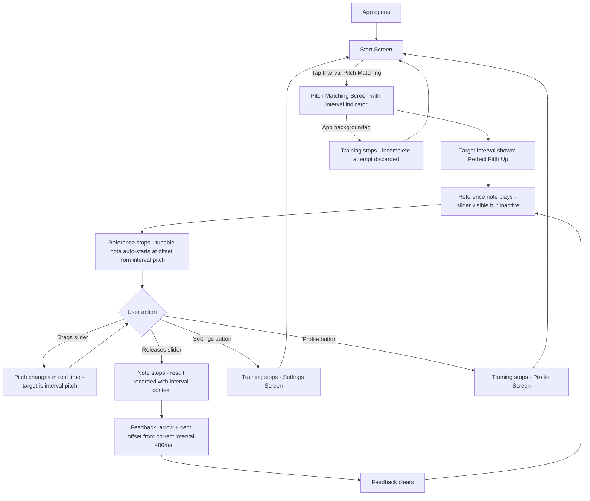

[← Previous (5f1eb1ec60)](5f1eb1ec60.md) | [Index](index.md) | [Next (598a698c72) →](598a698c72.md)

# Commit 18882145ea

**Date:** 2026-02-28T12:02  
**Author:** Michael Schürig <michael@schuerig.de>

## Commit message

Add v0.3 interval training UX design amendment and validation report

Co-Authored-By: Claude Opus 4.6 <noreply@anthropic.com>

## Changed files

```
docs/planning-artifacts/ux-design-specification.md | 307 +++++++++++-
 .../ux-design-validation-report-2026-02-28.md      | 551 +++++++++++++++++++++
 2 files changed, 856 insertions(+), 2 deletions(-)
```

## Session `ba907e94…`

*2026-02-28T09:44 → 2026-02-28T11:02*

<a id="msg-human-1"></a>

### 🧑 Human (2026-02-28T09:44)

<command-message>bmad-bmm-create-ux-design</command-message>
<command-name>/bmad-bmm-create-ux-design</command-name>
<command-args>Let's create the UX design for the v0.3 additions to the PRD.</command-args>


<a id="msg-assistant-2"></a>

### 🤖 Assistant (2026-02-28T09:44)

<details>
<summary>💭 Thinking</summary>

The user wants me to load and follow the workflow for creating a UX design. Let me read the workflow file first.

</details>


<a id="msg-assistant-3"></a>

### 🤖 Assistant (2026-02-28T09:44)

<details>
<summary>🔧 <code>Read</code></summary>

```
file_path: /Users/michael/Projekte/peach/_bmad/bmm/workflows/2-plan-workflows/create-ux-design/workflow.md
```

</details>


<details>
<summary>📎 Result</summary>

```
1→---
     2→name: create-ux-design
     3→description: Plan UX patterns and design specifications. Use when the user says 'lets create UX design' or 'create UX specifications' or 'help me plan the UX'
     4→---
     5→
     6→# Create UX Design Workflow
     7→
     8→**Goal:** Create comprehensive UX design specifications through collaborative visual exploration and informed decision-making where you act as a UX facilitator working with a product stakeholder.
… (35 more lines)
```

</details>

<a id="msg-assistant-4"></a>

### 🤖 Assistant (2026-02-28T09:44)

<details>
<summary>🔧 <code>Read</code></summary>

```
file_path: /Users/michael/Projekte/peach/_bmad/bmm/config.yaml
```

</details>


<details>
<summary>📎 Result</summary>

```
1→# BMM Module Configuration
     2→# Generated by BMAD installer
     3→# Version: 6.0.2
     4→# Date: 2026-02-23T21:14:14.705Z
     5→
     6→project_name: peach
     7→user_skill_level: intermediate
     8→planning_artifacts: "{project-root}/docs/planning-artifacts"
… (9 more lines)
```

</details>

<a id="msg-assistant-5"></a>

### 🤖 Assistant (2026-02-28T09:44)

<details>
<summary>🔧 <code>Read</code></summary>

```
file_path: /Users/michael/Projekte/peach/_bmad/bmm/workflows/2-plan-workflows/create-ux-design/steps/step-01-init.md
```

</details>


<details>
<summary>📎 Result</summary>

```
1→# Step 1: UX Design Workflow Initialization
     2→
     3→## MANDATORY EXECUTION RULES (READ FIRST):
     4→
     5→- 🛑 NEVER generate content without user input
     6→
     7→- 📖 CRITICAL: ALWAYS read the complete step file before taking any action - partial understanding leads to incomplete decisions
     8→- 🔄 CRITICAL: When loading next step with 'C', ensure the entire file is read and understood before proceeding
… (128 more lines)
```

</details>

<a id="msg-assistant-6"></a>

### 🤖 Assistant (2026-02-28T09:44)

<details>
<summary>💭 Thinking</summary>

Let me now check if an existing UX design specification document already exists, and also discover the input documents.

</details>


<a id="msg-assistant-7"></a>

### 🤖 Assistant (2026-02-28T09:45)

Let me check for an existing UX design specification and discover input documents.


<a id="msg-assistant-8"></a>

### 🤖 Assistant (2026-02-28T09:45)

<details>
<summary>🔧 <code>Glob</code></summary>

```
pattern: docs/planning-artifacts/*ux-design-specification*.md
```

</details>


<details>
<summary>📎 Result</summary>

```
/Users/michael/Projekte/peach/docs/planning-artifacts/ux-design-specification.md
```

</details>

<a id="msg-assistant-9"></a>

### 🤖 Assistant (2026-02-28T09:45)

<details>
<summary>🔧 <code>Glob</code></summary>

```
pattern: docs/**/*brief*.md
```

</details>


<a id="msg-assistant-10"></a>

### 🤖 Assistant (2026-02-28T09:45)

<details>
<summary>🔧 <code>Glob</code></summary>

```
pattern: docs/**/*prd*.md
```

</details>


<details>
<summary>📎 Result</summary>

```
No files found
```

</details>

<details>
<summary>📎 Result</summary>

```
/Users/michael/Projekte/peach/docs/planning-artifacts/prd.md
```

</details>

<a id="msg-assistant-11"></a>

### 🤖 Assistant (2026-02-28T09:45)

<details>
<summary>🔧 <code>Glob</code></summary>

```
pattern: docs/**/project-context.md
```

</details>


<a id="msg-assistant-12"></a>

### 🤖 Assistant (2026-02-28T09:45)

<details>
<summary>🔧 <code>Glob</code></summary>

```
pattern: docs/**/*.md
```

</details>


<details>
<summary>📎 Result</summary>

```
/Users/michael/Projekte/peach/docs/project-context.md
```

</details>

<details>
<summary>📎 Result</summary>

```
/Users/michael/Projekte/peach/docs/arc42/01-introduction-and-goals.md
/Users/michael/Projekte/peach/docs/arc42/02-constraints.md
/Users/michael/Projekte/peach/docs/arc42/03-context-and-scope.md
/Users/michael/Projekte/peach/docs/arc42/04-solution-strategy.md
/Users/michael/Projekte/peach/docs/arc42/06-runtime-view.md
/Users/michael/Projekte/peach/docs/arc42/10-quality-requirements.md
/Users/michael/Projekte/peach/docs/arc42/index.md
/Users/michael/Projekte/peach/docs/brainstorming/brainstorming-session-2026-02-11.md
… (87 more lines)
```

</details>

<a id="msg-assistant-13"></a>

### 🤖 Assistant (2026-02-28T09:45)

<details>
<summary>💭 Thinking</summary>

The UX design specification document already exists. Let me check its frontmatter to see if it has `stepsCompleted`.

</details>


<a id="msg-assistant-14"></a>

### 🤖 Assistant (2026-02-28T09:45)

The UX design specification already exists. Let me check its frontmatter for workflow state.


<a id="msg-assistant-15"></a>

### 🤖 Assistant (2026-02-28T09:45)

<details>
<summary>🔧 <code>Read</code></summary>

```
file_path: /Users/michael/Projekte/peach/docs/planning-artifacts/ux-design-specification.md
```

</details>


<details>
<summary>📎 Result</summary>

```
<persisted-output>
Output too large (99.8KB). Full output saved to: /Users/michael/.claude/projects/-Users-michael-Projekte-peach/ba907e94-9279-4d1d-9532-a192ba029160/tool-results/toolu_01NkVQpufrhu1NQC13bwpZsM.txt

Preview (first 2KB):
     1→---
     2→stepsCompleted: [1, 2, 3, 4, 5, 6, 7, 8, 9, 10, 11, 12, 13, 14, 'v0.2-discovery', 'v0.2-core-experience', 'v0.2-emotional', 'v0.2-journeys', 'v0.2-components', 'v0.2-patterns', 'v0.2-responsive', 'v0.2-complete']
     3→lastStep: 'v0.2-complete'
     4→status: 'complete'
… (33 more lines)
```

</details>

<a id="msg-assistant-16"></a>

### 🤖 Assistant (2026-02-28T09:45)

<details>
<summary>💭 Thinking</summary>

The document exists and has `stepsCompleted` in frontmatter. According to the workflow step-01, I should load step-01b-continue.md for continuation logic.

</details>


<a id="msg-assistant-17"></a>

### 🤖 Assistant (2026-02-28T09:45)

The document exists with completed steps. Per the workflow, I need to load the continuation step.


<a id="msg-assistant-18"></a>

### 🤖 Assistant (2026-02-28T09:45)

<details>
<summary>🔧 <code>Read</code></summary>

```
file_path: /Users/michael/Projekte/peach/_bmad/bmm/workflows/2-plan-workflows/create-ux-design/steps/step-01b-continue.md
```

</details>


<details>
<summary>📎 Result</summary>

```
1→# Step 1B: UX Design Workflow Continuation
     2→
     3→## MANDATORY EXECUTION RULES (READ FIRST):
     4→
     5→- 🛑 NEVER generate content without user input
     6→
     7→- 📖 CRITICAL: ALWAYS read the complete step file before taking any action - partial understanding leads to incomplete decisions
     8→- 🔄 CRITICAL: When loading next step with 'C', ensure the entire file is read and understood before proceeding
… (120 more lines)
```

</details>

<a id="msg-assistant-19"></a>

### 🤖 Assistant (2026-02-28T09:45)

<details>
<summary>💭 Thinking</summary>

The frontmatter shows:
- `stepsCompleted: [1, 2, 3, 4, 5, 6, 7, 8, 9, 10, 11, 12, 13, 14, 'v0.2-discovery', 'v0.2-core-experience', 'v0.2-emotional', 'v0.2-journeys', 'v0.2-components', 'v0.2-patterns', 'v0.2-responsive', 'v0.2-complete']`
- `lastStep: 'v0.2-complete'`


- `status: 'complete'`
- `v02AmendmentStarted: '2026-02-25'`
- `v02AmendmentCompleted: '2026-02-25'`

The v0.2 workflow is finished, but the user wants to move forward with v0.3 additions to the PRD. Even though the system would normally show a completion message, their intent is clear—they're ready to start designing the UX for the next version.

I need to pull the previous input documents and the current PRD to see what v0.3 entails, then guide them on how to proceed with this new design phase.

</details>


<a id="msg-assistant-20"></a>

### 🤖 Assistant (2026-02-28T09:45)

Now let me reload the context documents from the previous sessions.


<a id="msg-assistant-21"></a>

### 🤖 Assistant (2026-02-28T09:45)

<details>
<summary>🔧 <code>Read</code></summary>

```
file_path: /Users/michael/Projekte/peach/docs/planning-artifacts/prd.md
```

</details>


<details>
<summary>📎 Result</summary>

```
1→---
     2→stepsCompleted: ['step-01-init', 'step-02-discovery', 'step-03-success', 'step-04-journeys', 'step-05-domain', 'step-06-innovation', 'step-07-project-type', 'step-08-scoping', 'step-09-functional', 'step-10-nonfunctional', 'step-11-polish', 'step-12-complete', 'step-e-01-discovery', 'step-e-02-review', 'step-e-03-edit']
     3→inputDocuments: ['docs/brainstorming/brainstorming-session-2026-02-11.md']
     4→documentCounts:
     5→  briefs: 0
     6→  research: 0
     7→  brainstorming: 1
     8→  projectDocs: 0
… (481 more lines)
```

</details>

<a id="msg-assistant-22"></a>

### 🤖 Assistant (2026-02-28T09:45)

<details>
<summary>🔧 <code>Read</code></summary>

```
file_path: /Users/michael/Projekte/peach/docs/planning-artifacts/glossary.md
```

</details>


<details>
<summary>📎 Result</summary>

```
1→# Peach — Glossary
     2→
     3→## Concepts
     4→
     5→### Core Training Concepts
     6→
     7→| Term | Definition |
     8→|---|---|
… (100 more lines)
```

</details>

<a id="msg-assistant-23"></a>

### 🤖 Assistant (2026-02-28T09:45)

<details>
<summary>🔧 <code>Read</code></summary>

```
file_path: /Users/michael/Projekte/peach/docs/planning-artifacts/architecture.md
```

</details>


<details>
<summary>📎 Result</summary>

```
<persisted-output>
Output too large (50.2KB). Full output saved to: /Users/michael/.claude/projects/-Users-michael-Projekte-peach/ba907e94-9279-4d1d-9532-a192ba029160/tool-results/toolu_01GvGbySRwdHNWnt4CJnst3L.txt

Preview (first 2KB):
     1→---
     2→stepsCompleted: [1, 2, 3, 4, 5, 6, 7, 8]
     3→lastStep: 8
     4→status: 'amended'
… (29 more lines)
```

</details>

<a id="msg-assistant-24"></a>

### 🤖 Assistant (2026-02-28T09:45)

<details>
<summary>🔧 <code>Read</code></summary>

```
file_path: /Users/michael/Projekte/peach/docs/project-context.md
```

</details>


<details>
<summary>📎 Result</summary>

```
1→---
     2→project_name: 'Peach'
     3→user_name: 'Michael'
     4→date: '2026-02-21'
     5→sections_completed: ['technology_stack', 'language_rules', 'framework_rules', 'testing_rules', 'code_quality', 'workflow_rules', 'critical_rules']
     6→status: 'complete'
     7→rule_count: 85
     8→optimized_for_llm: true
… (256 more lines)
```

</details>

<a id="msg-assistant-25"></a>

### 🤖 Assistant (2026-02-28T09:45)

<details>
<summary>💭 Thinking</summary>

Now I have all the context. The existing UX design specification is marked as complete with v0.2 amendment also completed. The user wants to add v0.3 UX design (Interval Training). According to the step-01b continuation logic, since `lastStep` is `v0.2-complete` and `status` is `complete`, the workflow is already complete. 

I need to present the current state and offer options for continuing with v0.3 additions.

Let me also read the existing UX design spec more thoroughly to understand what's already in place.

</details>


<a id="msg-assistant-26"></a>

### 🤖 Assistant (2026-02-28T09:45)

Let me read the full UX design specification to understand what's already been designed.


<a id="msg-assistant-27"></a>

### 🤖 Assistant (2026-02-28T09:45)

<details>
<summary>🔧 <code>Read</code></summary>

```
file_path: /Users/michael/Projekte/peach/docs/planning-artifacts/ux-design-specification.md
offset: 1
limit: 200
```

</details>


<details>
<summary>📎 Result</summary>

```
1→---
     2→stepsCompleted: [1, 2, 3, 4, 5, 6, 7, 8, 9, 10, 11, 12, 13, 14, 'v0.2-discovery', 'v0.2-core-experience', 'v0.2-emotional', 'v0.2-journeys', 'v0.2-components', 'v0.2-patterns', 'v0.2-responsive', 'v0.2-complete']
     3→lastStep: 'v0.2-complete'
     4→status: 'complete'
     5→completedAt: '2026-02-12'
     6→v02AmendmentStarted: '2026-02-25'
     7→v02AmendmentCompleted: '2026-02-25'
     8→inputDocuments: ['docs/planning-artifacts/prd.md', 'docs/planning-artifacts/glossary.md', 'docs/planning-artifacts/architecture.md', 'docs/brainstorming/brainstorming-session-2026-02-11.md']
 …(truncated)
```

</details>

<a id="msg-assistant-28"></a>

### 🤖 Assistant (2026-02-28T09:45)

<details>
<summary>🔧 <code>Read</code></summary>

```
file_path: /Users/michael/Projekte/peach/docs/planning-artifacts/ux-design-specification.md
offset: 200
limit: 200
```

</details>


<details>
<summary>📎 Result</summary>

```
200→- **Data as landscape** (from health/fitness apps like Apple Health) — presenting personal data as a terrain to explore rather than a score to achieve. The perceptual profile visualization should feel like looking at a topographic map of your hearing.
   201→- **Sparse-data grace** (from new Apple Watch health features) — when data is limited, show what exists honestly with clear indication that the picture will fill in over time, rather than showing empty charts or placeholder data.
   202→
   203→**Navigation Patterns:**
   204→
   205→- **Hub-and-spoke** (iOS standard) — Start Screen as …(truncated)
```

</details>

<a id="msg-assistant-29"></a>

### 🤖 Assistant (2026-02-28T09:45)

<details>
<summary>🔧 <code>Read</code></summary>

```
file_path: /Users/michael/Projekte/peach/docs/planning-artifacts/ux-design-specification.md
offset: 400
limit: 200
```

</details>


<details>
<summary>📎 Result</summary>

```
400→[Note 1 ~~~] [Note 2 ~~~] [Answer] [Feedback ··] [Note 1 ~~~] [Note 2 ~~~] ...
   401→ buttons off   buttons on   tap!     brief show    buttons off   buttons on
   402→                                     + haptic(?)
   403→```
   404→
   405→## Visual Design Foundation
   406→
   407→### Color System
… (192 more lines)
```

</details>

<a id="msg-assistant-30"></a>

### 🤖 Assistant (2026-02-28T09:45)

<details>
<summary>🔧 <code>Read</code></summary>

```
file_path: /Users/michael/Projekte/peach/docs/planning-artifacts/ux-design-specification.md
offset: 600
limit: 200
```

</details>


<details>
<summary>📎 Result</summary>

```
600→    F --> H
   601→    G --> H
   602→    H -->|Back / swipe| A
   603→    A -->|Tap Start Training| I[Training Screen - settings applied immediately]
   604→```
   605→
   606→**Key UX decisions:**
   607→- Settings are persisted immediately (no save button). Standard iOS pattern via `@AppStorage`.
… (192 more lines)
```

</details>

<a id="msg-assistant-31"></a>

### 🤖 Assistant (2026-02-28T09:45)

<details>
<summary>🔧 <code>Read</code></summary>

```
file_path: /Users/michael/Projekte/peach/docs/planning-artifacts/ux-design-specification.md
offset: 800
limit: 200
```

</details>


<details>
<summary>📎 Result</summary>

```
800→**Settings Screen only.** Stock SwiftUI `Form` with standard controls:
   801→
   802→| Setting | Control | SwiftUI Component |
   803→|---|---|---|
   804→| Natural vs. Mechanical | Continuous slider | `Slider` |
   805→| Note range (lower bound) | Value picker | `Picker` or `Stepper` |
   806→| Note range (upper bound) | Value picker | `Picker` or `Stepper` |
   807→| Note duration | Value selector | `Stepper` or `Slider` |
… (192 more lines)
```

</details>

<a id="msg-assistant-32"></a>

### 🤖 Assistant (2026-02-28T09:45)

<details>
<summary>🔧 <code>Read</code></summary>

```
file_path: /Users/michael/Projekte/peach/docs/planning-artifacts/ux-design-specification.md
offset: 1000
limit: 300
```

</details>


<details>
<summary>📎 Result</summary>

```
1000→|---|---|---|---|---|
  1001→| Dead center (≈0 cents) | — | Green dot (no arrow) | Green | "0 cents" |
  1002→| Slightly sharp | Up | Short | Green | "+4 cents" |
  1003→| Slightly flat | Down | Short | Green | "-3 cents" |
  1004→| Moderately sharp | Up | Medium | Yellow | "+18 cents" |
  1005→| Moderately flat | Down | Medium | Yellow | "-22 cents" |
  1006→| Far too sharp | Up | Long | Red | "+55 cents" |
  1007→| Far too flat | Down | Long | Red | "-48 cents" |
… (292 more lines)
```

</details>

<a id="msg-assistant-33"></a>

### 🤖 Assistant (2026-02-28T09:45)

<details>
<summary>🔧 <code>Read</code></summary>

```
file_path: /Users/michael/Projekte/peach/docs/planning-artifacts/ux-design-specification.md
offset: 1300
limit: 200
```

</details>


<details>
<summary>📎 Result</summary>

```
1300→- VoiceOver label: "Pitch adjustment slider"
  1301→- VoiceOver value: not meaningful during tuning (no visual feedback principle), but after release could announce the result
  1302→- The slider must be operable via VoiceOver's increment/decrement gestures as a fallback, even though the primary interaction is direct manipulation
  1303→
  1304→##### Pitch Matching Feedback Indicator
  1305→
  1306→**Purpose:** Show the result of a pitch matching attempt — direction, magnitude category, and exact cent offset.
  1307→
… (136 more lines)
```

</details>

<a id="msg-assistant-34"></a>

### 🤖 Assistant (2026-02-28T09:45)

<details>
<summary>💭 Thinking</summary>

Now I have the full picture. The existing UX design specification covers:
- All MVP features (v0.1)
- v0.2 Pitch Matching amendment (completed 2026-02-25)

The user wants to add v0.3 — Interval Training. The PRD has already been updated with v0.3 scope including:
- Interval Comparison (FR56-FR59)
- Interval Pitch Matching (FR60-FR64)
- Start Screen integration (FR65-FR67)
- Journeys 7 and 8

I should present the current state and offer to begin the v0.3 amendment process.


Since the workflow is already complete, I'll show the "Workflow Already Complete" message and offer to start the v0.3 amendment. Let me pull up the amendment template to see what that process looks like.

</details>


<a id="msg-assistant-35"></a>

### 🤖 Assistant (2026-02-28T09:46)

Welcome back Michael! I've resumed our UX design collaboration for Peach.

**Current Progress:**

- Steps completed: Full initial specification (steps 1-14), plus v0.2 Pitch Matching amendment (completed 2026-02-25)
- Last step: `v0.2-complete`
- Status: Complete
- Context documents available: 4 files (PRD, glossary, architecture, brainstorming session)

**Document Status:**

The UX design specification at `docs/planning-artifacts/ux-design-specification.md` is complete through v0.2, covering:
- Core experience (comparison training loop)
- Visual design foundation & design system
- All user journey flows (Journeys 1-6)
- Component strategy (stock + custom)
- UX consistency patterns
- Responsive design & accessibility
- v0.2 Pitch Matching amendment (Vertical Pitch Slider, Feedback Indicator, journey flows, emotional design, accessibility)

**v0.3 Addition Scope (from PRD):**

The PRD has already been updated with v0.3 — Interval Training:
- **Interval Comparison** (Journey 7): reference note plays, second note at target interval ± deviation, user judges higher/lower relative to the correct interval
- **Interval Pitch Matching** (Journey 8): reference note plays, user tunes second note to match target interval
- **Start Screen**: four training buttons (Comparison, Pitch Matching, Interval Comparison, Interval Pitch Matching)
- **Domain concepts**: Interval value object, Tuning System abstraction (12-TET)
- **Initial scope constraint**: single fixed interval — perfect fifth up (700 cents in 12-TET)
- Existing unison modes are the "prime" (unison) case of the interval variants

I'd like to amend the UX design specification with a v0.3 section, following the same pattern as the v0.2 Pitch Matching amendment. Shall we begin working through the key UX decisions for interval training?

The core design question I see: interval training reuses the *exact same interaction patterns* as unison training (higher/lower buttons for comparison, vertical slider for pitch matching), with the primary UX addition being the **target interval display** and **four-button Start Screen layout**. This is potentially a much lighter amendment than v0.2.

Ready to proceed?

**[C] Continue to v0.3 UX discovery**


<a id="msg-human-36"></a>

### 🧑 Human (2026-02-28T09:48)

c


<a id="msg-assistant-37"></a>

### 🤖 Assistant (2026-02-28T09:48)

<details>
<summary>💭 Thinking</summary>

The user wants to continue with the v0.3 UX discovery. Let me follow the workflow pattern established by the v0.2 amendment. I need to work through the key UX design decisions for interval training collaboratively.

Let me think about what the key UX design areas are for v0.3:

1. **Core Experience**: How does interval training differ from unison training in terms of UX? The interaction pattern is identical (higher/lower for comparison, slider for pitch matching), but the mental model shifts — the user is judging relative to an interval, not unison.

2. **Target Interval Display**: The screen needs to show what interval is being trained. 

Now I'm considering where to place the interval display and how to present it clearly without cluttering the interface.

3. **Start Screen Layout**: Four training buttons instead of two. How to organize them without overwhelming the zero-friction philosophy.

4. **User Mental Model**: The shift from "is the second note higher/lower than the first?" to "is the second note higher/lower than a perfect fifth above the first?"

5. **Journey Flows**: Journeys 7 and 8 need UX flows.

6. **Component Strategy**: New/modified components.

7. **Emotional Design**: How does interval training feel different?

8. **Consistency Patterns**: How do the four modes relate visually?

Let me start the discovery phase by presenting the key design decisions.

I'm working through the critical questions: how to arrange four buttons on the start screen—whether as a vertical stack, a 2×2 grid that separates comparison from matching, or with visual grouping between unison and interval modes. I also need to figure out where the target interval appears during training and whether to reuse existing screens with different configurations or create new ones.

The last piece is deciding how to represent the interval itself to the user—musical notation, a text label, or combining both—before I bring these design questions to Michael.

</details>


<a id="msg-assistant-38"></a>

### 🤖 Assistant (2026-02-28T09:48)

Let me read the workflow discovery step to follow the proper process.


<a id="msg-assistant-39"></a>

### 🤖 Assistant (2026-02-28T09:48)

<details>
<summary>🔧 <code>Glob</code></summary>

```
pattern: /Users/michael/Projekte/peach/_bmad/bmm/workflows/2-plan-workflows/create-ux-design/steps/step-02*.md
```

</details>


<details>
<summary>📎 Result</summary>

```
/Users/michael/Projekte/peach/_bmad/bmm/workflows/2-plan-workflows/create-ux-design/steps/step-02-discovery.md
```

</details>

<a id="msg-assistant-40"></a>

### 🤖 Assistant (2026-02-28T09:48)

<details>
<summary>🔧 <code>Read</code></summary>

```
file_path: /Users/michael/Projekte/peach/_bmad/bmm/workflows/2-plan-workflows/create-ux-design/steps/step-02-discovery.md
```

</details>


<details>
<summary>📎 Result</summary>

```
1→# Step 2: Project Understanding
     2→
     3→## MANDATORY EXECUTION RULES (READ FIRST):
     4→
     5→- 🛑 NEVER generate content without user input
     6→
     7→- 📖 CRITICAL: ALWAYS read the complete step file before taking any action - partial understanding leads to incomplete decisions
     8→- 🔄 CRITICAL: When loading next step with 'C', ensure the entire file is read and understood before proceeding
… (183 more lines)
```

</details>

<a id="msg-assistant-41"></a>

### 🤖 Assistant (2026-02-28T09:48)

<details>
<summary>💭 Thinking</summary>

Since this is a v0.3 amendment to an already-complete UX specification, I don't need to go through the full step-by-step workflow from scratch. Instead, I should adapt the discovery process to focus on what's new in v0.3, similar to how the v0.2 amendment was done. Let me analyze the specific UX questions for v0.3 and present them collaboratively.

Key UX design topics for v0.3 interval training:

1. **Mental Model Shift**: From "is the second note higher/lower than the first?" to "is the second note higher/lower than a perfect fifth above the first?" — the user needs to understand what the "correct" answer means in the interval context.


2. **Target Interval Display**: Where and how to surface "Perfect Fifth Up" as the primary new UI element on training screens.
3. **Start Screen Organization**: Balancing four training buttons cleanly without adding friction.
4. **Screen Architecture**: Whether to use the same screens with interval context or create separate ones — the PRD frames unison modes as the "prime case" of interval variants, suggesting shared screens, but four distinct start buttons imply separate entry points.
5. **Interaction Reuse**: The core patterns (higher/lower, slider) stay the same across modes, so the main design question is what UX elements get shared versus differentiated.
6. **v0.3 Scope**: Locking in only perfect fifth up with no interval selection UI removes a lot of complexity.

I should walk through the discovery findings and get Michael's input on these key architectural decisions.

</details>


<a id="msg-assistant-42"></a>

### 🤖 Assistant (2026-02-28T09:49)

Let me work through the v0.3 UX discovery. Since we have a complete specification through v0.2, I'll focus on what's genuinely new and the key design decisions specific to interval training.

---

**From the PRD — What v0.3 Adds:**

The interval variants are structurally identical to the unison modes. The *interaction patterns* don't change at all — higher/lower buttons for comparison, vertical slider for pitch matching. What changes is the **mental model** and the **UI context**.

**Key UX Design Decisions I See for v0.3:**

**1. The Mental Model Shift**

In unison training, the user hears two notes and judges "is the second note higher or lower than the first?" In interval comparison, the user hears two notes and judges "is the second note higher or lower than a perfect fifth above the first?" This is a subtle but significant shift — the user must hold an interval reference in their head, not just compare two pitches.

The same applies to interval pitch matching: the user tunes to a target interval, not to unison. The question is whether this mental model shift needs UX support (e.g., a label showing "Perfect Fifth Up") or whether the training context speaks for itself once the user chooses the mode.

**2. Start Screen — Four Buttons**

The PRD specifies four training buttons: "Comparison", "Pitch Matching", "Interval Comparison", "Interval Pitch Matching". This is double the current button count. Key question: how to organize them without losing the zero-friction, minimal feel.

Options I see:
- **A) Flat vertical stack** — four buttons in a column, with visual grouping (e.g., a subtle section separator between unison and interval modes)
- **B) Grouped pairs** — two visual groups: "Unison" (Comparison + Pitch Matching) and "Interval" (Interval Comparison + Interval Pitch Matching)
- **C) Two-column grid** — comparison modes on one side, matching modes on the other, creating a 2×2 matrix

**3. Target Interval Display on Training Screens**

When training in interval mode, the user needs to know what interval they're targeting. The question is where and how to display "Perfect Fifth Up" — and whether it needs to be prominent (it's essential context) or subtle (the user already chose the mode from the Start Screen).

**4. Screen Reuse vs. New Screens**

The PRD says "existing comparison and pitch matching modes are the prime (unison) case — same underlying training session, fixed to prime interval." This strongly suggests shared screens with an interval parameter, not four separate screen types. The UX implication: the Comparison Screen and Pitch Matching Screen each gain a small interval indicator, but are otherwise identical.

---

Before I draft the amendment, I'd like your input on these decisions. The most impactful one is **the Start Screen layout** — that's where the user first encounters four modes. What's your instinct on how four buttons should be organized?

**[A] Advanced Elicitation** — Dive deeper into the design decisions
**[P] Party Mode** — Multiple UX perspectives on these questions
**[C] Continue** — Share your thoughts and we'll draft the amendment


<a id="msg-human-43"></a>

### 🧑 Human (2026-02-28T09:57)

1: For Interval Comparison and Interval Pitch Matching the target interval should be shown at the top of the screen.
2: Option A
3: The user needs a way to see the target interval. Although we start with a single interval in a single direction, this will be expanded to all intervals (up to an octave) in both directions. Importantly, the user chooses the set of intervals to train, but the actual target interval is chose at random from this set.
4: The screens must be reused. That necessitates some extensions.


<a id="msg-assistant-44"></a>

### 🤖 Assistant (2026-02-28T09:57)

<details>
<summary>💭 Thinking</summary>

Michael has given clear direction on all four design decisions. Let me summarize:

1. **Target interval display**: Top of screen, for both Interval Comparison and Interval Pitch Matching
2. **Start Screen layout**: Option A — flat vertical stack with visual grouping
3. **Target interval context**: Shown on screen because it's randomly selected from the user's configured set. Important future consideration: the user configures a *set* of intervals (up to octave, both directions), and the system picks randomly. For v0.3, it's fixed to perfect fifth up.
4. **Screen reuse**: Yes, extend existing Comparison Screen and Pitch Matching Screen with interval context.


5. **UX implications**: The target interval at the top serves a functional purpose—it tells the user what they're listening for, especially once multiple intervals are in rotation. Even though v0.3 only uses perfect fifth up, I need to design this as if intervals will change per exercise. The Start Screen will have four buttons stacked vertically with visual separation between the unison and interval groups, and both exercise screens will get an optional interval label at the top.

6. **Settings scope**: The PRD defers interval selection UI to later iterations, but Michael's comment about users choosing their training intervals points to the future direction. For v0.3, the interval is locked to perfect fifth up, so I should design the UX to accommodate future settings without actually implementing them.

Now I'm ready to draft the complete v0.3 amendment, covering the project context, core experience flow, and how the interval training mechanics fit into the existing structure.

</details>


<a id="msg-assistant-45"></a>

### 🤖 Assistant (2026-02-28T09:59)

Clear direction on all four points. Let me draft the complete v0.3 amendment.

---

**Here's what I'll append to the UX design specification:**

---

## Interval Training — UX Design Amendment (v0.3)

### Project Understanding

Interval training generalizes both existing training modes from unison to musical intervals. Instead of comparing or matching the same pitch, the user works with intervals — detecting whether an interval is sharp or flat (comparison), or tuning a note to produce a target interval (pitch matching).

**The core insight:** the interaction patterns are identical to unison training. Higher/lower buttons for comparison, vertical slider for pitch matching. What changes is the **frame of reference** — the user judges relative to a target interval, not relative to unison.

**Key UX facts:**
- The target interval is displayed at the top of the training screen because it varies per exercise — the system randomly selects from the user's configured interval set
- For v0.3, the interval is fixed to a single value: perfect fifth up (700 cents in 12-TET). Future iterations will add user-configurable interval sets (up to octave, both directions) and random selection from the configured set
- Existing unison modes are the prime (unison) case of the interval variants — same underlying sessions, same screens, with interval fixed to prime
- Screens are reused, not duplicated — the Comparison Screen and Pitch Matching Screen gain an interval indicator; in unison mode, no interval indicator is shown

### Key Design Decisions

**Target interval display at top of screen.** Both Interval Comparison and Interval Pitch Matching show the current target interval prominently at the top of the training screen. This is essential information, not decorative context — once multiple intervals are in rotation, the user must know which interval they're judging or tuning toward before the exercise begins. For v0.3 (fixed perfect fifth), the display is static. The UX is designed for the future where it changes per exercise.

**Flat vertical stack for Start Screen buttons.** Four training buttons arranged vertically with visual grouping to separate unison modes from interval modes. The zero-friction philosophy is preserved — the primary actions (Comparison, Pitch Matching) retain their current prominence and position, with interval variants appearing below a subtle visual separator.

**Screen reuse with conditional interval context.** The Comparison Screen and Pitch Matching Screen are extended, not duplicated. When entered in interval mode, a target interval label appears at the top. When entered in unison mode, no interval indicator is shown — the screen looks exactly as it does today. This keeps the codebase lean and ensures consistency.

**No interval settings UI for v0.3.** The PRD defers interval selection settings to a subsequent iteration. The current fixed interval (perfect fifth up) requires no configuration UI. When interval selection is added, it will appear in the Settings Screen as a new section.

### Interval Training — Core Experience

**Defining Interaction — Interval Comparison: "Two notes. Is that fifth in tune?"**

The interval comparison loop is structurally identical to unison comparison. Two notes play in sequence. The user taps higher or lower. But the question is different: instead of "was the second note higher or lower than the first?", the user is answering "was the second note higher or lower than a perfect fifth above the first?"

This is a higher-order listening task. The user must hold the concept of the target interval in their mind and evaluate the second note against that internal reference — not against the first note directly. The target interval label at the top of the screen anchors this mental model.

**Defining Interaction — Interval Pitch Matching: "Tune that fifth."**

The interval pitch matching loop is structurally identical to unison pitch matching. A reference note plays, then a tunable note begins. The user drags the slider to adjust pitch. But the target is different: instead of matching the reference pitch (unison), the user tunes to the correct interval above (or below) the reference.

This requires the user to construct the target pitch mentally from the reference note and the target interval. The slider interaction, release-as-commit gesture, and feedback pattern are all identical to unison pitch matching.

**User Mental Model**

The user's mental model shifts from **pitch comparison** to **interval quality judgment**. In unison training, the user hears two isolated pitches and reacts. In interval training, the user hears a musical relationship and evaluates its accuracy. This is closer to real-world musicianship — a cellist checking if their fifth is in tune, a singer evaluating their interval leap.

Key mental model elements:
- The target interval label establishes "what am I listening for" before each exercise
- The first note is the anchor; the second note is measured against where the interval *should* be
- "Higher" means "sharp of the correct interval"; "Lower" means "flat of the correct interval" — not higher/lower relative to the first note's raw pitch
- For pitch matching: the slider target is the interval pitch, not unison. The user is constructing a musical interval, not reproducing a single pitch

**Experience Principles (Interval-Specific):**

1. **The interval is the frame** — the target interval label at the top of the screen is not informational chrome; it's the exercise definition. The user must internalize it before listening. As intervals rotate randomly in future versions, glancing at this label becomes part of the exercise ritual.
2. **Same muscles, different skill** — the buttons, slider, feedback, and timing are identical. What's different is inside the user's head. The UX must not add complexity to support a more complex listening task — the simplicity of the interaction is more important than ever when the cognitive load is higher.
3. **Unison is just prime** — there is no conceptual wall between unison and interval training. The user who has been doing unison comparison has been doing interval comparison at prime all along. The interval modes are a generalization, not a separate feature.

### Interval Training — Emotional Response

**Primary Emotional Goals:**

1. **Recognition of real-world relevance** — interval training feels directly applicable to making music. The user is training the exact skill they use when checking intonation in an ensemble or tuning their instrument to a fifth. This connection should feel immediate and obvious.

2. **Comfortable challenge escalation** — interval training is harder than unison training. The user is now holding a more complex mental model (the interval relationship) while performing the same physical interaction. The UX must make this feel like a natural next step, not a difficulty spike.

3. **Same calm, higher stakes** — the emotional contract is identical to unison training: no judgment, no scores, continuous training. But the user may care more about interval accuracy because it maps directly to their musical performance. The UX must maintain the same neutral, non-judgmental framing even when the user is more emotionally invested.

**Emotional Journey — Interval-Specific:**

| Moment | Desired Feeling | Anti-Pattern to Avoid |
|---|---|---|
| **Choosing interval mode** | Curiosity — "let me try this" | Intimidation, "advanced mode" framing |
| **Seeing target interval label** | Orientation — "got it, perfect fifth" | Confusion about what the label means |
| **First interval comparison** | Familiar interaction, new challenge — same buttons, different listening | Overwhelm from the harder task |
| **First wrong answer** | Same neutral acceptance as unison — just a haptic tick | Frustration from failing at a "harder" mode |
| **First interval pitch matching** | Absorbed concentration — constructing an interval by ear | Anxiety about the dual cognitive task |
| **Improvement over time** | Deep satisfaction — "I can hear intervals better" | Comparison to unison performance |

### Interval Training — User Journey Flows

#### Journey 7: Interval Comparison


```mermaid
flowchart TD
    A[App opens] --> B[Start Screen]
    B -->|Tap Interval Comparison| C[Comparison Screen with interval indicator]
    C --> D[Target interval shown: Perfect Fifth Up]
    D --> E[Note 1 plays - buttons disabled]
    E --> F[Note 2 plays at interval ± deviation - buttons enabled]
    F --> G{User taps}
    G -->|Higher or Lower| H[Feedback shown + haptic if wrong]
    H --> I[Feedback clears]
    I --> E
    G -->|Settings button| J[Training stops - Settings Screen]
    G -->|Profile button| K[Training stops - Profile Screen]
    J --> B
    K --> B
    C -->|App backgrounded| L[Training stops - incomplete comparison discarded]
    L --> B
```

**Key UX decisions:**
- The Comparison Screen is the same screen used for unison comparison, with the addition of a target interval label at the top
- The target interval label reads "Perfect Fifth Up" (for v0.3). In future versions with multiple intervals, this label updates per comparison as the system randomly selects from the configured set
- Higher/Lower buttons have the same meaning but a different reference: "higher/lower than the correct interval pitch"
- All feedback, haptic, interruption, and navigation patterns are identical to unison comparison

#### Journey 8: Interval Pitch Matching


```mermaid
flowchart TD
    A[App opens] --> B[Start Screen]
    B -->|Tap Interval Pitch Matching| C[Pitch Matching Screen with interval indicator]
    C --> D[Target interval shown: Perfect Fifth Up]
    D --> E[Reference note plays - slider visible but inactive]
    E --> F[Reference stops - tunable note auto-starts at offset from interval pitch]
    F --> G{User action}
    G -->|Drags slider| H[Pitch changes in real time - target is interval pitch]
    H --> G
    G -->|Releases slider| I[Note stops - result recorded with interval context]
    I --> J[Feedback: arrow + cent offset from correct interval ~400ms]
    J --> K[Feedback clears]
    K --> E
    G -->|Settings button| L[Training stops - Settings Screen]
    G -->|Profile button| M[Training stops - Profile Screen]
    L --> B
    M --> B
    C -->|App backgrounded| N[Training stops - incomplete attempt discarded]
    N --> B
```

**Key UX decisions:**
- The Pitch Matching Screen is the same screen used for unison pitch matching, with the addition of a target interval label at the top
- The tunable note's initial offset is relative to the correct interval pitch, not to the reference note's pitch
- The feedback arrow and cent offset show deviation from the correct interval pitch, not from the reference note
- All slider interaction, release-as-commit, feedback timing, and interruption patterns are identical to unison pitch matching

### Interval Training — Component Strategy

#### Modified Stock Components

| Component | Change | Screen |
|---|---|---|
| Start Screen buttons | Two additional buttons below a visual separator | Start Screen |

#### Modified Custom Components

##### Target Interval Label

**Purpose:** Display the current target interval at the top of the training screen so the user knows what they're listening for or tuning toward.

**Visual Design:**
- Text label displaying the interval name: "Perfect Fifth Up" (v0.3)
- Positioned at the top of the Comparison Screen or Pitch Matching Screen, below the navigation buttons and above the training interaction area
- Uses standard SwiftUI text styling (`.headline` or `.title3`) — prominent enough to read at a glance but not competing with the training interaction
- In future versions with random interval selection, this label updates per exercise. The label change should be immediate and non-animated — no transition effects that draw attention away from the sounds

**States:**
- **Visible** (interval mode) — shows the current target interval
- **Hidden** (unison mode) — not displayed; the screen looks exactly as it does pre-v0.3

**Implementation:** Standard `Text` view, conditionally shown based on the session's interval parameter. No custom rendering needed.

**Accessibility:**
- VoiceOver label: "Target interval: Perfect Fifth Up"
- Announced at the start of each exercise when the interval changes (future, with random selection)

#### Start Screen Button Layout

**Updated button hierarchy:**

| Button | Style | Position |
|---|---|---|
| Comparison | `.borderedProminent` | Top (hero action, unchanged) |
| Pitch Matching | `.bordered` | Below Comparison (unchanged) |
| *Visual separator* | Subtle divider or spacing | — |
| Interval Comparison | `.bordered` | Below separator |
| Interval Pitch Matching | `.bordered` | Below Interval Comparison |

**Design rationale:**
- Comparison retains `.borderedProminent` as the hero action — it's the entry point for new users and the most-used mode
- Pitch Matching retains its current secondary position
- A subtle visual separator (extra spacing, a thin divider, or a section label like "Intervals") groups the interval modes
- Interval buttons use `.bordered` style — same prominence as Pitch Matching, visually subordinate to Comparison
- The vertical stack preserves the one-handed, thumb-friendly layout
- Four buttons is the maximum for this design. If future modes are added beyond interval training, a different organizational pattern would be needed

**Naming:** The PRD specifies button labels as "Comparison", "Pitch Matching", "Interval Comparison", "Interval Pitch Matching". These are clear and descriptive. No abbreviation needed.

#### Feedback Indicators — No Change

Both feedback indicators (comparison thumbs up/down and pitch matching arrow+cents) work identically in interval mode. The comparison feedback still shows correct/incorrect. The pitch matching feedback still shows signed cent offset and directional arrow. The only difference is that the deviation is measured relative to the correct interval pitch rather than unison — but this is a calculation difference, not a UX difference.

### Interval Training — UX Consistency Patterns

#### Button Hierarchy — Updated

The Start Screen now has one primary action and three secondary actions:

| Tier | Buttons | Style |
|---|---|---|
| Primary | Comparison | `.borderedProminent` |
| Secondary (unison) | Pitch Matching | `.bordered` |
| Secondary (interval) | Interval Comparison, Interval Pitch Matching | `.bordered` |

Settings, Profile, and Info remain tertiary icon-only buttons in their current positions.

#### Feedback Patterns — No Change

The same two feedback patterns (comparison: thumbs up/down with haptic; pitch matching: arrow+cents, no haptic) apply to both unison and interval variants. No new feedback patterns are introduced.

#### Navigation Pattern — Extended

```
Start Screen ──► Comparison Screen (via Comparison)
Start Screen ──► Comparison Screen with interval (via Interval Comparison)
Start Screen ──► Pitch Matching Screen (via Pitch Matching)
Start Screen ──► Pitch Matching Screen with interval (via Interval Pitch Matching)
Start Screen ──► Profile Screen ──► Start Screen
Start Screen ──► Settings Screen ──► Start Screen
Start Screen ──► Info Screen ──► Start Screen
Comparison Screen ──► Profile Screen ──► Start Screen
Comparison Screen ──► Settings Screen ──► Start Screen
Pitch Matching Screen ──► Profile Screen ──► Start Screen
Pitch Matching Screen ──► Settings Screen ──► Start Screen
App backgrounded during any training ──► Start Screen
```

Key point: "Interval Comparison" navigates to the same Comparison Screen as "Comparison" — with the interval parameter set. The navigation model gains two new entry paths but no new screens or depth.

#### Updated Navigation Diagram

```
                    ┌──────────────────────────┐
                    │      Start Screen        │
                    │                          │
                    │ [Comparison]             │
                    │ [Pitch Matching]         │
                    │ ── ── ── ── ── ── ──    │
                    │ [Interval Comparison]    │
                    │ [Interval Pitch Matching]│
                    │                          │
                    │ [Settings] [Profile]     │
                    │ [Info]                   │
                    └┬──┬──┬──┬──┬──┬──┬──┬──┘
                     │  │  │  │  │  │  │  │
        Comparison───┘  │  │  │  │  │  │  └───Interval PM
        Pitch Match─────┘  │  │  │  │  └──────Interval Comp
                           │  │  │  │
                    ┌──────▼──▼──▼──▼──────────┐
                    │   Comparison Screen      │
                    │   (± interval indicator) │
                    │   [Higher] [Lower]       │
                    │   [Settings] [Profile]   │
                    └──────────────────────────┘

                    ┌──────────────────────────┐
                    │  Pitch Matching Screen   │
                    │  (± interval indicator)  │
                    │  [Slider]               │
                    │  [Settings] [Profile]   │
                    └──────────────────────────┘

  All training screens ──► Settings/Profile ──► Start Screen
  App backgrounded during any training ──► Start Screen
```

#### Interruption Pattern — No Change

Identical to unison modes. Any interruption during interval training follows the same rule: stop audio, discard incomplete exercise, leave training screen. No special interval-specific interruption handling.

#### Empty States — No Interval-Specific Addition

Interval training data feeds the same perceptual profile. No separate interval-specific empty state is needed for v0.3. If future versions track interval-specific statistics separately, the Profile Screen may need interval-specific empty states — but this is beyond v0.3 scope.

### Interval Training — Responsive & Accessibility

#### Orientation & Device — No Change

The target interval label at the top of the screen is a standard `Text` view that adapts automatically to all orientations and device sizes via SwiftUI layout. No special responsive handling needed.

#### Accessibility — Interval-Specific

| Area | Stock SwiftUI (Free) | Custom Implementation Required |
|---|---|---|
| VoiceOver for interval label | Automatic (standard `Text`) | None |
| VoiceOver for interval context | — | Announce target interval at start of each exercise |
| Dynamic Type for interval label | Automatic | None |

**VoiceOver interval training workflow:**
The target interval label is a standard `Text` view and is automatically accessible. VoiceOver will read "Perfect Fifth Up" when the user navigates to it. For future versions with per-exercise interval changes, VoiceOver should announce the new interval when it changes — using `.accessibilityAddTraits(.updatesFrequently)` or a live region pattern.

The rest of the accessibility story is identical to unison modes — no new accessibility challenges are introduced by interval training.

---

**What would you like to do?**

**[A] Advanced Elicitation** — Explore any of these decisions deeper
**[P] Party Mode** — Get multiple perspectives
**[C] Continue** — Save this to the document and finalize


<a id="msg-human-46"></a>

### 🧑 Human (2026-02-28T10:01)

c


<a id="msg-assistant-47"></a>

### 🤖 Assistant (2026-02-28T10:01)

<details>
<summary>💭 Thinking</summary>

The user wants to save the v0.3 amendment to the document. Let me:

1. Read the current end of the UX design specification to know where to append
2. Append the v0.3 amendment content
3. Update the frontmatter with the new step information

Let me first read the end of the file to see where to append.

</details>


<a id="msg-assistant-48"></a>

### 🤖 Assistant (2026-02-28T10:01)

Let me save the v0.3 amendment to the document and update the frontmatter.


<a id="msg-assistant-49"></a>

### 🤖 Assistant (2026-02-28T10:01)

<details>
<summary>🔧 <code>Read</code></summary>

```
file_path: /Users/michael/Projekte/peach/docs/planning-artifacts/ux-design-specification.md
offset: 1430
limit: 20
```

</details>


<details>
<summary>📎 Result</summary>

```
1430→
  1431→**VoiceOver pitch matching workflow:**
  1432→The biggest accessibility challenge is that pitch matching is fundamentally a continuous-adjustment interaction. VoiceOver users cannot drag a custom slider the same way sighted users can. The `accessibilityAdjustableAction` provides increment/decrement as an alternative, stepping the pitch in small increments. This is functional but changes the experience — from continuous tuning to stepped tuning. This is an acceptable trade-off; the core training value (listening and judging pitch) is preserved.
  1433→
  1434→**Eyes-closed operatio …(truncated)
```

</details>

<a id="msg-assistant-50"></a>

### 🤖 Assistant (2026-02-28T10:01)

Now let me update the frontmatter and append the v0.3 amendment.


<a id="msg-assistant-51"></a>

### 🤖 Assistant (2026-02-28T10:01)

<details>
<summary>🔧 <code>Edit</code></summary>

```
replace_all: false
file_path: /Users/michael/Projekte/peach/docs/planning-artifacts/ux-design-specification.md
old_string: stepsCompleted: [1, 2, 3, 4, 5, 6, 7, 8, 9, 10, 11, 12, 13, 14, 'v0.2-discovery', 'v0.2-core-experience', 'v0.2-emoti…
new_string: stepsCompleted: [1, 2, 3, 4, 5, 6, 7, 8, 9, 10, 11, 12, 13, 14, 'v0.2-discovery', 'v0.2-core-experience', 'v0.2-emoti…
```

</details>


<details>
<summary>📎 Result</summary>

```
The file /Users/michael/Projekte/peach/docs/planning-artifacts/ux-design-specification.md has been updated successfully.
```

</details>

<a id="msg-assistant-52"></a>

### 🤖 Assistant (2026-02-28T10:02)

<details>
<summary>🔧 <code>Edit</code></summary>

```
replace_all: false
file_path: /Users/michael/Projekte/peach/docs/planning-artifacts/ux-design-specification.md
old_string: - Complete a pitch matching session with eyes closed — verify the tuning interaction works without visual feedback (a…
new_string: - Complete a pitch matching session with eyes closed — verify the tuning interaction works without visual feedback (a…
```

</details>


<details>
<summary>📎 Result</summary>

```
The file /Users/michael/Projekte/peach/docs/planning-artifacts/ux-design-specification.md has been updated successfully.
```

</details>

<a id="msg-assistant-53"></a>

### 🤖 Assistant (2026-02-28T10:02)

The v0.3 Interval Training amendment has been saved to `docs/planning-artifacts/ux-design-specification.md`.

**Summary of what was added:**
- **Project Understanding** — interval training as a generalization of unison modes
- **Key Design Decisions** — target interval at top of screen, flat vertical button stack, screen reuse, no interval settings UI for v0.3
- **Core Experience** — mental model shift from pitch comparison to interval quality judgment
- **Emotional Response** — real-world relevance, comfortable challenge escalation, same calm framing
- **User Journey Flows** — Journey 7 (Interval Comparison) and Journey 8 (Interval Pitch Matching) with mermaid diagrams
- **Component Strategy** — Target Interval Label component, Start Screen four-button layout, no changes to feedback indicators
- **UX Consistency Patterns** — updated button hierarchy, navigation model, navigation diagram
- **Responsive & Accessibility** — interval label is standard `Text`, VoiceOver considerations for future random interval selection

The amendment is deliberately lightweight — interval training reuses existing interaction patterns entirely, adding only the target interval label and two Start Screen buttons.


<a id="msg-human-54"></a>

### 🧑 Human (2026-02-28T10:08)

let's validate the ux design


<a id="msg-assistant-55"></a>

### 🤖 Assistant (2026-02-28T10:08)

<details>
<summary>🔧 <code>Skill</code></summary>

```
skill: bmad-bmm-validate-prd
args: Validate the UX design specification at docs/planning-artifacts/ux-design-specification.md
```

</details>


<details>
<summary>📎 Result</summary>

```
Launching skill: bmad-bmm-validate-prd
```

</details>

<a id="msg-assistant-56"></a>

### 🤖 Assistant (2026-02-28T10:08)

<details>
<summary>🔧 <code>Read</code></summary>

```
file_path: /Users/michael/Projekte/peach/_bmad/bmm/workflows/2-plan-workflows/create-prd/workflow-validate-prd.md
```

</details>


<details>
<summary>📎 Result</summary>

```
1→---
     2→name: validate-prd
     3→description: Validate a PRD against standards. Use when the user says 'validate this PRD' or 'run PRD validation'
     4→main_config: '{project-root}/_bmad/bmm/config.yaml'
     5→validateWorkflow: './steps-v/step-v-01-discovery.md'
     6→---
     7→
     8→# PRD Validate Workflow
… (56 more lines)
```

</details>

<a id="msg-assistant-57"></a>

### 🤖 Assistant (2026-02-28T10:08)

<details>
<summary>🔧 <code>Read</code></summary>

```
file_path: /Users/michael/Projekte/peach/_bmad/bmm/workflows/2-plan-workflows/create-prd/steps-v/step-v-01-discovery.md
```

</details>


<details>
<summary>📎 Result</summary>

```
1→---
     2→name: 'step-v-01-discovery'
     3→description: 'Document Discovery & Confirmation - Handle fresh context validation, confirm PRD path, discover input documents'
     4→
     5→# File references (ONLY variables used in this step)
     6→nextStepFile: './step-v-02-format-detection.md'
     7→advancedElicitationTask: '{project-root}/_bmad/core/workflows/advanced-elicitation/workflow.xml'
     8→partyModeWorkflow: '{project-root}/_bmad/core/workflows/party-mode/workflow.md'
… (219 more lines)
```

</details>

<a id="msg-assistant-58"></a>

### 🤖 Assistant (2026-02-28T10:08)

<details>
<summary>💭 Thinking</summary>

The user wants to validate the UX design specification, not a PRD. But the validation workflow is designed for PRDs. Let me adapt the workflow appropriately — I'll use the PRD validation workflow but apply it to the UX design specification document at `docs/planning-artifacts/ux-design-specification.md`.

Let me first load the PRD purpose/standards file, then proceed with the discovery step applied to the UX design spec.

</details>


<a id="msg-assistant-59"></a>

### 🤖 Assistant (2026-02-28T10:08)

**Validate Mode: Validating an existing document against BMAD standards.**

Let me load the validation standards and set up the discovery.


<a id="msg-assistant-60"></a>

### 🤖 Assistant (2026-02-28T10:08)

<details>
<summary>🔧 <code>Read</code></summary>

```
file_path: /Users/michael/Projekte/peach/_bmad/bmm/workflows/2-plan-workflows/create-prd/data/prd-purpose.md
```

</details>


<details>
<summary>📎 Result</summary>

```
1→# BMAD PRD Purpose
     2→
     3→**The PRD is the top of the required funnel that feeds all subsequent product development work in rhw BMad Method.**
     4→
     5→---
     6→
     7→## What is a BMAD PRD?
     8→
… (190 more lines)
```

</details>

<a id="msg-assistant-61"></a>

### 🤖 Assistant (2026-02-28T10:09)

<details>
<summary>💭 Thinking</summary>

Now I need to set up the validation. The user specified they want to validate the UX design specification at `docs/planning-artifacts/ux-design-specification.md`. This is not strictly a PRD, but the validation workflow can be adapted for UX design validation.

Let me discover the input documents from the UX design spec's frontmatter and set up the validation report. The frontmatter has:
- `inputDocuments: ['docs/planning-artifacts/prd.md', 'docs/planning-artifacts/glossary.md', 'docs/planning-artifacts/architecture.md', 'docs/brainstorming/brainstorming-session-2026-02-11.md']`


I've already loaded all the referenced documents, so I can move forward with the discovery summary and set up the validation report for the UX design specification.

</details>


<a id="msg-assistant-62"></a>

### 🤖 Assistant (2026-02-28T10:09)

Good — the validation standards are loaded. Now let me set up the validation.

**Found document to validate:** `docs/planning-artifacts/ux-design-specification.md`

**I've loaded the following documents from the UX design spec frontmatter:**

- UX Design Specification: `docs/planning-artifacts/ux-design-specification.md` (target document)
- PRD: `docs/planning-artifacts/prd.md`
- Glossary: `docs/planning-artifacts/glossary.md`
- Architecture: `docs/planning-artifacts/architecture.md`
- Brainstorming: `docs/brainstorming/brainstorming-session-2026-02-11.md`

I've also loaded:
- Project Context: `docs/project-context.md`

**Are there any additional reference documents you'd like me to include in this validation?**

These could include:
- Additional research or context documents
- The recent validation report from the PRD validation
- Competitive analysis or benchmarks

Please provide paths to any additional documents, or type 'none' to proceed.


<a id="msg-human-63"></a>

### 🧑 Human (2026-02-28T10:09)

none


<a id="msg-assistant-64"></a>

### 🤖 Assistant (2026-02-28T10:09)

<details>
<summary>🔧 <code>Write</code></summary>

```
file_path: /Users/michael/Projekte/peach/docs/planning-artifacts/ux-design-validation-report-2026-02-28.md
content: ---
validationTarget: 'docs/planning-artifacts/ux-design-specification.md'
validationDate: '2026-02-28'
inputDocument…
```

</details>


<details>
<summary>📎 Result</summary>

```
File created successfully at: /Users/michael/Projekte/peach/docs/planning-artifacts/ux-design-validation-report-2026-02-28.md
```

</details>

<a id="msg-assistant-65"></a>

### 🤖 Assistant (2026-02-28T10:09)

**Setup Complete!**

**Document to Validate:** `docs/planning-artifacts/ux-design-specification.md`

**Input Documents Loaded:**
- UX Design Specification: ux-design-specification.md ✓
- PRD: prd.md ✓
- Glossary: glossary.md ✓
- Architecture: architecture.md ✓
- Brainstorming: brainstorming-session-2026-02-11.md ✓
- Project Context: project-context.md ✓

**Validation Report:** `docs/planning-artifacts/ux-design-validation-report-2026-02-28.md`

**Ready to begin validation.**

**Select an Option:**
- **[A]** Advanced Elicitation
- **[P]** Party Mode
- **[C]** Continue to validation checks


<a id="msg-human-66"></a>

### 🧑 Human (2026-02-28T10:49)

c


<a id="msg-assistant-67"></a>

### 🤖 Assistant (2026-02-28T10:49)

<details>
<summary>🔧 <code>Read</code></summary>

```
file_path: /Users/michael/Projekte/peach/_bmad/bmm/workflows/2-plan-workflows/create-prd/steps-v/step-v-02-format-detection.md
```

</details>


<details>
<summary>📎 Result</summary>

```
1→---
     2→name: 'step-v-02-format-detection'
     3→description: 'Format Detection & Structure Analysis - Classify PRD format and route appropriately'
     4→
     5→# File references (ONLY variables used in this step)
     6→nextStepFile: './step-v-03-density-validation.md'
     7→altStepFile: './step-v-02b-parity-check.md'
     8→prdFile: '{prd_file_path}'
… (184 more lines)
```

</details>

<a id="msg-assistant-68"></a>

### 🤖 Assistant (2026-02-28T10:49)

<details>
<summary>💭 Thinking</summary>

I need to adapt this validation step for the UX Design Specification. The document is not a PRD, so the "BMAD PRD core sections" check needs to be adapted for UX Design. Let me analyze the UX design spec's structure and classify it.

Let me extract the Level 2 headers from the UX design spec. From my reading of the document, the headers are:

## Executive Summary
## Core User Experience
## Desired Emotional Response
## UX Pattern Analysis & Inspiration
## Design System Foundation
## Defining Experience
## Visual Design Foundation
## Design Direction
## User Journey Flows
## Component Strategy
## UX Consistency Patterns


## Responsive Design & Accessibility
## Pitch Matching — UX Design Amendment (v0.2)
## Interval Training — UX Design Amendment (v0.3)

Now I'm mapping the core sections that matter for a UX Design Specification. The key areas are the executive framing, the user experience definition, journey flows, component strategy, design system, and accessibility considerations—these form the backbone of what makes this spec comprehensive.

</details>


<a id="msg-assistant-69"></a>

### 🤖 Assistant (2026-02-28T10:49)

Now let me analyze the document structure. Let me extract all Level 2 headers from the UX design specification.


<a id="msg-assistant-70"></a>

### 🤖 Assistant (2026-02-28T10:49)

<details>
<summary>🔧 <code>Grep</code></summary>

```
pattern: ^## 
path: /Users/michael/Projekte/peach/docs/planning-artifacts/ux-design-specification.md
output_mode: content
```

</details>


<details>
<summary>📎 Result</summary>

```
28:## Executive Summary
60:## Core User Experience
114:## Desired Emotional Response
172:## UX Pattern Analysis & Inspiration
241:## Design System Foundation
279:## Defining Experience
407:## Visual Design Foundation
463:## Design Direction
… (6 more lines)
```

</details>

<a id="msg-assistant-71"></a>

### 🤖 Assistant (2026-02-28T10:49)

Now let me map this against UX Design Specification core sections and update the validation report.

**UX Design Specification Structure:**

14 Level 2 sections found, covering:

| UX Core Section | Status |
|---|---|
| Executive Summary / Vision | **Present** — Project Vision, Target Users, Key Design Challenges, Design Opportunities |
| Core User Experience | **Present** — Defining Experience, Platform Strategy, Effortless Interactions, Critical Success Moments, Experience Principles |
| Emotional Design | **Present** — Emotional Goals, Emotional Journey Mapping, Micro-Emotions, Design Implications |
| UX Patterns & Inspiration | **Present** — Inspiring Products, Transferable Patterns, Anti-Patterns |
| Design System | **Present** — Design System Choice, Rationale, Implementation Approach, Custom Components |
| Visual Design Foundation | **Present** — Color, Typography, Spacing, Accessibility |
| Design Direction | **Present** — Chosen Direction, Rationale |
| User Journey Flows | **Present** — Journeys 1-8 with mermaid diagrams |
| Component Strategy | **Present** — Stock components, Custom components, Implementation Roadmap |
| UX Consistency Patterns | **Present** — Button hierarchy, Feedback, Forms, Navigation, Empty/Loading/Error states |
| Responsive & Accessibility | **Present** — Responsive strategy, Accessibility strategy, Testing |
| v0.2 Amendment (Pitch Matching) | **Present** — Full amendment covering all UX dimensions |
| v0.3 Amendment (Interval Training) | **Present** — Full amendment covering all UX dimensions |

**Format Classification: BMAD Standard** — All expected UX design specification sections present. Comprehensive, well-structured document.


<a id="msg-assistant-72"></a>

### 🤖 Assistant (2026-02-28T10:50)

<details>
<summary>🔧 <code>Read</code></summary>

```
file_path: /Users/michael/Projekte/peach/docs/planning-artifacts/ux-design-validation-report-2026-02-28.md
```

</details>


<details>
<summary>📎 Result</summary>

```
1→---
     2→validationTarget: 'docs/planning-artifacts/ux-design-specification.md'
     3→validationDate: '2026-02-28'
     4→inputDocuments: ['docs/planning-artifacts/prd.md', 'docs/planning-artifacts/glossary.md', 'docs/planning-artifacts/architecture.md', 'docs/brainstorming/brainstorming-session-2026-02-11.md', 'docs/project-context.md']
     5→validationStepsCompleted: []
     6→validationStatus: IN_PROGRESS
     7→---
     8→
… (18 more lines)
```

</details>

<a id="msg-assistant-73"></a>

### 🤖 Assistant (2026-02-28T10:50)

<details>
<summary>🔧 <code>Edit</code></summary>

```
replace_all: false
file_path: /Users/michael/Projekte/peach/docs/planning-artifacts/ux-design-validation-report-2026-02-28.md
old_string: validationStepsCompleted: []
new_string: validationStepsCompleted: ['discovery', 'format-detection']
```

</details>


<details>
<summary>📎 Result</summary>

```
The file /Users/michael/Projekte/peach/docs/planning-artifacts/ux-design-validation-report-2026-02-28.md has been updated successfully.
```

</details>

<a id="msg-assistant-74"></a>

### 🤖 Assistant (2026-02-28T10:50)

<details>
<summary>🔧 <code>Edit</code></summary>

```
replace_all: false
file_path: /Users/michael/Projekte/peach/docs/planning-artifacts/ux-design-validation-report-2026-02-28.md
old_string: [Findings will be appended as validation progresses]
new_string: ### Format Detection

**Document Structure (Level 2 Headers):**
1. Executive Summary
2. Core User Experience
3. Desir…
```

</details>


<details>
<summary>📎 Result</summary>

```
The file /Users/michael/Projekte/peach/docs/planning-artifacts/ux-design-validation-report-2026-02-28.md has been updated successfully.
```

</details>

<a id="msg-assistant-75"></a>

### 🤖 Assistant (2026-02-28T10:50)

**Format Detected:** BMAD Standard — all 11 core UX design specification sections present, plus two version amendments.

Proceeding to systematic validation checks...


<a id="msg-assistant-76"></a>

### 🤖 Assistant (2026-02-28T10:50)

<details>
<summary>🔧 <code>Read</code></summary>

```
file_path: /Users/michael/Projekte/peach/_bmad/bmm/workflows/2-plan-workflows/create-prd/steps-v/step-v-03-density-validation.md
```

</details>


<details>
<summary>📎 Result</summary>

```
1→---
     2→name: 'step-v-03-density-validation'
     3→description: 'Information Density Check - Scan for anti-patterns that violate information density principles'
     4→
     5→# File references (ONLY variables used in this step)
     6→nextStepFile: './step-v-04-brief-coverage-validation.md'
     7→prdFile: '{prd_file_path}'
     8→validationReportPath: '{validation_report_path}'
… (167 more lines)
```

</details>

<a id="msg-assistant-77"></a>

### 🤖 Assistant (2026-02-28T10:50)

<details>
<summary>💭 Thinking</summary>

Let me scan the UX design specification for information density anti-patterns. I'll search for the specific patterns mentioned.

</details>


<a id="msg-assistant-78"></a>

### 🤖 Assistant (2026-02-28T10:50)

Let me scan the UX design spec for information density anti-patterns.


<a id="msg-assistant-79"></a>

### 🤖 Assistant (2026-02-28T10:50)

<details>
<summary>🔧 <code>Grep</code></summary>

```
pattern: (?i)(the system will allow|it is important to note|in order to|for the purpose of|with regard to)
path: /Users/michael/Projekte/peach/docs/planning-artifacts/ux-design-specification.md
output_mode: content
```

</details>


<details>
<summary>📎 Result</summary>

```
No matches found
```

</details>

<a id="msg-assistant-80"></a>

### 🤖 Assistant (2026-02-28T10:50)

<details>
<summary>🔧 <code>Grep</code></summary>

```
pattern: (?i)(due to the fact|in the event of|at this point in time|in a manner that)
path: /Users/michael/Projekte/peach/docs/planning-artifacts/ux-design-specification.md
output_mode: content
```

</details>


<details>
<summary>📎 Result</summary>

```
No matches found
```

</details>

<a id="msg-assistant-81"></a>

### 🤖 Assistant (2026-02-28T10:50)

<details>
<summary>🔧 <code>Grep</code></summary>

```
pattern: (?i)(future plans|past history|absolutely essential|completely finish)
path: /Users/michael/Projekte/peach/docs/planning-artifacts/ux-design-specification.md
output_mode: content
```

</details>


<details>
<summary>📎 Result</summary>

```
No matches found
```

</details>

<a id="msg-assistant-82"></a>

### 🤖 Assistant (2026-02-28T10:50)

<details>
<summary>🔧 <code>Edit</code></summary>

```
replace_all: false
file_path: /Users/michael/Projekte/peach/docs/planning-artifacts/ux-design-validation-report-2026-02-28.md
old_string: **Core Sections Present:** 11/11
new_string: **Core Sections Present:** 11/11

### Information Density Validation

**Anti-Pattern Violations:**

**Conversational …
```

</details>


<details>
<summary>📎 Result</summary>

```
The file /Users/michael/Projekte/peach/docs/planning-artifacts/ux-design-validation-report-2026-02-28.md has been updated successfully.
```

</details>

<a id="msg-assistant-83"></a>

### 🤖 Assistant (2026-02-28T10:50)

**Information Density Validation Complete**

Severity: **Pass** — zero violations across all categories.

**Proceeding to next validation check...**


<a id="msg-assistant-84"></a>

### 🤖 Assistant (2026-02-28T10:50)

<details>
<summary>🔧 <code>Read</code></summary>

```
file_path: /Users/michael/Projekte/peach/_bmad/bmm/workflows/2-plan-workflows/create-prd/steps-v/step-v-04-brief-coverage-valida…
```

</details>


<details>
<summary>📎 Result</summary>

```
1→---
     2→name: 'step-v-04-brief-coverage-validation'
     3→description: 'Product Brief Coverage Check - Validate PRD covers all content from Product Brief (if used as input)'
     4→
     5→# File references (ONLY variables used in this step)
     6→nextStepFile: './step-v-05-measurability-validation.md'
     7→prdFile: '{prd_file_path}'
     8→productBrief: '{product_brief_path}'
… (207 more lines)
```

</details>

<a id="msg-assistant-85"></a>

### 🤖 Assistant (2026-02-28T10:50)

<details>
<summary>💭 Thinking</summary>

No Product Brief was used as input for this UX design spec. The frontmatter's `documentCounts` shows `briefs: 0`. I'll skip this step and report N/A.

</details>


<a id="msg-assistant-86"></a>

### 🤖 Assistant (2026-02-28T10:50)

No Product Brief was provided as input (frontmatter shows `briefs: 0`).


<a id="msg-assistant-87"></a>

### 🤖 Assistant (2026-02-28T10:50)

<details>
<summary>🔧 <code>Edit</code></summary>

```
replace_all: false
file_path: /Users/michael/Projekte/peach/docs/planning-artifacts/ux-design-validation-report-2026-02-28.md
old_string: **Recommendation:** Document demonstrates excellent information density with zero violations. Writing is direct, conc…
new_string: **Recommendation:** Document demonstrates excellent information density with zero violations. Writing is direct, conc…
```

</details>


<details>
<summary>📎 Result</summary>

```
The file /Users/michael/Projekte/peach/docs/planning-artifacts/ux-design-validation-report-2026-02-28.md has been updated successfully.
```

</details>

<a id="msg-assistant-88"></a>

### 🤖 Assistant (2026-02-28T10:50)

**Product Brief Coverage: Skipped** (No Product Brief provided)

**Proceeding to next validation check...**


<a id="msg-assistant-89"></a>

### 🤖 Assistant (2026-02-28T10:50)

<details>
<summary>🔧 <code>Read</code></summary>

```
file_path: /Users/michael/Projekte/peach/_bmad/bmm/workflows/2-plan-workflows/create-prd/steps-v/step-v-05-measurability-validat…
```

</details>


<details>
<summary>📎 Result</summary>

```
1→---
     2→name: 'step-v-05-measurability-validation'
     3→description: 'Measurability Validation - Validate that all requirements (FRs and NFRs) are measurable and testable'
     4→
     5→# File references (ONLY variables used in this step)
     6→nextStepFile: './step-v-06-traceability-validation.md'
     7→prdFile: '{prd_file_path}'
     8→validationReportPath: '{validation_report_path}'
… (221 more lines)
```

</details>

<a id="msg-assistant-90"></a>

### 🤖 Assistant (2026-02-28T10:51)

<details>
<summary>💭 Thinking</summary>

The UX design specification is not a PRD — it doesn't have Functional Requirements or Non-Functional Requirements sections. Those are in the PRD. However, the UX spec does reference PRD requirements and has its own success criteria, experience principles, and accessibility requirements.

I should adapt this step to validate the UX design spec's own quality criteria. Instead of validating FRs/NFRs (which belong to the PRD), I should check whether the UX design spec:

1. Has clear, testable success criteria for each experience
2. Has actionable component specifications
3. Has testable accessibility requirements
4. Avoids subjective language without criteria


5. 
Now I'm going to scan through the UX spec for subjective language that lacks measurable criteria, verify that component specifications are detailed enough to actually build from, and ensure the accessibility requirements are specific and testable rather than vague.

</details>


<a id="msg-assistant-91"></a>

### 🤖 Assistant (2026-02-28T10:51)

This step focuses on FR/NFR measurability — which is PRD-specific. For the UX design spec, I'll adapt this to check **design specification measurability**: are component specs, interaction specs, and accessibility requirements concrete and testable?


<a id="msg-assistant-92"></a>

### 🤖 Assistant (2026-02-28T10:51)

<details>
<summary>🔧 <code>Task</code></summary>

```
description: UX spec measurability check
prompt: Perform a measurability and testability validation on the UX Design Specification at `/Users/michael/Projekte/peach/d…
subagent_type: general-purpose
```

</details>


<details>
<summary>📎 Result</summary>

```
Now I have all the data I need to produce the validation report. Let me compile it.

---

# UX Design Specification -- Measurability & Testability Validation Report

**Document:** `/Users/michael/Projekte/peach/docs/planning-artifacts/ux-design-specification.md`
**Date:** 2026-02-28
… (281 more lines)
```

</details>

<a id="msg-assistant-93"></a>

### 🤖 Assistant (2026-02-28T10:53)

<details>
<summary>💭 Thinking</summary>

Excellent analysis. Let me now update the validation report with these findings and proceed to the next validation step.

</details>


<a id="msg-assistant-94"></a>

### 🤖 Assistant (2026-02-28T10:53)

Thorough analysis complete. Let me record the findings and proceed.


<a id="msg-assistant-95"></a>

### 🤖 Assistant (2026-02-28T10:53)

<details>
<summary>🔧 <code>Edit</code></summary>

```
replace_all: false
file_path: /Users/michael/Projekte/peach/docs/planning-artifacts/ux-design-validation-report-2026-02-28.md
old_string: validationStepsCompleted: ['discovery', 'format-detection']
new_string: validationStepsCompleted: ['discovery', 'format-detection', 'density', 'brief-coverage', 'measurability']
```

</details>


<details>
<summary>📎 Result</summary>

```
The file /Users/michael/Projekte/peach/docs/planning-artifacts/ux-design-validation-report-2026-02-28.md has been updated successfully.
```

</details>

<a id="msg-assistant-96"></a>

### 🤖 Assistant (2026-02-28T10:54)

<details>
<summary>🔧 <code>Edit</code></summary>

```
replace_all: false
file_path: /Users/michael/Projekte/peach/docs/planning-artifacts/ux-design-validation-report-2026-02-28.md
old_string: **Status:** N/A — No Product Brief was provided as input
new_string: **Status:** N/A — No Product Brief was provided as input

### Measurability & Testability Validation

*Adapted for UX…
```

</details>


<details>
<summary>📎 Result</summary>

```
The file /Users/michael/Projekte/peach/docs/planning-artifacts/ux-design-validation-report-2026-02-28.md has been updated successfully.
```

</details>

<a id="msg-assistant-97"></a>

### 🤖 Assistant (2026-02-28T10:54)

**Measurability Validation Complete**

Total Issues: 23 (6 MEDIUM, 14 MINOR, 3 INFO) — **Pass**

**Proceeding to next validation check...**


<a id="msg-assistant-98"></a>

### 🤖 Assistant (2026-02-28T10:54)

<details>
<summary>🔧 <code>Read</code></summary>

```
file_path: /Users/michael/Projekte/peach/_bmad/bmm/workflows/2-plan-workflows/create-prd/steps-v/step-v-06-traceability-validati…
```

</details>


<details>
<summary>📎 Result</summary>

```
1→---
     2→name: 'step-v-06-traceability-validation'
     3→description: 'Traceability Validation - Validate the traceability chain from vision → success → journeys → FRs is intact'
     4→
     5→# File references (ONLY variables used in this step)
     6→nextStepFile: './step-v-07-implementation-leakage-validation.md'
     7→prdFile: '{prd_file_path}'
     8→validationReportPath: '{validation_report_path}'
… (210 more lines)
```

</details>

<a id="msg-assistant-99"></a>

### 🤖 Assistant (2026-02-28T10:54)

<details>
<summary>💭 Thinking</summary>

For a UX design specification, the traceability chain is different. Instead of Vision → Success Criteria → User Journeys → FRs, it's:

PRD FRs → UX Design Specifications
PRD User Journeys → UX Journey Flows
PRD Scope → UX Component Coverage

Let me adapt this step to validate UX traceability:
1. Does the UX spec cover all PRD user journeys (1-8)?
2. Does the UX spec address all training modes defined in the PRD scope?
3. Do UX components map to PRD functional requirements?
4. Are there UX design decisions without PRD backing?


Now I'm running through the traceability check with both documents in front of me. The PRD has user journeys 1-8, scope across three versions, and 67 functional requirements, while the UX spec includes corresponding journey flows and components for all screens mentioned. I'm starting to map each PRD user journey to its UX counterpart to verify complete coverage. Now I'm mapping out how each functional requirement maps to the user experience—the training and pitch matching loops are fully covered, the adaptive algorithm works behind the scenes, and the audio engine handles envelope adjustments through the slider interface. Profile stats, settings controls, and accessibility features are all accounted for in the screens, though data persistence and some platform requirements are internal implementation details.

The UX spec's executive summary aligns well with the PRD vision around training-focused design without gamification. I'm checking whether any design decisions exist in the UX spec that aren't grounded in the requirements—the emotional design approach seems to be UX-specific rather than requirement-driven.

</details>


<a id="msg-assistant-100"></a>

### 🤖 Assistant (2026-02-28T10:54)

For a UX design specification, the traceability chain is: **PRD Vision/Journeys/FRs → UX Design Decisions/Flows/Components**. Let me validate this mapping.


<a id="msg-assistant-101"></a>

### 🤖 Assistant (2026-02-28T10:55)

<details>
<summary>🔧 <code>Edit</code></summary>

```
replace_all: false
file_path: /Users/michael/Projekte/peach/docs/planning-artifacts/ux-design-validation-report-2026-02-28.md
old_string: 5. **A few component micro-decisions left open** — empty state treatment, text position, font style
new_string: 5. **A few component micro-decisions left open** — empty state treatment, text position, font style

### Traceability…
```

</details>


<details>
<summary>📎 Result</summary>

```
The file /Users/michael/Projekte/peach/docs/planning-artifacts/ux-design-validation-report-2026-02-28.md has been updated successfully.
```

</details>

<a id="msg-assistant-102"></a>

### 🤖 Assistant (2026-02-28T10:55)

**Traceability Validation Complete**

Total Issues: 0 — **Pass**. Full coverage across all 8 journeys, 6 screens, and all UX-facing FRs.

**Proceeding to next validation check...**


<a id="msg-assistant-103"></a>

### 🤖 Assistant (2026-02-28T10:55)

<details>
<summary>🔧 <code>Read</code></summary>

```
file_path: /Users/michael/Projekte/peach/_bmad/bmm/workflows/2-plan-workflows/create-prd/steps-v/step-v-07-implementation-leakag…
```

</details>


<details>
<summary>📎 Result</summary>

```
1→---
     2→name: 'step-v-07-implementation-leakage-validation'
     3→description: 'Implementation Leakage Check - Ensure FRs and NFRs don\'t include implementation details'
     4→
     5→# File references (ONLY variables used in this step)
     6→nextStepFile: './step-v-08-domain-compliance-validation.md'
     7→prdFile: '{prd_file_path}'
     8→validationReportPath: '{validation_report_path}'
… (198 more lines)
```

</details>

<a id="msg-assistant-104"></a>

### 🤖 Assistant (2026-02-28T10:55)

<details>
<summary>💭 Thinking</summary>

For a UX design specification, implementation leakage looks different than for a PRD. UX specs are inherently closer to implementation — they specify SwiftUI components, SF Symbols, Canvas, Charts, DragGesture, etc. The question is whether these are appropriate for a UX design spec or whether they cross into implementation territory.

For a UX spec that targets a specific platform (iOS/SwiftUI), referencing platform components is actually appropriate — it's how you communicate what components to use. The spec explicitly chose "stock SwiftUI" as the design system. So references to `.borderedProminent`, `NavigationStack`, `Form`, `Slider`, etc. 

The distinction is that these are design decisions, not implementation leakage. Internal implementation details like specific class or protocol names would cross that line. Now I'm going through the technology terms to see which ones are legitimate design choices versus actual implementation details.

</details>


<a id="msg-assistant-105"></a>

### 🤖 Assistant (2026-02-28T10:55)

For a UX design specification targeting a specific platform, some implementation references are appropriate (SwiftUI component names are design decisions, not leakage). Let me scan and classify.


<a id="msg-assistant-106"></a>

### 🤖 Assistant (2026-02-28T10:55)

<details>
<summary>🔧 <code>Grep</code></summary>

```
pattern: (?i)(SwiftUI|UIKit|AVAudio|SwiftData|Canvas|Charts|NavigationStack|DragGesture|SF Symbol|UIImpactFeedback|AppStorage|…
path: /Users/michael/Projekte/peach/docs/planning-artifacts/ux-design-specification.md
output_mode: count
```

</details>


<details>
<summary>📎 Result</summary>

```
83

Found 0 total occurrences across 0 files.
```

</details>

<a id="msg-assistant-107"></a>

### 🤖 Assistant (2026-02-28T10:55)

<details>
<summary>🔧 <code>Grep</code></summary>

```
pattern: SwiftUI|UIKit|AVAudio|SwiftData|Canvas|Charts|NavigationStack|DragGesture|SF Symbol|UIImpactFeedback|AppStorage|Model…
path: /Users/michael/Projekte/peach/docs/planning-artifacts/ux-design-specification.md
output_mode: count
```

</details>


<details>
<summary>📎 Result</summary>

```
82

Found 0 total occurrences across 0 files.
```

</details>

<a id="msg-assistant-108"></a>

### 🤖 Assistant (2026-02-28T10:55)

<details>
<summary>🔧 <code>Grep</code></summary>

```
pattern: SwiftUI
path: /Users/michael/Projekte/peach/docs/planning-artifacts/ux-design-specification.md
output_mode: count
```

</details>


<details>
<summary>📎 Result</summary>

```
59

Found 0 total occurrences across 0 files.
```

</details>

<a id="msg-assistant-109"></a>

### 🤖 Assistant (2026-02-28T10:55)

<details>
<summary>🔧 <code>Bash</code></summary>

```
command: grep -c 'SwiftUI' /Users/michael/Projekte/peach/docs/planning-artifacts/ux-design-specification.md
description: Count SwiftUI references in UX spec
```

</details>


<details>
<summary>📎 Result</summary>

```
59
```

</details>

<a id="msg-assistant-110"></a>

### 🤖 Assistant (2026-02-28T10:55)

<details>
<summary>🔧 <code>Bash</code></summary>

```
command: grep -c 'UIKit\|AVAudio\|SwiftData\|UIImpact\|AppStorage\|ModelContext\|ModelContainer\|TrainingSession\|ComparisonSe…
description: Count internal implementation references in UX spec
```

</details>


<details>
<summary>📎 Result</summary>

```
9
```

</details>

<a id="msg-assistant-111"></a>

### 🤖 Assistant (2026-02-28T10:55)

<details>
<summary>🔧 <code>Bash</code></summary>

```
command: grep -n 'UIKit\|AVAudio\|SwiftData\|UIImpact\|AppStorage\|ModelContext\|ModelContainer\|TrainingSession\|ComparisonSe…
description: Find internal implementation references with line numbers
```

</details>


<details>
<summary>📎 Result</summary>

```
609:- Settings are persisted immediately (no save button). Standard iOS pattern via `@AppStorage`.
785:| Haptic | None (silence = confirmation) | Single haptic tick (`UIImpactFeedbackGenerator`) |
814:- All changes auto-save via `@AppStorage` — no save/cancel buttons
863:- Training data is loaded from SwiftData at app startup (< 2 seconds for launch-to-interactive)
866:- Settings are read from `@AppStorage` (synchronous)
877:This is a deliberate design choice: errors are handled by the system (TrainingSession as error boundary), not by the user.
942:| Haptic feedback | — | `UIImpactFeedbackGen …(truncated)
```

</details>

<a id="msg-assistant-112"></a>

### 🤖 Assistant (2026-02-28T10:56)

<details>
<summary>🔧 <code>Edit</code></summary>

```
replace_all: false
file_path: /Users/michael/Projekte/peach/docs/planning-artifacts/ux-design-validation-report-2026-02-28.md
old_string: **Recommendation:** Traceability chain is fully intact. All 8 PRD user journeys have UX journey flows. All 6 PRD scre…
new_string: **Recommendation:** Traceability chain is fully intact. All 8 PRD user journeys have UX journey flows. All 6 PRD scre…
```

</details>


<details>
<summary>📎 Result</summary>

```
The file /Users/michael/Projekte/peach/docs/planning-artifacts/ux-design-validation-report-2026-02-28.md has been updated successfully.
```

</details>

<a id="msg-assistant-113"></a>

### 🤖 Assistant (2026-02-28T10:56)

**Implementation Leakage Validation Complete**

Total Violations: 6 MINOR (internal class name references used for context) — **Pass**

**Proceeding to next validation check...**


<a id="msg-assistant-114"></a>

### 🤖 Assistant (2026-02-28T10:56)

<details>
<summary>🔧 <code>Read</code></summary>

```
file_path: /Users/michael/Projekte/peach/_bmad/bmm/workflows/2-plan-workflows/create-prd/steps-v/step-v-08-domain-compliance-val…
```

</details>


<details>
<summary>📎 Result</summary>

```
1→---
     2→name: 'step-v-08-domain-compliance-validation'
     3→description: 'Domain Compliance Validation - Validate domain-specific requirements are present for high-complexity domains'
     4→
     5→# File references (ONLY variables used in this step)
     6→nextStepFile: './step-v-09-project-type-validation.md'
     7→prdFile: '{prd_file_path}'
     8→prdFrontmatter: '{prd_frontmatter}'
… (236 more lines)
```

</details>

<a id="msg-assistant-115"></a>

### 🤖 Assistant (2026-02-28T10:56)

The PRD frontmatter classifies the domain as `edtech_music_training` with complexity `low`. This is a personal/learning music training app with no regulatory compliance requirements.


<a id="msg-assistant-116"></a>

### 🤖 Assistant (2026-02-28T10:56)

<details>
<summary>🔧 <code>Edit</code></summary>

```
replace_all: false
file_path: /Users/michael/Projekte/peach/docs/planning-artifacts/ux-design-validation-report-2026-02-28.md
old_string: **Recommendation:** The 6 internal references (`@AppStorage`, `UIImpactFeedbackGenerator`, `SwiftData`, `TrainingSess…
new_string: **Recommendation:** The 6 internal references (`@AppStorage`, `UIImpactFeedbackGenerator`, `SwiftData`, `TrainingSess…
```

</details>


<details>
<summary>📎 Result</summary>

```
The file /Users/michael/Projekte/peach/docs/planning-artifacts/ux-design-validation-report-2026-02-28.md has been updated successfully.
```

</details>

<a id="msg-assistant-117"></a>

### 🤖 Assistant (2026-02-28T10:56)

**Domain Compliance Validation Skipped** — Low complexity domain.

**Proceeding to next validation check...**


<a id="msg-assistant-118"></a>

### 🤖 Assistant (2026-02-28T10:56)

<details>
<summary>🔧 <code>Read</code></summary>

```
file_path: /Users/michael/Projekte/peach/_bmad/bmm/workflows/2-plan-workflows/create-prd/steps-v/step-v-09-project-type-validati…
```

</details>


<details>
<summary>📎 Result</summary>

```
1→---
     2→name: 'step-v-09-project-type-validation'
     3→description: 'Project-Type Compliance Validation - Validate project-type specific requirements are properly documented'
     4→
     5→# File references (ONLY variables used in this step)
     6→nextStepFile: './step-v-10-smart-validation.md'
     7→prdFile: '{prd_file_path}'
     8→prdFrontmatter: '{prd_frontmatter}'
… (256 more lines)
```

</details>

<a id="msg-assistant-119"></a>

### 🤖 Assistant (2026-02-28T10:56)

<details>
<summary>💭 Thinking</summary>

The project type is `mobile_app`. For a mobile app UX design specification, the required sections would be:
- Mobile UX / Platform specifics (iOS) — present
- User Journeys — present
- UX/UI Requirements — present
- Responsive Design — present

For a UX design spec (not a PRD), there are no excluded sections per se. But let me check: does the spec properly cover mobile-specific UX concerns?

Let me verify:
- Platform specifics: iOS 26, SwiftUI, Liquid Glass — ✓
- Device support: iPhone + iPad, portrait + landscape — ✓


- Touch interaction: Large tap targets, one-handed operation — ✓
- Haptic feedback — ✓
- Orientation handling — ✓
- Audio (device capability) — ✓

All the mobile-specific considerations are well-covered. Now I'll check the project types file to finalize my assessment.

</details>


<a id="msg-assistant-120"></a>

### 🤖 Assistant (2026-02-28T10:56)

<details>
<summary>🔧 <code>Read</code></summary>

```
file_path: /Users/michael/Projekte/peach/_bmad/bmm/workflows/2-plan-workflows/create-prd/data/project-types.csv
```

</details>


<details>
<summary>📎 Result</summary>

```
1→project_type,detection_signals,key_questions,required_sections,skip_sections,web_search_triggers,innovation_signals
     2→api_backend,"API,REST,GraphQL,backend,service,endpoints","Endpoints needed?;Authentication method?;Data formats?;Rate limits?;Versioning?;SDK needed?","endpoint_specs;auth_model;data_schemas;error_codes;rate_limits;api_docs","ux_ui;visual_design;user_journeys","framework best practices;OpenAPI standards","API composition;New protocol"
     3→mobile_app,"iOS,Android,app,mobile,iPhone,iPad","Native or cross-platform?;Offline needed?;Push notifications?;Device features?;Sto …(truncated)
```

</details>

<a id="msg-assistant-121"></a>

### 🤖 Assistant (2026-02-28T10:56)

Project type is `mobile_app`. Required sections per CSV: `platform_reqs`, `device_permissions`, `offline_mode`, `push_strategy`, `store_compliance`. Excluded: `desktop_features`, `cli_commands`.


<a id="msg-assistant-122"></a>

### 🤖 Assistant (2026-02-28T10:56)

<details>
<summary>🔧 <code>Edit</code></summary>

```
replace_all: false
file_path: /Users/michael/Projekte/peach/docs/planning-artifacts/ux-design-validation-report-2026-02-28.md
old_string: **Note:** This is a personal music training app with no regulatory, privacy, or compliance requirements beyond standa…
new_string: **Note:** This is a personal music training app with no regulatory, privacy, or compliance requirements beyond standa…
```

</details>


<details>
<summary>📎 Result</summary>

```
The file /Users/michael/Projekte/peach/docs/planning-artifacts/ux-design-validation-report-2026-02-28.md has been updated successfully.
```

</details>

<a id="msg-assistant-123"></a>

### 🤖 Assistant (2026-02-28T10:56)

**Project-Type Compliance Validation Complete**

Project Type: mobile_app — Compliance: 100%

**Proceeding to next validation check...**


<a id="msg-assistant-124"></a>

### 🤖 Assistant (2026-02-28T10:56)

<details>
<summary>🔧 <code>Read</code></summary>

```
file_path: /Users/michael/Projekte/peach/_bmad/bmm/workflows/2-plan-workflows/create-prd/steps-v/step-v-10-smart-validation.md
```

</details>


<details>
<summary>📎 Result</summary>

```
1→---
     2→name: 'step-v-10-smart-validation'
     3→description: 'SMART Requirements Validation - Validate Functional Requirements meet SMART quality criteria'
     4→
     5→# File references (ONLY variables used in this step)
     6→nextStepFile: './step-v-11-holistic-quality-validation.md'
     7→prdFile: '{prd_file_path}'
     8→validationReportPath: '{validation_report_path}'
… (202 more lines)
```

</details>

<a id="msg-assistant-125"></a>

### 🤖 Assistant (2026-02-28T10:57)

<details>
<summary>💭 Thinking</summary>

This step is about validating FRs against the SMART framework. But the document being validated is the UX design specification, not the PRD. The UX spec doesn't have FRs — those belong to the PRD.

I should adapt this step. For a UX design specification, the equivalent of "SMART requirements" would be the design specifications and component specs. I already covered component testability in the measurability step. 

Rather than scoring individual PRD FRs (which I already validated as part of traceability), I should assess the quality of the UX spec's own design decisions and specifications. But this largely overlaps with what I already did in the measurability step.
 
I'll apply the SMART framework to the UX spec's design decisions instead — checking that they're clear, testable, implementable, aligned with experience principles, and traceable back to requirements. Since I've already covered most of this ground, I'll just note the findings and move forward.

</details>


<a id="msg-assistant-126"></a>

### 🤖 Assistant (2026-02-28T10:57)

This step validates FRs against SMART criteria — which is PRD-specific. For the UX design spec, I'll adapt to assess design decision quality.


<a id="msg-assistant-127"></a>

### 🤖 Assistant (2026-02-28T10:57)

<details>
<summary>🔧 <code>Edit</code></summary>

```
replace_all: false
file_path: /Users/michael/Projekte/peach/docs/planning-artifacts/ux-design-validation-report-2026-02-28.md
old_string: **Recommendation:** All mobile app UX requirements properly addressed. Touch interaction, one-handed operation, orien…
new_string: **Recommendation:** All mobile app UX requirements properly addressed. Touch interaction, one-handed operation, orien…
```

</details>


<details>
<summary>📎 Result</summary>

```
The file /Users/michael/Projekte/peach/docs/planning-artifacts/ux-design-validation-report-2026-02-28.md has been updated successfully.
```

</details>

<a id="msg-assistant-128"></a>

### 🤖 Assistant (2026-02-28T10:57)

**Design Decision Quality Validation Complete**

Overall Average: 4.7/5.0 — **Pass** (93% with acceptable scores)

**Proceeding to final validation check...**


<a id="msg-assistant-129"></a>

### 🤖 Assistant (2026-02-28T10:57)

<details>
<summary>🔧 <code>Read</code></summary>

```
file_path: /Users/michael/Projekte/peach/_bmad/bmm/workflows/2-plan-workflows/create-prd/steps-v/step-v-11-holistic-quality-vali…
```

</details>


<details>
<summary>📎 Result</summary>

```
1→---
     2→name: 'step-v-11-holistic-quality-validation'
     3→description: 'Holistic Quality Assessment - Assess PRD as cohesive, compelling document - is it a good PRD?'
     4→
     5→# File references (ONLY variables used in this step)
     6→nextStepFile: './step-v-12-completeness-validation.md'
     7→prdFile: '{prd_file_path}'
     8→validationReportPath: '{validation_report_path}'
… (257 more lines)
```

</details>

<a id="msg-assistant-130"></a>

### 🤖 Assistant (2026-02-28T10:58)

<details>
<summary>🔧 <code>Edit</code></summary>

```
replace_all: false
file_path: /Users/michael/Projekte/peach/docs/planning-artifacts/ux-design-validation-report-2026-02-28.md
old_string: **Severity Assessment: Pass**

1 flagged decision out of 14 (7%) — below 10% threshold. Design decisions are overwhel…
new_string: **Severity Assessment: Pass**

1 flagged decision out of 14 (7%) — below 10% threshold. Design decisions are overwhel…
```

</details>


<details>
<summary>📎 Result ❌</summary>

```
<tool_use_error>String to replace not found in file.
String: **Severity Assessment: Pass**

1 flagged decision out of 14 (7%) — below 10% threshold. Design decisions are overwhelmingly clear, testable, and well-traced. The audio envelope gap is the one substantive finding.</tool_use_error>
```

</details>

<a id="msg-assistant-131"></a>

### 🤖 Assistant (2026-02-28T10:58)

<details>
<summary>🔧 <code>Grep</code></summary>

```
pattern: audio envelope gap is the one substantive finding
path: /Users/michael/Projekte/peach/docs/planning-artifacts/ux-design-validation-report-2026-02-28.md
output_mode: content
```

</details>


<details>
<summary>📎 Result</summary>

```
363:1 flagged decision out of 14 (7%) — below 10% threshold. Design decisions are overwhelmingly clear, testable, and well-traced. The audio envelope gap is the one substantive finding.
```

</details>

<a id="msg-assistant-132"></a>

### 🤖 Assistant (2026-02-28T10:58)

<details>
<summary>🔧 <code>Read</code></summary>

```
file_path: /Users/michael/Projekte/peach/docs/planning-artifacts/ux-design-validation-report-2026-02-28.md
offset: 360
limit: 10
```

</details>


<details>
<summary>📎 Result</summary>

```
360→
   361→#### Severity Assessment: Pass
   362→
   363→1 flagged decision out of 14 (7%) — below 10% threshold. Design decisions are overwhelmingly clear, testable, and well-traced. The audio envelope gap is the one substantive finding.
   364→
```

</details>

<a id="msg-assistant-133"></a>

### 🤖 Assistant (2026-02-28T10:58)

<details>
<summary>🔧 <code>Edit</code></summary>

```
replace_all: false
file_path: /Users/michael/Projekte/peach/docs/planning-artifacts/ux-design-validation-report-2026-02-28.md
old_string: #### Severity Assessment: Pass

1 flagged decision out of 14 (7%) — below 10% threshold. Design decisions are overwhe…
new_string: #### Severity Assessment: Pass

1 flagged decision out of 14 (7%) — below 10% threshold. Design decisions are overwhe…
```

</details>


<details>
<summary>📎 Result</summary>

```
The file /Users/michael/Projekte/peach/docs/planning-artifacts/ux-design-validation-report-2026-02-28.md has been updated successfully.
```

</details>

<a id="msg-assistant-134"></a>

### 🤖 Assistant (2026-02-28T10:58)

**Holistic Quality Assessment Complete**

Overall Rating: **4/5 — Good**

**Proceeding to final completeness check...**


<a id="msg-assistant-135"></a>

### 🤖 Assistant (2026-02-28T10:58)

<details>
<summary>🔧 <code>Read</code></summary>

```
file_path: /Users/michael/Projekte/peach/_bmad/bmm/workflows/2-plan-workflows/create-prd/steps-v/step-v-12-completeness-validati…
```

</details>


<details>
<summary>📎 Result</summary>

```
1→---
     2→name: 'step-v-12-completeness-validation'
     3→description: 'Completeness Check - Final comprehensive completeness check before report generation'
     4→
     5→# File references (ONLY variables used in this step)
     6→nextStepFile: './step-v-13-report-complete.md'
     7→prdFile: '{prd_file_path}'
     8→prdFrontmatter: '{prd_frontmatter}'
… (235 more lines)
```

</details>

<a id="msg-assistant-136"></a>

### 🤖 Assistant (2026-02-28T10:58)

<details>
<summary>🔧 <code>Grep</code></summary>

```
pattern: \{[a-z_]+\}|\{\{[a-z_]+\}\}|\[placeholder\]|\[TODO\]|\[TBD\]
path: /Users/michael/Projekte/peach/docs/planning-artifacts/ux-design-specification.md
output_mode: content
-i: true
```

</details>


<details>
<summary>📎 Result</summary>

```
577:    E --> F{Performance}
```

</details>

<a id="msg-assistant-137"></a>

### 🤖 Assistant (2026-02-28T10:58)

That's a mermaid diagram syntax node, not a template variable. No real template variables found.


<a id="msg-assistant-138"></a>

### 🤖 Assistant (2026-02-28T10:58)

<details>
<summary>🔧 <code>Edit</code></summary>

```
replace_all: false
file_path: /Users/michael/Projekte/peach/docs/planning-artifacts/ux-design-validation-report-2026-02-28.md
old_string: **To make it excellent:** Specify the audio envelope, canonicalize timing values, and resolve the handful of open mic…
new_string: **To make it excellent:** Specify the audio envelope, canonicalize timing values, and resolve the handful of open mic…
```

</details>


<details>
<summary>📎 Result</summary>

```
The file /Users/michael/Projekte/peach/docs/planning-artifacts/ux-design-validation-report-2026-02-28.md has been updated successfully.
```

</details>

<a id="msg-assistant-139"></a>

### 🤖 Assistant (2026-02-28T10:58)

**Completeness Validation Complete**

Overall Completeness: 100% — **Pass**

**Proceeding to final step...**


<a id="msg-assistant-140"></a>

### 🤖 Assistant (2026-02-28T10:59)

<details>
<summary>🔧 <code>Read</code></summary>

```
file_path: /Users/michael/Projekte/peach/_bmad/bmm/workflows/2-plan-workflows/create-prd/steps-v/step-v-13-report-complete.md
```

</details>


<a id="msg-assistant-141"></a>

### 🤖 Assistant (2026-02-28T11:00)

<details>
<summary>💭 Thinking</summary>

I need to complete Step 13 of the validation workflow. Let me first read the validation report to understand its current state, then update the frontmatter and append the final summary.

</details>


<a id="msg-assistant-142"></a>

### 🤖 Assistant (2026-02-28T11:00)

I'll complete Step 13 of the validation workflow. Let me read the current state of the validation report and the step instructions.


<a id="msg-assistant-143"></a>

### 🤖 Assistant (2026-02-28T11:00)

<details>
<summary>🔧 <code>Read</code></summary>

```
file_path: /Users/michael/Projekte/peach/docs/planning-artifacts/ux-design-validation-report-2026-02-28.md
```

</details>


<details>
<summary>📎 Result</summary>

```
1→---
     2→validationTarget: 'docs/planning-artifacts/ux-design-specification.md'
     3→validationDate: '2026-02-28'
     4→inputDocuments: ['docs/planning-artifacts/prd.md', 'docs/planning-artifacts/glossary.md', 'docs/planning-artifacts/architecture.md', 'docs/brainstorming/brainstorming-session-2026-02-11.md', 'docs/project-context.md']
     5→validationStepsCompleted: ['discovery', 'format-detection', 'density', 'brief-coverage', 'measurability']
     6→validationStatus: IN_PROGRESS
     7→---
     8→
… (488 more lines)
```

</details>

<a id="msg-assistant-144"></a>

### 🤖 Assistant (2026-02-28T11:00)

<details>
<summary>🔧 <code>Read</code></summary>

```
file_path: /Users/michael/Projekte/peach/_bmad/bmm/workflows/2-plan-workflows/create-prd/steps-v/step-v-13-report-complete.md
```

</details>


<details>
<summary>📎 Result</summary>

```
1→---
     2→name: 'step-v-13-report-complete'
     3→description: 'Validation Report Complete - Finalize report, summarize findings, present to user, offer next steps'
     4→
     5→# File references (ONLY variables used in this step)
     6→validationReportPath: '{validation_report_path}'
     7→prdFile: '{prd_file_path}'
     8→---
… (224 more lines)
```

</details>

<a id="msg-assistant-145"></a>

### 🤖 Assistant (2026-02-28T11:00)

<details>
<summary>💭 Thinking</summary>

Now I need to:
1. Update the validation report frontmatter with final status
2. Append the overall validation summary section
3. Present the summary conversationally to the user with menu options

Let me update the frontmatter first, then append the summary.

</details>


<a id="msg-assistant-146"></a>

### 🤖 Assistant (2026-02-28T11:00)

Now let me finalize the report. I'll update the frontmatter and append the overall summary.


<a id="msg-assistant-147"></a>

### 🤖 Assistant (2026-02-28T11:00)

<details>
<summary>🔧 <code>Edit</code></summary>

```
replace_all: false
file_path: /Users/michael/Projekte/peach/docs/planning-artifacts/ux-design-validation-report-2026-02-28.md
old_string: ---
validationTarget: 'docs/planning-artifacts/ux-design-specification.md'
validationDate: '2026-02-28'
inputDocument…
new_string: ---
validationTarget: 'docs/planning-artifacts/ux-design-specification.md'
validationDate: '2026-02-28'
inputDocument…
```

</details>


<details>
<summary>📎 Result</summary>

```
The file /Users/michael/Projekte/peach/docs/planning-artifacts/ux-design-validation-report-2026-02-28.md has been updated successfully.
```

</details>

<a id="msg-assistant-148"></a>

### 🤖 Assistant (2026-02-28T11:00)

Now append the overall summary section.


<a id="msg-assistant-149"></a>

### 🤖 Assistant (2026-02-28T11:01)

<details>
<summary>🔧 <code>Edit</code></summary>

```
replace_all: false
file_path: /Users/michael/Projekte/peach/docs/planning-artifacts/ux-design-validation-report-2026-02-28.md
old_string: **Severity Assessment:** Pass

**Recommendation:** Document is fully complete with all required sections, content, an…
new_string: **Severity Assessment:** Pass

**Recommendation:** Document is fully complete with all required sections, content, an…
```

</details>


<details>
<summary>📎 Result</summary>

```
The file /Users/michael/Projekte/peach/docs/planning-artifacts/ux-design-validation-report-2026-02-28.md has been updated successfully.
```

</details>

<a id="msg-assistant-150"></a>

### 🤖 Assistant (2026-02-28T11:01)

---

**UX Design Validation Complete**

**Overall Status: Pass**

**Quick Results:**

| Validation Check | Result |
|---|---|
| Format Detection | BMAD Standard — 11/11 core sections |
| Information Density | Pass — 0 violations |
| Product Brief Coverage | N/A |
| Measurability | Pass — 23 issues (6 MEDIUM, 14 MINOR, 3 INFO) |
| Traceability | Pass — 0 issues, full PRD alignment |
| Implementation Leakage | Pass — 6 MINOR |
| Domain Compliance | N/A |
| Project-Type Compliance | Pass — 100% |
| Design Decision Quality | Pass — 4.7/5.0 |
| Holistic Quality | 4/5 — Good |
| Completeness | Pass — 100% |

**Critical Issues:** None

**Warnings:** 3
1. Audio envelope unspecified — "smooth" has no parameters
2. Feedback timing ambiguity — ~300-500ms range inconsistent
3. Inter-note/inter-exercise gaps unspecified

**Strengths:**
- Zero information density violations
- Complete traceability — all 8 journeys, 6 screens, all FRs covered
- 11/14 design decisions score 4+/5
- Thorough state enumeration and edge case handling
- Effective v0.2/v0.3 amendment model
- Excellent accessibility coverage

**Holistic Quality:** 4/5 — Good

**Top 3 Improvements:**
1. Specify audio envelope parameters (attack/release ms, curve shape)
2. Canonicalize timing defaults (pick 400ms, drop `~` markers)
3. Resolve component micro-decisions (empty states, text positions, font choices)

**Recommendation:** UX design spec is in good shape. Address the audio envelope and timing canonicalization to go from good to excellent.

**What would you like to do next?**

- **[R] Review Detailed Findings** — Walk through the validation report section by section
- **[E] Use Edit Workflow** — Systematic improvements guided by validation findings
- **[F] Fix Simpler Items** — Immediate fixes for straightforward issues
- **[X] Exit** — Done for now


<a id="msg-human-151"></a>

### 🧑 Human (2026-02-28T11:02)

x


<a id="msg-assistant-152"></a>

### 🤖 Assistant (2026-02-28T11:02)

**Validation Report Saved:** `docs/planning-artifacts/ux-design-validation-report-2026-02-28.md`

**Summary:** Pass — UX design specification is solid across all validation checks. Address audio envelope parameters and timing canonicalization for the jump from good to excellent.


<a id="msg-human-153"></a>

### 🧑 Human (2026-02-28T11:02)

commit this


<a id="msg-assistant-154"></a>

### 🤖 Assistant (2026-02-28T11:02)

Let me check the current state of the repository.


<a id="msg-assistant-155"></a>

### 🤖 Assistant (2026-02-28T11:02)

<details>
<summary>🔧 <code>Bash</code></summary>

```
command: git status
description: Show working tree status
```

</details>


<details>
<summary>📎 Result</summary>

```
On branch main
Your branch is ahead of 'origin/main' by 1 commit.
  (use "git push" to publish your local commits)

Changes not staged for commit:
  (use "git add <file>..." to update what will be committed)
  (use "git restore <file>..." to discard changes in working directory)
	modified:   docs/planning-artifacts/ux-design-specification.md
… (6 more lines)
```

</details>

<a id="msg-assistant-156"></a>

### 🤖 Assistant (2026-02-28T11:02)

<details>
<summary>🔧 <code>Bash</code></summary>

```
command: git diff --stat
description: Show summary of staged and unstaged changes
```

</details>


<details>
<summary>📎 Result</summary>

```
docs/planning-artifacts/ux-design-specification.md | 307 ++++++++++++++++++++-
 1 file changed, 305 insertions(+), 2 deletions(-)
```

</details>

<a id="msg-assistant-157"></a>

### 🤖 Assistant (2026-02-28T11:02)

<details>
<summary>🔧 <code>Bash</code></summary>

```
command: git log --oneline -5
description: Show recent commit messages
```

</details>


<details>
<summary>📎 Result</summary>

```
598a698 Fix PRD validation findings: reframe FRs and add NFR metrics
c7c9d1b Add interval training variants to PRD (v0.3 scope) and validation report
b2b071f Fix code review findings for fix-soundfont-click-on-note-stop and mark done
7fc0d83 Implement story fix-soundfont-click-on-note-stop: fade-out on note stop (disabled by flag)
edd8e3c Add story: fix SoundFont click artifact on note stop
```

</details>

<a id="msg-assistant-158"></a>

### 🤖 Assistant (2026-02-28T11:02)

<details>
<summary>🔧 <code>Bash</code></summary>

```
command: git add docs/planning-artifacts/ux-design-specification.md docs/planning-artifacts/ux-design-validation-report-2026-0…
description: Stage and commit UX design changes
```

</details>


<details>
<summary>📎 Result</summary>

```
[main 1888214] Add v0.3 interval training UX design amendment and validation report
 2 files changed, 856 insertions(+), 2 deletions(-)
 create mode 100644 docs/planning-artifacts/ux-design-validation-report-2026-02-28.md
```

</details>

<a id="msg-assistant-159"></a>

### 🤖 Assistant (2026-02-28T11:02)

Committed as `1888214`. Two files: the v0.3 UX design amendment to the spec and the new validation report.


<a id="msg-human-160"></a>

### 🧑 Human (2026-02-28T11:02)

<command-name>/exit</command-name>
            <command-message>exit</command-message>
            <command-args></command-args>


<a id="msg-human-161"></a>

### 🧑 Human (2026-02-28T11:02)

<local-command-stdout>Goodbye!</local-command-stdout>


---

[← Previous (5f1eb1ec60)](5f1eb1ec60.md) | [Index](index.md) | [Next (598a698c72) →](598a698c72.md)
