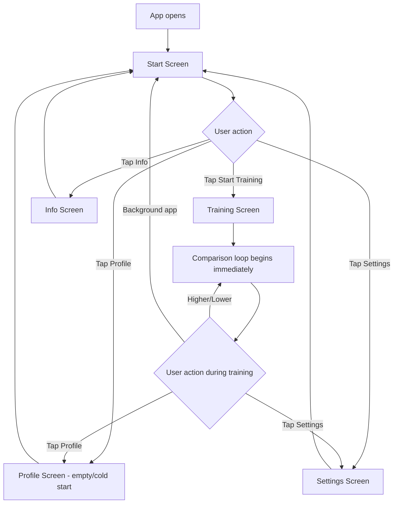
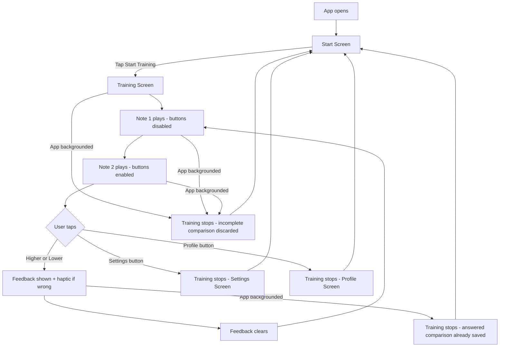
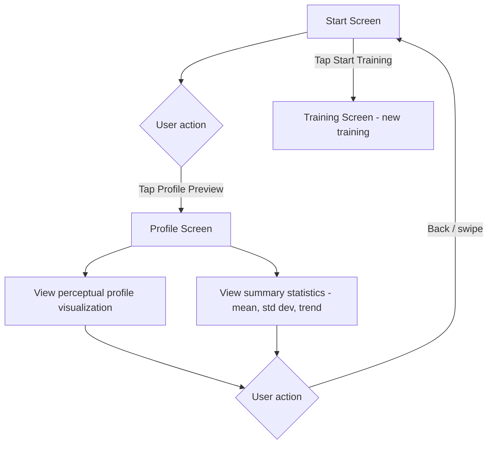
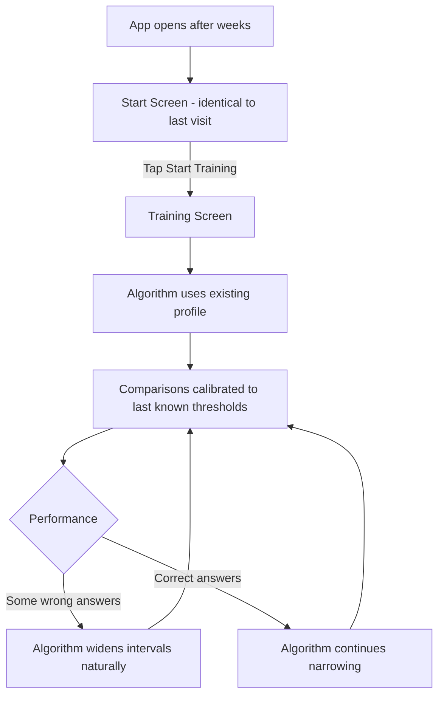
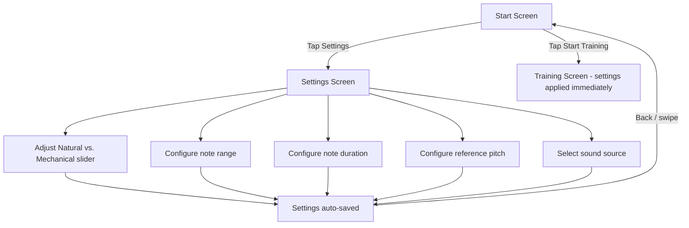

# UX Design Specification Peach

**Author:** Michael
**Date:** 2026-02-12

---

## Executive Summary

### Project Vision

Peach is a pitch discrimination ear training app for iOS built on the philosophy of "training, not testing." Where existing apps like InTune escalate difficulty until failure to produce a score, Peach builds a perceptual profile of the user's hearing and relentlessly targets weak spots. No scores, no gamification, no sessions. Every comparison makes the user better; no single answer matters.

The interaction is radically simple: two notes play in sequence, the user taps higher or lower. The intelligence lives entirely in the adaptive algorithm, not the UI. The app is designed for incidental use — 30 seconds on the bus, a minute during a practice break — with zero friction between wanting to train and training.

### Target Users

Musicians (singers, string, woodwind, brass players) for whom intonation is a practical challenge. These users are musically sophisticated but not necessarily tech-savvy. They want a tool that fits into the cracks of their day — practice breaks, commuting, waiting — and makes them measurably better without demanding attention or emotional investment.

Primary persona: a working musician who knows their intonation needs work, has tried score-based apps and found that the scoring paradigm gets in the way of actual training, and wants a tool that maximizes training throughput rather than measuring performance.

### Key Design Challenges

1. **Invisible intelligence** — The adaptive algorithm is the product's core value, but users can't see it working. The UX must make the adaptive behavior feel right — not random, not mechanical — without exposing its inner mechanics.

2. **Sparse-data visualization** — On first use, the perceptual profile has almost no data. The Profile Screen and Profile Preview must look meaningful and inviting even when mostly empty, without misleading users about what sparse data represents.

3. **No-session training model** — Most app UX patterns assume sessions with clear beginnings, endings, and summaries. Peach has none of that. Start and stop must feel natural without conventional session framing.

4. **One-handed reflexive interaction** — The Training Screen must support rapid, imprecise tapping in mobile contexts (bus, standing, holding an instrument). Button placement, sizing, and feedback timing are critical for the "instinctive reflex" feel.

### Design Opportunities

1. **Anti-gamification as differentiator** — By rejecting scores and streaks, Peach can create a calm, pressure-free aesthetic that feels fundamentally different from every other training app. This absence is a UX feature, not a missing feature.

2. **The profile as intrinsic motivation** — The perceptual profile visualization can be the app's emotional hook. Watching the confidence band tighten over weeks is inherently satisfying without needing badges or points. The data itself is the reward.

3. **Native iOS 26 design language** — As a greenfield app targeting iOS 26 exclusively, Peach can fully embrace Apple's latest Liquid Glass design language from day one, creating a polished, modern feel that's rare in music training apps.

## Core User Experience

### Defining Experience

The core experience is the **comparison loop**: two notes play in sequence, the user taps higher or lower, feedback flashes, the next pair begins. This loop is the entire product. Everything else — the profile, the settings, the Start Screen — exists to support or reflect it.

The loop must feel **reflexive, not deliberative**. The user should be reacting to sounds, not thinking about an app. The ideal state is flow — a rhythmic back-and-forth between listening and tapping where the app disappears and only the sounds and responses remain. If the user is ever thinking about the UI during training, the design has failed.

### Platform Strategy

- **Native iOS (Swift/SwiftUI, iOS 26+)** — single-platform, no cross-platform considerations
- **iPhone primary, iPad supported** — designed for the phone in your hand, scales up gracefully
- **Portrait primary, landscape supported** — one-handed portrait use is the default context
- **Entirely offline** — no network dependency, no loading states, no connectivity concerns
- **Audio output required** — speaker or headphones; no microphone, no camera, no permissions dialogs
- **Haptic engine** — wrong-answer feedback channel that works even when the user isn't looking at the screen
- **Liquid Glass design language** — fully embrace iOS 26 aesthetics as a greenfield app

### Effortless Interactions

1. **Start training** — one tap from app launch to hearing the first note. No onboarding, no account, no "welcome back," no session naming. The Start Training Button is the app.

2. **Stop training** — one tap, immediate, no confirmation dialog, no session summary, no "are you sure?" The incomplete comparison is silently discarded. The user just puts their phone away.

3. **Answer a comparison** — large, thumb-friendly buttons that don't require visual precision. Disabled during the first note (preventing premature answers), enabled the moment the second note begins playing. The transition from listening to answering must be seamless.

4. **Resume where you left off** — there is no resume. There are no sessions. The user opens the app and starts training; the algorithm already knows their profile. Whether it's been 5 minutes or 5 weeks, the experience is identical.

5. **See progress** — the Profile Preview on the Start Screen provides a glanceable snapshot without navigating anywhere. Tapping it opens the full profile. No digging through menus.

### Critical Success Moments

1. **First 10 seconds** — The user taps Start Training and is immediately in a rhythm of listening and tapping. If this moment feels clunky, slow, or confusing, the app has lost. This is the moment where "training, not testing" must be felt, not explained.

2. **First wrong answer** — A subtle haptic buzz and a thumbs-down that doesn't linger. The next comparison is already coming. The user learns that wrong answers don't matter — they're just data. This moment establishes that the app is a trainer, not a judge.

3. **First profile check** — The user opens the Profile Screen after a few days and sees their perceptual landscape taking shape. Even with limited data, it should feel like looking at something real and personal — a map of their hearing, not a score sheet.

4. **The "it's working" realization** — After weeks of incidental training, the user sees their mean detection threshold dropping. This isn't a celebration screen — it's a quiet, factual confirmation that their perception is sharpening. The data speaks for itself.

5. **Mid-interruption stop** — The user's bus stop comes. They tap stop mid-comparison and put their phone away in one motion. Zero friction, zero guilt, zero lost data. The app respects their time completely.

### Experience Principles

1. **Disappearing UI** — The best training session is one where the user forgets they're using an app. Every design decision should reduce the distance between the user and the sounds. Controls, transitions, and feedback should be felt, not studied.

2. **Every answer improves you** — No answer is wasted, no answer is punished. Wrong answers are information, not failure. The UX must never make the user feel judged — no scores, no streaks, no "try again" language, no summary screens that highlight mistakes.

3. **Respect incidental time** — The app is designed for the cracks in a musician's day. This means instant start, instant stop, no warm-up, no wind-down, no session overhead. 30 seconds of training is as valid as 30 minutes.

4. **Show, don't score** — Progress is a perceptual profile that the user can see evolving, not a number going up. The visualization is factual and personal — it shows what the user can hear, not how they rank.

5. **Sound first, pixels second** — Audio quality, timing, and envelope shaping take absolute priority over visual polish. A beautiful screen with clicking audio artifacts is a failed product. A plain screen with pristine sound is a working one.

## Desired Emotional Response

### Primary Emotional Goals

1. **Calm focus** — Training should feel meditative, not competitive. The rhythmic cadence of sound-tap-sound-tap creates a flow state closer to warming up with scales than taking a test. The user's mind is on the sounds, not on performance.

2. **Quiet confidence** — Over time, the user develops a sense that their hearing is sharpening. This isn't announced or celebrated — it's a growing inner certainty, confirmed when they check the profile and see the data matching what they've started to feel.

3. **Freedom from judgment** — No answer carries weight. The user should feel the same emotional neutrality toward a wrong answer as toward a correct one. Both are just moments in a continuous flow. The app never evaluates the user — it trains them.

### Emotional Journey Mapping

| Moment | Desired Feeling | Anti-Pattern to Avoid |
|---|---|---|
| **First launch** | Curiosity, ease — "that's it?" | Overwhelm, obligation, setup fatigue |
| **First comparisons** | Playful alertness — like a reflex game | Slow round-trips, scoring overhead, distraction from the task |
| **First wrong answer** | Nothing — just a haptic tick and the next pair | Shame, frustration, "try again" pressure |
| **Stopping mid-session** | Neutral — like putting down a cup of coffee | Guilt, loss aversion, "are you sure?" friction |
| **Checking the profile** | Honest curiosity — "what does my hearing look like?" | Score-driven framing, social comparison |
| **Seeing improvement** | Quiet satisfaction — the data speaks for itself | Artificial celebration, badges, confetti |
| **Returning after a break** | Seamless continuity — as if no time passed | Guilt trips, streak resets, "welcome back" banners |
| **Getting more wrong after a break** | Acceptance — the algorithm adapts, no announcement | Decline warnings, skill degradation messages |

### Micro-Emotions

**Cultivate:**
- **Trust** — the algorithm is working for you, even when you can't see how. Comparisons feel purposeful, not random.
- **Competence** — the interaction is so simple that the user feels immediately capable. No learning curve, no confusion.
- **Ownership** — the perceptual profile is *yours*. It's a personal map of your hearing, not a score assigned by the app.
- **Presence** — during training, the user is fully in the moment with the sounds. Eyes can be closed. The world narrows to two notes and a thumb.

**Prevent:**
- **Impatience** — slow transitions, unnecessary screens, and scoring overhead pull the user out of training flow. Every millisecond of dead time between comparisons is a design failure.
- **Guilt** — no streaks, no missed-day tracking, no engagement mechanics that punish absence.
- **Boredom** — the algorithm keeps comparisons at the edge of perception. Too easy is as bad as too hard.
- **Distrust** — if comparisons feel random or pointless, the user loses faith. The "Natural vs. Mechanical" slider gives the user a sense of agency over the algorithm's behavior.

### Design Implications

| Emotional Goal | UX Design Approach |
|---|---|
| Calm focus | Minimal Training Screen — no stats, no counters, no progress bars during training. Just the sounds, the buttons, and the feedback. |
| Freedom from judgment | Feedback Indicator (thumbs up/down) is brief and non-emphatic. Same visual weight for correct and incorrect. No cumulative score visible anywhere during training. |
| Eyes-closed training | Haptic feedback is a primary output channel, not a secondary one. Correct answer: no haptic (silence = confirmation). Wrong answer: single haptic tick. The Training Screen must function as a purely audio-haptic experience where visuals are optional. |
| Quiet confidence | Profile visualization uses calm, factual presentation. No celebratory animations. Trend indicators are understated — a gentle directional signal, not a scoreboard. |
| Seamless continuity | No session boundaries means no session UI. No timers, no "session complete" screens, no "X comparisons today" counters. The app has no concept of today vs. yesterday. |
| Trust in the algorithm | The "Natural vs. Mechanical" slider gives users a tangible control that affects how training feels, building trust that the algorithm is responsive to their preferences. |

### Emotional Design Principles

1. **Silence is feedback** — The absence of reaction is itself a response. No haptic after a correct answer means "yes, move on." No session summary means "your data is safe, nothing to review." No welcome-back screen means "nothing changed, pick up where you left off." Design with silence as deliberately as with sound.

2. **The app has no opinion about you** — Peach never judges, congratulates, encourages, or admonishes. It plays sounds, records answers, and shows data. The emotional interpretation belongs entirely to the user. This neutrality is the core emotional contract.

3. **Sensory hierarchy: ears > fingers > eyes** — Audio is primary (the training content), haptic is secondary (the result feedback), visual is tertiary (optional confirmation). The app must be fully functional with eyes closed. Design decisions that privilege visual feedback over audio-haptic feedback violate this hierarchy.

4. **Boredom is a bug** — If the user feels bored, the algorithm is failing — comparisons are too easy or too predictable. The emotional antidote to boredom is the constant edge-of-perception challenge, not gamification or visual novelty.

## UX Pattern Analysis & Inspiration

### Inspiring Products Analysis

**InTune (Negative Reference)**

InTune is the primary reference point — as a model of what *not* to do. Two concrete problems inform Peach's design:

1. **Scoring as purpose:** InTune treats each interaction as a test item contributing to a score. This is a fundamental goal mismatch — scoring and training are different activities. When the app's purpose is to produce a score, the comparison selection optimizes for measurement accuracy, not for training effectiveness. Peach eliminates scoring entirely so that every comparison can be selected purely for its training value.

2. **Slow comparison round-trips:** InTune introduces multi-second delays between comparisons — transition animations, result displays, difficulty adjustments visible to the user. This kills training throughput and causes the user's attention to drift. In the time InTune completes one comparison cycle, Peach should complete three or four.

**Metronome Apps (Positive Pattern)**

The best metronome apps (e.g., Pro Metronome, Tempo) share a key UX pattern with Peach: the core interaction is purely temporal and auditory. Tap to start, listen, tap to stop. No session framing, no results. The UI exists only to configure the experience, not to mediate it. This "configure then disappear" pattern is directly transferable.

**Meditation / Breathing Apps (Emotional Pattern)**

Apps like Apple's Mindfulness (Breathe) demonstrate that a calm, minimal interface can frame repetitive interaction as beneficial rather than tedious. The key lesson: visual restraint communicates that the *experience itself* is the point, not the screen content. Peach's Training Screen should have this quality — a screen that says "listen" by showing almost nothing.

### Transferable UX Patterns

**Interaction Patterns:**

- **Zero-delay looping** (from rhythm games) — the next event begins the instant the previous one resolves. No transition screens, no result pauses. The loop is continuous until the user breaks it.
- **Configure-then-disappear** (from metronome apps) — settings exist on a separate screen. The active experience screen is stripped to the absolute minimum. Configuration and execution are fully separated.
- **Eyes-optional interaction** (from fitness/running apps) — the app works through audio and haptic channels alone. The screen is a bonus, not a requirement. Large touch targets in predictable positions enable blind operation.

**Visual Patterns:**

- **Data as landscape** (from health/fitness apps like Apple Health) — presenting personal data as a terrain to explore rather than a score to achieve. The perceptual profile visualization should feel like looking at a topographic map of your hearing.
- **Sparse-data grace** (from new Apple Watch health features) — when data is limited, show what exists honestly with clear indication that the picture will fill in over time, rather than showing empty charts or placeholder data.

**Navigation Patterns:**

- **Hub-and-spoke** (iOS standard) — Start Screen as the hub with direct paths to Training, Profile, and Settings. No deep navigation, no tabs, no hamburger menus. Every destination is one tap from home.

### Anti-Patterns to Avoid

1. **Score-driven design** — Any UI element that frames training outcomes as a score, percentage, or pass/fail undermines Peach's core purpose. This includes hidden scores disguised as "levels" or "achievements."

2. **Transition theater** — Animated transitions, loading indicators, result screens, and "preparing next challenge" delays between comparisons. Every second of non-training time is a design failure. The round-trip between comparisons must be effectively instantaneous.

3. **Engagement guilt mechanics** — Streaks, daily goals, "you haven't trained in X days" notifications, declining statistics presented as warnings. These treat the user's absence as a problem to solve rather than a neutral fact.

4. **Complexity creep** — Adding visible algorithm parameters, detailed per-comparison statistics, or "advanced mode" toggles to the Training Screen. The training experience must remain radically simple regardless of the algorithm's sophistication underneath.

5. **Onboarding tutorials** — The interaction (two notes, tap higher or lower) is self-explanatory. A tutorial would imply complexity that doesn't exist and add friction to first launch.

### Design Inspiration Strategy

**Adopt:**
- Zero-delay comparison looping — continuous flow with no dead time
- Hub-and-spoke navigation from Start Screen — one tap to any destination
- Eyes-optional training via audio-haptic feedback channels
- Data-as-landscape visualization for the perceptual profile

**Adapt:**
- Metronome "configure then disappear" pattern — applied to Settings vs. Training Screen separation
- Health app sparse-data presentation — adapted for the perceptual profile's cold-start state
- Meditation app visual restraint — Training Screen as a calm, minimal space

**Reject:**
- Score-driven interaction framing (InTune)
- Slow comparison round-trips with transition overhead (InTune)
- Gamification mechanics (streaks, badges, levels)
- Onboarding wizards and tutorial overlays
- Session-based framing with summaries and statistics screens

## Design System Foundation

### Design System Choice

**Apple Human Interface Guidelines (HIG) + Stock SwiftUI** — no customization layer, no theming, no bespoke component library.

Peach uses SwiftUI's built-in components exactly as Apple designed them. Standard buttons, standard navigation, standard layout patterns, standard Liquid Glass appearance on iOS 26. The app should look and feel like it belongs on the platform — indistinguishable from a first-party Apple app in its interaction patterns.

### Rationale for Selection

1. **HIG compliance is a UX feature, not a constraint.** Users already know how iOS apps work. Every standard SwiftUI component carries years of learned behavior — tap targets, gestures, navigation patterns, accessibility. Using stock components means zero learning curve for the app's chrome, so all cognitive attention goes to the training content (the sounds).

2. **"Disappearing UI" demands platform-native interaction.** The core experience principle is that the UI should disappear during training. Non-standard components draw attention to themselves. Stock components are invisible precisely because they're familiar.

3. **Solo developer, learning iOS.** Custom components require custom accessibility implementation, custom animation tuning, custom dark mode support, and custom Dynamic Type handling. Stock SwiftUI provides all of this for free. Building custom components would be effort spent fighting the platform instead of building the product.

4. **Four screens, minimal chrome.** Peach has a Start Screen, Training Screen, Profile Screen, and Settings Screen. Three of these (Start, Profile, Settings) are conventional enough for stock components. The Training Screen is minimal by design — it needs large buttons and a feedback indicator, not a custom design system.

### Implementation Approach

- **Standard SwiftUI components everywhere:** Buttons, NavigationStack, Form (for Settings), standard layout containers
- **System colors and typography:** No custom color palette, no custom fonts. Use SwiftUI semantic colors (`.primary`, `.secondary`, `.accent`) and Dynamic Type
- **Liquid Glass:** Accept iOS 26's default Liquid Glass appearance without overriding it
- **Standard navigation patterns:** NavigationStack with standard push/pop for Start → Profile, sheet presentation for Settings
- **Accessibility for free:** VoiceOver labels, Dynamic Type scaling, and contrast ratios handled by stock components automatically

### Custom Components (Only Where Necessary)

The only areas requiring custom implementation are where SwiftUI has no built-in equivalent:

1. **Perceptual profile visualization** — The piano keyboard with confidence band overlay is a domain-specific data visualization. No stock component exists for this. Built with SwiftUI Canvas or Charts framework.

2. **Profile Preview** — The stylized miniature profile on the Start Screen. A simplified rendering of the same visualization data.

3. **Training Screen button layout** — While the buttons themselves are standard SwiftUI buttons, their sizing (large, thumb-friendly, eyes-closed operable) and positioning (optimized for one-handed use) require intentional layout work. The components are stock; the layout is considered.

These custom elements follow HIG principles (tap target sizes, accessibility labels, Dynamic Type awareness) even though they aren't stock components.

## Defining Experience

### Core Interaction

**"Two notes. Higher or lower. Next."**

The defining experience is the comparison loop — a continuous, rhythmic cycle of listening and responding. The user hears two sequential notes, judges whether the second was higher or lower than the first, and the next comparison follows. The intelligence is invisible; the interaction is instinctive.

### User Mental Model

The user's mental model is **reflexive discrimination, not analytical comparison**. They are not thinking "that was 440Hz and that was 445Hz." They are hearing two sounds and reacting — higher or lower — the way a musician reacts to intonation in real time. The interaction should feel closer to catching a ball than solving a math problem.

**What users bring from existing solutions:**
- From InTune: the basic concept of comparing two pitches. But InTune wraps this in scoring and slow round-trips that interrupt the training flow. Users who've used InTune expect overhead between comparisons — Peach's rapid loop will feel surprisingly fast and liberating.
- From musical practice: the concept of ear training as repetitive, focused listening. Musicians already understand that pitch discrimination improves through volume of exposure, not through testing.

**Key mental model shift:** There is no "session" and no "result." The user is not completing something or achieving something — they are *doing* something. Training is the activity, not the means to an outcome.

### Success Criteria

The comparison loop succeeds when:

1. **The user stops thinking about the app** — they are reacting to sounds, not operating a UI. The buttons, the feedback, the transitions all fade from conscious attention.
2. **Throughput feels fast but not rushed** — comparisons flow at the pace of the user's reflexes, not faster and not slower. The app matches the user's rhythm, not the other way around.
3. **Eyes-closed operation works** — the user can close their eyes, listen, tap in the right area of the screen, feel the haptic (or not), and continue. The visual layer adds nothing essential during active training.
4. **Stopping feels like leaving, not quitting** — the user navigates to Profile or Settings, or simply backgrounds the app. There is no "stop" action — just doing something else. Training ends as naturally as it began.
5. **The loop is instantly resumable** — reopening the app and tapping Start Training puts the user back into the same rhythm within seconds, regardless of how long they've been away.

### Novel UX Patterns

The comparison loop uses **established patterns combined in an uncommon way:**

- **Binary choice buttons** (established) — Higher/Lower is a simple A/B input, familiar from countless apps
- **Continuous looping without session boundaries** (uncommon) — most training apps have sessions, rounds, or levels. Peach's sessionless continuous loop is unusual and requires no user education — it simply never stops until the user leaves
- **Audio-haptic primary feedback** (uncommon for training apps) — the sensory hierarchy (ears > fingers > eyes) is atypical. Most apps treat visual feedback as primary. Peach inverts this for eyes-closed operation
- **Navigation-as-stop** (uncommon) — there is no stop/exit button. The user stops training by navigating elsewhere (Settings, Profile) or leaving the app. Training is the default state of the Training Screen; everything else is leaving
- **Stateful button disabling** (established) — Higher/Lower buttons disabled during the first note, enabled when the second note plays. Prevents premature answers without explanation — the user discovers this naturally in the first comparison

No novel patterns require user education. The interaction is self-evident: two sounds play, two buttons are available, tap one.

### Experience Mechanics

**The Comparison Loop — Step by Step:**

**1. Initiation:**
- User taps Start Training Button on Start Screen
- Training Screen appears with Higher/Lower buttons (disabled) and Settings/Profile buttons
- First comparison begins immediately — no countdown, no "get ready," no transition animation

**2. First Note:**
- System plays the first note (the reference note, always an exact MIDI note)
- Higher/Lower buttons remain disabled — visually indicated per stock SwiftUI disabled state
- Duration: configurable (default ~1 second), with smooth attack/release envelope

**3. Second Note:**
- System plays the second note (same MIDI note shifted by a cent difference)
- Higher/Lower buttons become enabled the moment the second note begins playing
- The user can answer at any point during or after the second note
- Same duration and envelope as the first note

**4. Answer:**
- User taps Higher or Lower
- Both buttons disable immediately to prevent double-tap
- Feedback phase begins instantly

**5. Feedback:**
- Feedback Indicator appears immediately (thumbs up for correct, thumbs down for incorrect)
- If incorrect: single haptic tick fires simultaneously with the visual feedback
- If correct: no haptic (silence = confirmation)
- Feedback persists for a brief duration (tunable, ~300-500ms)
- No other information shown — no score, no streak, no comparison details

**6. Clear and Loop:**
- Feedback Indicator clears completely
- The comparison result is written to the data store
- The algorithm selects the next comparison
- The next first note begins playing — return to step 2
- The loop continues indefinitely until the user navigates away

**7. Leaving:**
- User taps Settings or Profile button on Training Screen, or backgrounds the app
- If mid-comparison: the incomplete comparison is silently discarded
- If during feedback: feedback clears; the answered comparison was already recorded
- Training stops, user arrives at the selected destination (Settings/Profile) or Start Screen (on foreground after backgrounding)
- Settings and Profile always return to Start Screen when dismissed
- No session summary, no statistics, no confirmation dialog

**Navigation Model:**

```
                    ┌──────────────┐
                    │ Start Screen │
                    │              │
                    │ [Start]      │
                    │ [Settings]   │
                    │ [Profile]    │
                    └──┬───┬───┬──┘
          Start Training│   │   │
                    ┌───▼┐  │   │
                    │Train│  │   │
                    │Screen│ │   │
                    │     │  │   │
                    │[H/L]│  │   │
                    │[Set] │  │   │
                    │[Prof]│  │   │
                    └─┬──┬┘  │   │
                      │  │   │   │
              ┌───────▼──▼───▼┐  │
              │   Settings    │──┘◄── always returns
              │   Screen      │      to Start Screen
              └───────────────┘
                                 │
              ┌──────────────────▼┐
              │   Profile         │──┘◄── always returns
              │   Screen          │      to Start Screen
              └───────────────────┘

  App backgrounded during training → returns to Start Screen
```

**Timing Diagram:**

```
[Note 1 ~~~] [Note 2 ~~~] [Answer] [Feedback ··] [Note 1 ~~~] [Note 2 ~~~] ...
 buttons off   buttons on   tap!     brief show    buttons off   buttons on
                                     + haptic(?)
```

## Visual Design Foundation

### Color System

**System defaults throughout.** No custom color palette, no custom accent color.

- **Accent color:** SwiftUI system default (blue)
- **Semantic colors:** `.primary`, `.secondary`, `.tertiary` for text hierarchy
- **Background colors:** System background colors (`.background`, `.secondarySystemBackground`)
- **Feedback colors:** System green for correct, system red for incorrect (Feedback Indicator only)
- **Dark mode:** Automatic — respects system setting. Stock SwiftUI handles all color adaptation.

No brand colors. The app's identity comes from its behavior, not its color scheme.

### Typography System

**San Francisco (system font) at all system-defined sizes.** No custom fonts, no custom type scale.

- **Dynamic Type:** Fully supported via stock SwiftUI. All text scales with the user's accessibility settings.
- **Text styles:** Standard SwiftUI text styles (`.largeTitle`, `.title`, `.headline`, `.body`, `.caption`, etc.) used according to information hierarchy.
- **No custom font weights or sizes.** If SwiftUI's semantic text styles don't provide the right emphasis, use a different text style — don't override font metrics.

### Spacing & Layout Foundation

**SwiftUI default spacing and layout.** No custom spacing system, no custom grid.

- **Spacing:** SwiftUI's default padding and spacing values. Use `.padding()` without custom values wherever possible.
- **Layout:** Standard SwiftUI layout containers (`VStack`, `HStack`, `ZStack`, `Form`, `List`) with default spacing.
- **Safe areas:** Respect all system safe areas. No custom insets.
- **Adaptive layout:** SwiftUI's built-in support for iPhone/iPad, portrait/landscape, and Dynamic Type scaling handles all layout adaptation.

The only layout area requiring intentional design is the Training Screen button placement — positioning Higher/Lower buttons for comfortable one-handed, eyes-closed thumb reach. Even here, the buttons themselves are stock SwiftUI; only their size and position are considered.

### Accessibility Considerations

**Stock SwiftUI provides the accessibility baseline for free:**

- **VoiceOver:** All stock components are automatically labeled. Custom components (profile visualization, profile preview) require explicit accessibility labels.
- **Dynamic Type:** All text scales automatically with system font size settings.
- **Color contrast:** System colors meet accessibility contrast ratios in both light and dark mode.
- **Tap targets:** Stock SwiftUI buttons meet Apple's 44x44pt minimum. Training Screen buttons will exceed this significantly for eyes-closed operation.
- **Haptic feedback:** Provides non-visual feedback channel, supporting the sensory hierarchy (ears > fingers > eyes).
- **Reduce Motion:** Stock SwiftUI respects the system Reduce Motion setting automatically.

### Info Screen

A simple informational screen accessible from the Start Screen via a standard info button (e.g., `Image(systemName: "info.circle")`).

**Contents:**
- App name (Peach)
- Developer name
- Copyright notice
- App version number (pulled from bundle)

Presented as a standard SwiftUI sheet. Minimal content, stock presentation.

## Design Direction

### Design Directions Explored

No visual design direction exploration was performed. Peach uses stock SwiftUI with all system defaults (colors, typography, spacing, Liquid Glass). There are no custom visual design decisions to make — the design direction is iOS 26 itself.

This is a deliberate choice, not an omission. See [Design System Foundation](#design-system-foundation) for the full rationale.

### Chosen Direction

**Stock iOS 26 / Liquid Glass** — the app should be visually indistinguishable from a first-party Apple app in its use of standard components, system colors, and platform conventions.

### Design Rationale

1. **HIG as gospel** — the user explicitly requires strict adherence to Apple's Human Interface Guidelines with no custom UI embellishments.
2. **Disappearing UI principle** — visual customization draws attention to the app's chrome. Stock appearance is invisible, keeping focus on the training content (sounds).
3. **Development efficiency** — no custom design system to build, maintain, or test. All visual behavior comes from the platform for free.

### Remaining Design Work

The design work that matters for Peach is not visual styling but **screen layout and interaction flow**:

- Training Screen: button sizing and placement for one-handed, eyes-closed operation
- Start Screen: information hierarchy and element arrangement
- Profile Screen: perceptual profile visualization (the one truly custom visual element)
- Navigation flow between all five screens (Start, Training, Profile, Settings, Info)

These are addressed in subsequent sections.

## User Journey Flows

### Journey 1: First Launch



**Key UX decisions:**
- No onboarding, no tutorial, no welcome screen. The Start Screen *is* the onboarding.
- Profile Preview on Start Screen is visible but sparse (cold start state). Tapping it shows the full Profile Screen with honest empty-state presentation.
- The user discovers the comparison loop by doing it. The first comparison is self-explanatory: two sounds, two buttons.

### Journey 2: Daily Training



**Key UX decisions:**
- The loop has no exit point — it only has departure points (navigating elsewhere or leaving the app).
- Backgrounding at any point returns to Start Screen on foreground.
- Audio interruptions (phone call, headphone disconnect) behave identically to backgrounding — training stops, incomplete comparison discarded.

### Journey 3: Checking Progress



**Key UX decisions:**
- Profile Screen is read-only — no interactions beyond viewing and navigating back.
- Summary statistics show trend direction (improving/stable/declining) as an understated indicator.
- Returning from Profile always goes to Start Screen, making it natural to start a new training session afterward.

### Journey 4: Return After Break



**Key UX decisions:**
- No "welcome back" messaging. No streak reset. No skill degradation warning.
- The Start Screen is identical regardless of time elapsed since last use.
- The algorithm handles reacclimation silently — it widens intervals when the user gets more wrong, without announcement.

### Journey 5: Tweaking Settings



**Key UX decisions:**
- Settings are persisted immediately (no save button). Standard iOS pattern via `@AppStorage`.
- Settings Screen uses stock SwiftUI `Form` — standard iOS settings presentation.
- Changes take effect on the next comparison after returning to training.

### Journey Patterns

**Navigation pattern:** All roads lead back to Start Screen. Settings, Profile, and Info all return to Start Screen when dismissed. Training Screen is only entered via Start Training. This creates a simple, predictable hub-and-spoke model with no deep navigation.

```
Start Screen ──► Training Screen (via Start Training only)
Start Screen ──► Profile Screen ──► Start Screen
Start Screen ──► Settings Screen ──► Start Screen
Start Screen ──► Info Screen ──► Start Screen
Training Screen ──► Profile Screen ──► Start Screen
Training Screen ──► Settings Screen ──► Start Screen
App backgrounded during training ──► Start Screen
```

**Feedback pattern:** The comparison loop uses a consistent feedback cycle: action → immediate feedback → brief hold → clear → next action. This pattern never varies — correct and incorrect answers follow the same timing, with the only difference being the haptic tick on incorrect.

**Interruption pattern:** Any interruption during training (navigation, backgrounding, phone call, headphone disconnect) follows the same rule: stop audio, discard incomplete comparison, leave Training Screen. No special cases, no confirmation dialogs, no state to recover.

### Flow Optimization Principles

1. **Minimum taps to value:** App launch → Start Screen → one tap → training. Two taps from cold launch to hearing the first note.

2. **No dead ends:** Every screen has a clear path forward or back. No screen requires a specific action to leave. The user is never trapped.

3. **Consistent dismissal:** Every non-training screen returns to Start Screen via standard iOS back navigation (swipe or back button). No custom dismiss patterns.

4. **Stateless navigation:** No screen depends on how you arrived. Profile Screen shows the same content whether reached from Start Screen or Training Screen. Settings Screen doesn't know or care if training was interrupted to get there.

## Component Strategy

### Design System Components (Stock SwiftUI)

Every screen in Peach is built primarily from stock SwiftUI components. The following covers all standard component usage across the app:

| Component | SwiftUI Implementation | Used On |
|---|---|---|
| Start Training button | `Button` with `.buttonStyle(.borderedProminent)` | Start Screen |
| Settings button | `Button` with `Image(systemName:)` | Start Screen, Training Screen |
| Profile button | `Button` with `Image(systemName:)` | Start Screen, Training Screen |
| Info button | `Button` with `Image(systemName: "info.circle")` | Start Screen |
| Higher/Lower buttons | `Button` with `.disabled()` state | Training Screen |
| Navigation | `NavigationStack` | App-wide |
| Settings form | `Form` with `Slider`, `Stepper`, `Picker` | Settings Screen |
| Sheet presentation | `.sheet()` modifier | Info Screen |
| Text hierarchy | `Text` with `.font(.largeTitle)`, `.title`, `.body`, etc. | All screens |
| Back navigation | Standard NavigationStack back button / swipe | Profile, Settings, Info |

**Coverage assessment:** Stock SwiftUI covers approximately 90% of Peach's UI needs. The remaining 10% is domain-specific visualization that no design system would provide.

### Custom Components

#### Perceptual Profile Visualization

**Purpose:** Display the user's pitch discrimination ability across their training range as an intuitive, glanceable landscape.

**Visual Design:**
- **X-axis:** Piano keyboard representation — a horizontal strip of alternating white and black keys spanning the training range. Keys are stylized (not photorealistic) — simple rectangles with standard piano proportions. Note names shown at octave boundaries (C2, C3, C4, etc.).
- **Y-axis:** Detection threshold in cents — lower is better. The axis is inverted so that improvement (smaller cent differences) visually moves the band *downward* toward the keyboard, creating the intuitive metaphor of "getting closer to the notes."
- **Confidence band:** A filled area chart overlaid above the keyboard, showing the detection threshold at each note. The band's width represents uncertainty — wider where data is sparse, narrower where many comparisons have been answered. Uses system colors (`.blue` or `.tint` for the band fill, with opacity for the confidence range).
- **Empty state (cold start):** The keyboard renders fully. The confidence band is either absent or shown as a wide, uniform band at the 100-cent level with high transparency, communicating "no data yet" without looking broken. A brief text label ("Start training to build your profile") appears centered above the keyboard.
- **Sparse data state:** The confidence band renders where data exists and fades out where it doesn't. No interpolation across large gaps — honest representation of what's known.

**Implementation:** SwiftUI `Canvas` for the keyboard rendering, Swift Charts `AreaMark` for the confidence band overlay. Both are first-party frameworks requiring no dependencies.

**States:**
- Empty (cold start) — keyboard only, no band or minimal placeholder band
- Sparse — partial band with visible gaps and wide confidence intervals
- Populated — continuous band with narrowing confidence intervals in trained regions
- All states render identically in light and dark mode using system semantic colors

**Accessibility:**
- VoiceOver summary: "Perceptual profile showing detection thresholds from [lowest note] to [highest note]. Average threshold: [X] cents."
- Not individually navigable per note (would be overwhelming) — provide aggregate summary
- Sufficient contrast via system colors in both light and dark mode

#### Profile Preview

**Purpose:** Provide a glanceable miniature of the perceptual profile on the Start Screen, inviting the user to tap for detail.

**Visual Design:**
- A compact, simplified version of the full profile visualization — same confidence band shape, no axis labels, no note names, no numerical values
- Sized to fit as a secondary element on the Start Screen (roughly the width of the screen, ~60-80pt tall)
- Acts as a button — tappable to navigate to the full Profile Screen
- Empty state: shows a placeholder shape or subtle empty-state treatment that still looks intentional

**Implementation:** Same rendering logic as the full visualization, scaled down and stripped of labels. SwiftUI `Canvas` with a `Button` or `NavigationLink` wrapper.

**Accessibility:**
- VoiceOver label: "Your pitch profile. Tap to view details."
- If data exists: "Your pitch profile. Average threshold: [X] cents. Tap to view details."

#### Feedback Indicator

**Purpose:** Show immediate visual confirmation of correct/incorrect after each comparison answer.

**Visual Design:**
- Thumbs up (`Image(systemName: "hand.thumbsup.fill")`) for correct, thumbs down (`Image(systemName: "hand.thumbsdown.fill")`) for incorrect
- Uses system green (correct) and system red (incorrect) — standard semantic meaning
- Appears as a centered overlay on the Training Screen, large enough to be visible in peripheral vision but not obstructing the Higher/Lower buttons
- Brief appearance (~300-500ms, tunable), then fades or disappears
- No animation on appearance (respects Reduce Motion by default); simple opacity transition if motion is enabled

**Implementation:** SF Symbols with `.foregroundStyle()` color, shown/hidden via SwiftUI state. Standard `.transition(.opacity)` for appearance/disappearance.

**States:**
- Hidden (default during note playback and awaiting answer)
- Correct (thumbs up, green)
- Incorrect (thumbs down, red)

**Accessibility:**
- VoiceOver announcement: "Correct" or "Incorrect" (automatic via SF Symbol labels)
- Haptic feedback on incorrect is the primary non-visual channel — already specified in emotional design principles

### Component Implementation Strategy

**Principle: stock first, custom only when forced.**

1. **Use stock SwiftUI components exactly as provided** — no subclassing, no custom styles, no appearance overrides. If a stock component doesn't look exactly right, reconsider the layout before customizing the component.

2. **Custom components use first-party frameworks only** — SwiftUI Canvas and Swift Charts. No third-party visualization libraries.

3. **Custom components follow stock patterns** — even custom components use system colors, Dynamic Type, and standard accessibility APIs. They should *feel* like stock components that Apple just hasn't built yet.

4. **Single implementation shared across contexts** — the profile visualization logic is written once and used at two scales (full Profile Screen and Start Screen preview). No separate implementations.

### Implementation Roadmap

**Phase 1 — Training Loop (MVP Core):**
- Higher/Lower buttons with disabled state (stock `Button`)
- Feedback Indicator (SF Symbols + state management)
- Settings/Profile navigation buttons on Training Screen (stock `Button`)

**Phase 2 — Screens (MVP Complete):**
- Start Screen layout with Start Training button, Profile Preview, navigation buttons (stock components + Profile Preview custom)
- Settings Screen (stock `Form`)
- Info Screen (stock layout in `.sheet()`)
- Profile Screen with full visualization (custom `Canvas` + Swift Charts)
- Profile Preview on Start Screen (shared rendering, scaled down)

**Phase 3 — Polish (MVP Refinement):**
- Empty/sparse state handling for profile visualization
- Feedback Indicator timing tuning
- Training Screen button sizing optimization for eyes-closed operation
- Accessibility label refinement for custom components

## UX Consistency Patterns

### Button Hierarchy

**Primary action (one per screen):**
- Start Training Button on Start Screen — `.buttonStyle(.borderedProminent)`, prominent size
- Higher and Lower buttons on Training Screen — large, prominent, filling most of the lower screen area

**Secondary actions (navigation):**
- Settings, Profile, Info buttons — icon-only using SF Symbols, standard size, consistent placement across screens
- On Start Screen: Settings, Profile, Info buttons in a consistent location (e.g., toolbar or grouped near the top)
- On Training Screen: Settings and Profile buttons in the same relative position as on Start Screen, but visually subordinate to Higher/Lower

**Button state rules:**
- Disabled buttons use stock SwiftUI `.disabled()` — no custom disabled appearance
- Higher/Lower buttons transition between disabled and enabled states during the comparison loop. This is the only dynamic button state in the app.
- All other buttons are always enabled when visible

### Feedback Patterns

Peach has exactly one feedback pattern, used consistently throughout:

**Comparison feedback (the only feedback in the app):**

| Aspect | Correct | Incorrect |
|---|---|---|
| Visual | Thumbs up (SF Symbol), system green | Thumbs down (SF Symbol), system red |
| Haptic | None (silence = confirmation) | Single haptic tick (`UIImpactFeedbackGenerator`) |
| Audio | None | None |
| Duration | ~300-500ms (tunable) | ~300-500ms (tunable) |
| Timing | Appears instantly on answer | Appears instantly on answer |
| Dismissal | Clears automatically before next comparison | Clears automatically before next comparison |

**What Peach does NOT have:**
- No success/error/warning/info alerts
- No toast notifications
- No banners or snackbars
- No confirmation dialogs (including for stopping training)
- No progress indicators or loading spinners (everything is local and instant)

This radical simplicity is intentional. The only feedback the user ever receives during training is the comparison result. Everything else is silent.

### Form Patterns

**Settings Screen only.** Stock SwiftUI `Form` with standard controls:

| Setting | Control | SwiftUI Component |
|---|---|---|
| Natural vs. Mechanical | Continuous slider | `Slider` |
| Note range (lower bound) | Value picker | `Picker` or `Stepper` |
| Note range (upper bound) | Value picker | `Picker` or `Stepper` |
| Note duration | Value selector | `Stepper` or `Slider` |
| Reference pitch | Value input | `Stepper` (default 440Hz) |
| Sound source | Selection list | `Picker` (MVP: sine wave only) |

**Form behavior rules:**
- All changes auto-save via `@AppStorage` — no save/cancel buttons
- No form validation needed — all controls are bounded (sliders have min/max, steppers have ranges)
- No confirmation for changes — settings take effect on the next comparison
- Standard `Form` section grouping for related settings

### Navigation Patterns

**Hub-and-spoke, one level deep.** No exceptions.

| Rule | Implementation |
|---|---|
| Start Screen is always the hub | `NavigationStack` root |
| All secondary screens return to Start Screen | Standard back navigation |
| Training Screen is entered only via Start Training | `NavigationLink` or programmatic navigation |
| Training Screen is exited only by navigating away | Settings/Profile buttons, or app backgrounding |
| Sheets for lightweight screens | Info Screen presented as `.sheet()` |
| Push navigation for content screens | Profile, Settings via `NavigationStack` push |
| No deep navigation | Maximum depth is always 1 level from Start Screen |
| No tabs | Single navigation stack, no `TabView` |

**Transition rules:**
- All navigation uses stock SwiftUI transitions (push/pop, sheet present/dismiss)
- No custom transition animations
- No transition interrupts the comparison loop — navigation *is* stopping the loop

### Empty States

Peach has two empty-state scenarios:

**1. Profile visualization — cold start (no training data):**
- Piano keyboard renders fully
- Confidence band absent or shown as a faint, uniform placeholder at 100 cents
- Text: "Start training to build your profile"
- The empty state should look like the beginning of something, not a broken screen
- No call-to-action button in the empty state (the Start Training button is on the Start Screen)

**2. Summary statistics — cold start (no training data):**
- Statistics area shows dashes or "—" instead of numbers
- Trend indicator hidden (not enough data for a trend)
- No "you haven't trained yet" messaging — just the absence of data

**What Peach does NOT have empty states for:**
- Training Screen — never empty, the loop starts immediately
- Settings Screen — always populated with current values (defaults on first launch)
- Start Screen — always shows all elements; Profile Preview shows its own empty state

### Loading States

**Peach has no loading states.** Everything is local and instantaneous:
- Training data is loaded from SwiftData at app startup (< 2 seconds for launch-to-interactive)
- Profile computation is in-memory
- Audio generation is real-time
- Settings are read from `@AppStorage` (synchronous)

If app launch takes noticeable time as the dataset grows, the system splash screen covers it. No custom loading indicators.

### Error States

**Peach has no user-visible error states.** Per the architecture document:
- Audio failure → training stops silently (user returns to Start Screen)
- Data write failure → logged internally, training continues (one comparison's data may be lost)
- The user never sees an error screen, error alert, or error message

This is a deliberate design choice: errors are handled by the system (TrainingSession as error boundary), not by the user.

### Orientation & Device Patterns

| Pattern | Rule |
|---|---|
| Portrait | Primary orientation. Training Screen optimized for one-handed portrait use. |
| Landscape | Supported. Layout adapts via SwiftUI automatic layout. Training Screen buttons reflow to horizontal arrangement. |
| iPhone | Primary device. All screens designed for iPhone-sized viewport first. |
| iPad | Supported. Layouts scale naturally. No iPad-specific layouts or split views. |
| iPad windowed mode | Supported via SwiftUI adaptive layout. No minimum window size requirements. |
| Dynamic Type | All text scales. Custom components (profile visualization) handle text scaling for labels. |

## Responsive Design & Accessibility

### Responsive Strategy

**SwiftUI handles responsive layout automatically.** No breakpoints, no media queries, no manual layout adaptation.

**Device adaptation:**
- **iPhone (all sizes):** SwiftUI adaptive layout. Training Screen buttons scale proportionally. Profile visualization fills available width.
- **iPad:** Same layouts, more space. No split views, no sidebar, no iPad-specific layouts. The app runs as a simple, spacious single-column experience.
- **iPad windowed/compact mode:** SwiftUI handles gracefully. Layouts compress the same way they do on smaller iPhones.

**Orientation adaptation:**
- **Portrait (primary):** All screens designed for portrait first. Training Screen has Higher/Lower stacked vertically with Settings/Profile buttons above.
- **Landscape:** SwiftUI reflows automatically. Training Screen buttons may arrange horizontally. Profile visualization gains width for more keyboard detail. No orientation lock — both are supported.

**Dynamic Type adaptation:**
- All stock SwiftUI text scales automatically with the user's preferred text size.
- Custom components (profile visualization) use system font for labels, which scales with Dynamic Type.
- Layout must not break at the largest accessibility text sizes — SwiftUI's adaptive layout handles this, but profile visualization labels may need to hide or abbreviate at extreme sizes.

### Accessibility Strategy

**Compliance target:** Apple's accessibility best practices (equivalent to WCAG AA for native apps). Stock SwiftUI provides the foundation; custom components fill in accessibility labels and summaries.

**Peach-specific accessibility considerations:**

**1. Sensory hierarchy is an accessibility feature:**
The design principle "ears > fingers > eyes" means the app is inherently more accessible than visually-dependent training apps. A user who cannot see the screen can still train effectively:
- Audio provides the training content (the two notes)
- Haptic provides the result feedback (tick on wrong, silence on correct)
- VoiceOver provides navigation and screen context

**2. Eyes-closed operation as accessibility baseline:**
The Training Screen is designed to work with eyes closed. This means it already meets many accessibility requirements by default:
- Large, fixed-position buttons usable without visual precision
- Non-visual feedback (haptic) as the primary result channel
- No visual-only information during active training

**3. Audio dependency:**
Peach requires audio output to function. This is an inherent constraint — the app trains pitch discrimination through sound. Users who are deaf or hard of hearing cannot use the core training functionality. This is acknowledged as a fundamental limitation of the domain, not a design oversight.

### Accessibility Implementation

| Area | Stock SwiftUI (Free) | Custom Implementation Required |
|---|---|---|
| VoiceOver labels on buttons | Automatic | None |
| VoiceOver for profile visualization | — | Custom `.accessibilityLabel()` with aggregate summary |
| VoiceOver for profile preview | — | Custom `.accessibilityLabel()` with threshold summary |
| VoiceOver for feedback indicator | Automatic (SF Symbol labels) | None |
| Dynamic Type | Automatic | Profile visualization label scaling |
| Color contrast | Automatic (system colors) | None |
| Tap target sizes | Automatic (44x44pt minimum) | Training buttons exceed minimum by design |
| Haptic feedback | — | `UIImpactFeedbackGenerator` on incorrect answer |
| Reduce Motion | Automatic | Feedback Indicator transition respects setting |
| Dark mode | Automatic | Profile visualization uses system semantic colors |
| Bold Text | Automatic | None |
| Button Shapes | Automatic | None |

### Testing Strategy

**Accessibility testing:**
- VoiceOver walkthrough of all five screens — verify all elements are labeled and navigable
- Dynamic Type testing at all size categories including the five accessibility sizes
- Test with Bold Text enabled
- Test with Reduce Motion enabled
- Test with Dark Mode — verify profile visualization contrast

**Device testing:**
- iPhone SE (smallest current screen) — verify Training Screen buttons are reachable and large enough
- iPhone 16 Pro Max (largest current screen) — verify layout doesn't feel empty or sparse
- iPad (any model) — verify layouts scale appropriately
- Both orientations on all devices

**Functional accessibility testing:**
- Complete a training session with eyes closed — verify the audio-haptic loop works without visual feedback
- Navigate all five screens using VoiceOver only
- Verify Settings Screen is fully operable with VoiceOver

### Implementation Guidelines

**For AI agents building this app:**

1. **Never override stock accessibility.** SwiftUI's built-in accessibility labels, traits, and behaviors are correct by default for stock components. Don't add custom accessibility modifiers to stock components unless the default is wrong.

2. **Always add accessibility to custom components.** The profile visualization, profile preview, and feedback indicator need explicit `.accessibilityLabel()` and `.accessibilityValue()` modifiers because they're custom-rendered.

3. **Test VoiceOver during development.** Run VoiceOver on every screen as you build it, not as a final pass. Catching accessibility issues early is cheaper than retrofitting.

4. **Respect system settings.** Use `@Environment(\.dynamicTypeSize)`, `@Environment(\.colorScheme)`, and `@Environment(\.accessibilityReduceMotion)` where relevant in custom components.

5. **Don't add accessibility theater.** Don't add accessibility features that don't serve a real user need (e.g., sonification of the profile chart, haptic feedback for navigation). Focus on making the real workflows work with assistive technology.
